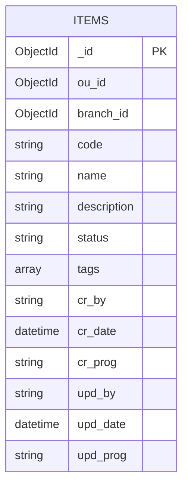

# crud-service — MongoDB: ERD, data dictionary, indexes, and operations

Single **`docs/db/`** reference for **MongoDB** used by this package: connection/lifecycle, persisted **`items`** shape (diagram + field dictionary), DBA index audit (`explain`), and security notes. HTTP contract: [`../../openapi.yaml`](../../openapi.yaml). Service design summary: [`../architecture.md`](../architecture.md).

**Scope:** this package writes **only** collection **`items`** in database **`DB_NAME`** (default `api_example`). **`GET /api/v1/me`** does not read MongoDB.

---

## Engine and scope

- **Engine:** MongoDB (official Node driver in [`../../src/config/database.js`](../../src/config/database.js)).
- **Database name:** from **`DB_NAME`** (default **`api_example`** — see [`../../.env.example`](../../.env.example) and [`../../src/config/env.js`](../../src/config/env.js)).
- **Collections written by this service:** **`items`** only (repository constant in [`../../src/modules/items/items.repository.js`](../../src/modules/items/items.repository.js)).

## Connection and environment

| Variable / setting                       | Role                                                                                                                   |
| ---------------------------------------- | ---------------------------------------------------------------------------------------------------------------------- |
| **`MONGODB_URI`**                        | Required at runtime (validated in production via `readEnv`). Full connection string including auth database if needed. |
| **`DB_NAME`**                            | Logical database name passed to `MongoClient#db()`.                                                                    |
| **`MAX_POOL_SIZE`**, **`MIN_POOL_SIZE`** | Driver pool sizing (defaults in `env.js`).                                                                             |
| **`APP_NAME`**                           | MongoDB `appName` client metadata (default `crud-service`).                                                            |

Driver options (timeouts, `readPreference`, retries) are set in code in `database.js` — change there if org policy requires different defaults.

## Lifecycle

1. **`src/server.js`** calls **`connectDatabase(env)`** before `listen`.
2. Handlers use **`getDatabase()`** → `collection("items")` for CRUD.
3. **`GET /readyz`** uses **`pingDatabase(1000)`** (admin `ping` with timeout).
4. Shutdown closes the client via **`closeDatabase()`** (see server graceful shutdown).

## Security notes

- Never log raw **`MONGODB_URI`** with credentials; startup errors use a **redacted** URI in logs (`redactMongoUri` in `database.js`).
- Tenant isolation for `items` is enforced in the repository layer with **`ou_id`** + **`branch_id`** on every query aligned to trusted headers (not from client body for identity).

---

## ER diagram (logical)

Logical entity **`ITEMS`** = documents in MongoDB collection **`items`**. Types below are logical; the driver persists BSON (`ObjectId`, `Date`, arrays, strings).



**Cardinality:** each document is scoped by **`(ou_id, branch_id)`** on every read/write path in the repository. There is **no separate `tenants` collection** in this demo package.

---

## Data dictionary (`items` document)

| Storage field | BSON type (typical)  | Required           | Exposed in list/detail API | Description                                                                                  |
| ------------- | -------------------- | ------------------ | -------------------------- | -------------------------------------------------------------------------------------------- |
| `_id`         | `ObjectId`           | yes (generated)    | yes as `id` (string)       | Primary key; public shape uses stringified id (`mapPublic`).                                 |
| `ou_id`       | `ObjectId` or string | yes                | no                         | Tenant OU; must align with trusted `x-user-ou` on requests.                                  |
| `branch_id`   | `ObjectId` or string | yes                | no                         | Tenant branch; must align with trusted `x-user-branch`.                                      |
| `code`        | string               | yes                | yes                        | Business code; uniqueness enforced per tenant in service layer / index strategy (see below). |
| `name`        | string               | yes                | yes                        | Display name.                                                                                |
| `description` | string or null       | no                 | yes                        | Nullable description.                                                                        |
| `status`      | string               | yes                | yes                        | Example values: `draft`, `active`, `inactive` (see OpenAPI).                                 |
| `tags`        | array of string      | no (defaults `[]`) | yes                        | Tag list; stored as BSON array.                                                              |
| `cr_by`       | string               | yes                | no                         | Create audit: user id from trusted context.                                                  |
| `cr_date`     | `Date`               | yes                | no                         | Create audit timestamp.                                                                      |
| `cr_prog`     | string               | yes                | no                         | Create audit: route template / program id.                                                   |
| `upd_by`      | string               | yes                | no                         | Update audit user id.                                                                        |
| `upd_date`    | `Date`               | yes                | no                         | Update audit time; basis for weak **`ETag`** / optimistic concurrency.                       |
| `upd_prog`    | string               | yes                | no                         | Update audit: route template / program id.                                                   |

**Source of truth for write shape:** [`../../src/modules/items/items.repository.js`](../../src/modules/items/items.repository.js) (`createItem`, `mapPublic`, updates).

---

## Indexes (summary)

| Index name                           | Key pattern                                       | Purpose (short)                                                            |
| ------------------------------------ | ------------------------------------------------- | -------------------------------------------------------------------------- |
| **`IDX_ITEMS_TENANT_LIST`**          | `{ ou_id: 1, branch_id: 1, _id: -1 }`             | Tenant-scoped list + `_id` descending pagination.                          |
| **`IDX_ITEMS_TENANT_VERSION_CHECK`** | `{ _id: 1, ou_id: 1, branch_id: 1, upd_date: 1 }` | Reads/updates with tenant + `_id` + **`upd_date`** for optimistic locking. |

**Policy:** application bootstrap **does not** create indexes; treat indexes as **DBA-owned**.

### IDX_ITEMS_TENANT_LIST

- name: `IDX_ITEMS_TENANT_LIST`
- keys: `{ ou_id: 1, branch_id: 1, _id: -1 }`
- options: `{ background: true }`
- reason: Supports `GET /api/v1/items` filter by tenant (`ou_id`, `branch_id`) with `_id` descending pagination/sort.
- date: `2026-04-20`
- PR/ticket: `TBD`
- explain (`executionStats`):

```js
db.items
  .find({ ou_id: "<ou_id>", branch_id: "<branch_id>" })
  .sort({ _id: -1 })
  .skip(0)
  .limit(20)
  .explain("executionStats");
```

### IDX_ITEMS_TENANT_VERSION_CHECK

- name: `IDX_ITEMS_TENANT_VERSION_CHECK`
- keys: `{ _id: 1, ou_id: 1, branch_id: 1, upd_date: 1 }`
- options: `{ background: true }`
- reason: Supports optimistic concurrency filters used by `PUT`, `PATCH`, and `DELETE` with `_id + tenant + upd_date`.
- date: `2026-04-20`
- PR/ticket: `TBD`
- explain (`executionStats`):

```js
db.items
  .find({
    _id: ObjectId("<item_id>"),
    ou_id: "<ou_id>",
    branch_id: "<branch_id>",
    upd_date: ISODate("<etag_timestamp>"),
  })
  .explain("executionStats");
```
