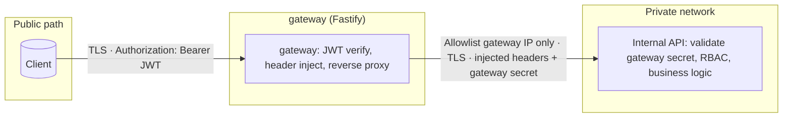
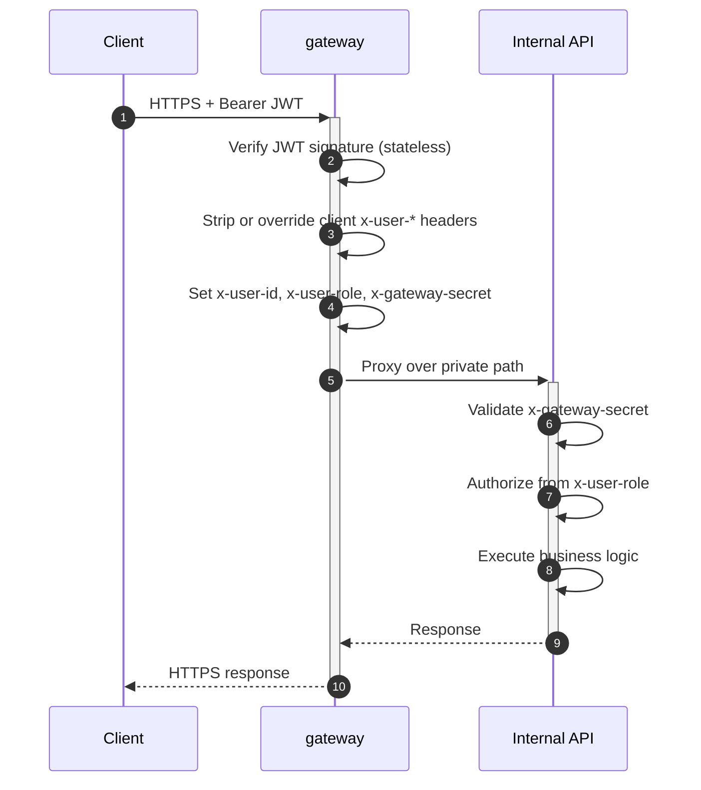
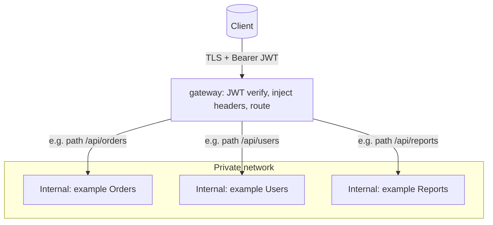
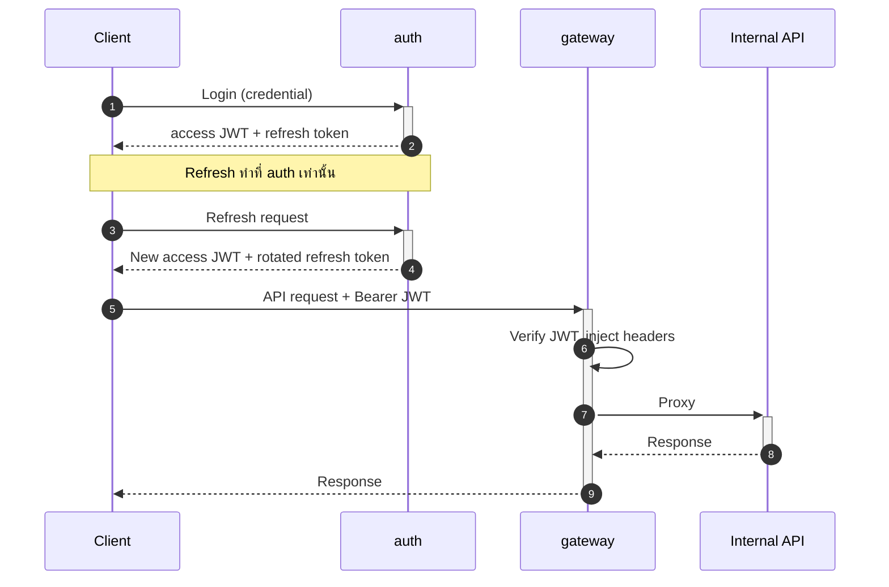

# 🏛️ zero-platform — Architecture ADR

> **TL;DR:** Client รับ Access JWT จาก `auth` แล้วส่งคำร้องขอผ่าน `gateway`; `gateway` เป็นด่านหน้า (Stateless) ในการ Verify JWT, Inject headers, และ Proxy ไปยัง Internal APIs ส่วน Internal API จะเชื่อถือ Context ก็ต่อเมื่อ Request ผ่าน `gateway` และตรวจสอบ `x-gateway-secret` สำเร็จเท่านั้น

## 📋 Metadata

| Field | Value |
|-------|-------|
| **Filename** | `ARCHITECTURE.md` |
| **Document index** | [README.md](./README.md) |
| **Status** | **Active** — ADR / Architecture overview, trust boundary, และ system flow |
| **Companion docs** | [`gateway` SoT](./gateway/docs/architecture.md) · [`001-gateway-esm-fastify.md`](./gateway/docs/adrs/001-gateway-esm-fastify.md) · [`auth` SoT](./auth/docs/architecture.md) |
| **Scope** | ภาพรวมเชิงสถาปัตยกรรม, Trust boundary, และเหตุผลเชิงระบบ (ไม่แทนที่ SoT เชิง Contract ของแต่ละ Service) |
| **Document version** | `1.0.9` |
| **Terms** | **ต้อง (MUST)** = บังคับ · **ควร (SHOULD)** = แนะนำ (Default) · **อาจ (MAY)** = ทางเลือก |

> ⚠️ **การเปลี่ยนแปลง:** หากแก้ไข Flow, Trust boundary, Security strategy, หรือ Diagram ที่กระทบระบบโดยรวม **ควร** Review คู่กับ SoT ของ Gateway/Auth เสมอ

---

*(หมายเหตุ: ชุดเอกสารในโฟลเดอร์นี้อ้างอิงร่วมกันระหว่าง `gateway`, `auth`, และตัวอย่าง upstream **[`crud-service`](./services/.demo/crud-service/README.md)** (อยู่ใต้ `services/.demo/` — `/api/v1/me`, `/api/v1/items`, และ catch-all `/api` ผ่าน gateway) — ดูเอกสารที่เกี่ยวข้องได้ที่ [README.md](./README.md))*

## 1. System Flow

**ก่อนเริ่ม Flow:** Client ขอรับ **Access JWT** จาก **[`auth`](./auth/docs/architecture.md)** (ในกรณีที่เป็น Self-hosted IdP)

1. **Client** ส่ง Request พร้อม `Authorization: Bearer <JWT>`
2. **`gateway`** ตรวจสอบ (Verify) JWT Signature แบบ Stateless
3. **`gateway`** อ่าน Payload และ Inject HTTP Headers (เช่น `x-user-*`) พร้อมแนบ `x-gateway-secret` — ระบบจะไม่เชื่อถือ User Context ที่ Client ส่งมาโดยตรง 
   *(หมายเหตุ: Claim ที่ Map ไปยัง `x-user-id` **ควร** เป็น ASCII printable และ **ต้องไม่** เกิน 128 ตัวอักษร มิฉะนั้น Gateway จะตอบ `400`)*
4. **`gateway`** ทำการ Proxy ไปยัง Internal API ตาม Routing ที่กำหนด
5. **Internal API** ตรวจสอบ `x-gateway-secret` ก่อนเสมอ จากนั้นจึงนำ User Context จาก Headers ที่ Gateway แนบมา ไปใช้ประมวลผล Business Logic ต่อไป

**Trust Boundary:** Internal API ถือว่า Headers (เช่น `x-user-id`, `x-user-role`, `x-user-ou`, `x-user-branch`) เป็นความจริง **ก็ต่อเมื่อ** Request วิ่งมาทาง Private Network ที่อนุญาตเฉพาะ Gateway, ผ่านการส่งต่อจาก Gateway และตรวจสอบ `x-gateway-secret` สำเร็จแล้วเท่านั้น

## 2. `gateway` Component

- **Tech Stack:** Node.js + **Fastify** (**jose** สำหรับ verify JWT / JWKS, `@fastify/http-proxy`) — เขียนด้วย **JavaScript ESM** (`import`/`export`, `"type": "module"`) **ไม่ใช้ TypeScript** — ทดสอบด้วย **Jest**
- **Reasoning:** Fastify มี Overhead ต่ำและรองรับ Throughput ได้ดี เหมาะกับการเป็น Proxy ด้านหน้า; การใช้ ESM ช่วยให้สอดคล้องกับ Module Graph และ Ecosystem ใหม่ๆ ซึ่ง**ต่างจาก**มาตรฐาน Backend หลักของทีม (Express + CommonJS) ถือเป็น Exception เฉพาะ Service นี้เท่านั้น
- **Responsibilities:**
  - Stateless Authentication (JWT)
  - Header Injection (User Context + Gateway Secret)
  - Reverse Proxy / Routing แบบ **Path-based (`prefix`)** ไปยัง Internal Upstream ต่างๆ

### 2.1 MVP Decisions (อ้างอิง [Gateway SoT](./gateway/docs/architecture.md) section 11)

- **Gateway Secret:** ใช้ค่าเดียวกันกับทุก Upstream (ในระยะเริ่มต้น)
- **ไม่ Forward Header:** จะไม่ส่ง `Authorization` ไปที่ Internal API; ยืนยัน Identity ผ่าน Headers ที่ Gateway Inject ให้เท่านั้น
- **JWT:** **ต้อง** Verify Access JWT ด้วยโหมด **Asymmetric + JWKS** (`JWT_JWKS_URL`) และตรวจสอบ `aud` / `iss` (โหมด `HS256` ไม่รองรับในปัจจุบัน)

### 2.2 Operational Baseline (อ้างอิง [Gateway SoT](./gateway/docs/architecture.md) section 12)

- **Public Routes:** เปิดเฉพาะ **`GET /healthz`** และ **`GET /readyz`** (ตรวจสอบ JWKS เบื้องต้น)
- **`x-user-id`:** Map จาก `JWT_CLAIM_USER_ID` — ความยาวสูงสุด 128 ตัวอักษร (เกินกำหนดตอบ `400`)
- **`x-user-role`:** String เดียว หรือหลายค่าโดยคั่นด้วย comma — ความยาวสูงสุด 256 ตัวอักษร (เกินกำหนดตอบ `400`)
- **JWT Leeway:** Default ที่ 60 วินาที
- **CORS:** ปิดเป็น Default (Server-to-Server) · กำหนด Body ไว้ที่ 1 MiB
- **Error Handling ขอบ Gateway:** ใช้ `application/problem+json` อ้างอิงตาม `codes.yaml`
- **Upstream Handling:** ถ้า Internal Secret ผิดตอบ `403`; ถ้า Upstream ตอบ HTTP `5xx` ให้ Passthrough ไปยัง Client 

### 2.3 Key Risks & Mitigations

- **Proxy Timeout:** ตั้งค่า Upstream Timeout เสมอ หากขาดการติดต่อให้ตอบ `504 Gateway Timeout` ป้องกันไม่ให้ Gateway ค้างตาม Internal API
- **Error Mapping:** 
  - ใช้ `502`/`504` เมื่อติดต่อ Upstream ไม่ได้
  - Passthrough HTTP `5xx` หาก Upstream ส่งมาสมบูรณ์
  - Internal API ใช้ **`403`** แจ้งกลับเมื่อ `x-gateway-secret` ไม่ถูกต้อง

## 3. Internal API Component

Upstream ภายในหมายถึงบริการหลัง `gateway` ที่ไม่รับ public traffic โดยตรง — ใน monorepo นี้มีตัวอย่างอ้างอิงที่ **[`crud-service`](./services/.demo/crud-service/README.md)** (แพ็กเกจใต้ `services/.demo/`); บริการอื่นใน workspace (เช่น smart-report) ปฏิบัติตามสัญญา mesh (`x-gateway-secret`, `x-user-*`) เช่นกัน

- **Responsibilities:** มุ่งเน้นไปที่ Business Logic เป็นหลัก
- **Security Rules:**
  - **ห้าม Verify JWT ซ้ำ** — หน้าที่ยืนยันตัวตนเสร็จสิ้นตั้งแต่ที่ `gateway` แล้ว
  - **Authorization:** ตรวจสอบสิทธิ์ (เช่น RBAC) ผ่าน `x-user-role` หรือ Claims อื่นๆ หลังมั่นใจว่า Request ผ่าน Gateway มาแล้ว
  - **Gateway Validation:** ตรวจสอบ `x-gateway-secret` **ทุกครั้ง** ก่อนเริ่มการทำงานเสมอ

## 4. Security Strategy (Defense in Depth)

เพื่อลดความเสี่ยงจากการโจมตีและป้องกันการ Bypass ข้าม Gateway ไปยัง Internal โดยตรง:

1. **Infrastructure (Network Isolation):** วาง Internal API ใน Private Network และอนุญาต Inbound เฉพาะ IP/Subnet ของ `gateway`
2. **Application (Shared Secret):** ใช้ `x-gateway-secret` เป็นปราการยืนยันว่า Request มาจาก Gateway จริง ป้องกัน Header Spoofing ภายใน Network เดียวกัน

### Operational notes (secret & transport)

- **Secret:** เก็บใน env/secret manager; หลีกเลี่ยงการ log request headers ที่มี secret; เปรียบเทียบแบบ constant-time; วางแผน rotate (หรือ dual-key ระหว่างช่วงเปลี่ยน)
- **Transport:** Client → `gateway` **ต้อง** ใช้ TLS; `gateway` → internal **ต้อง** วิ่งบน private network และ **ต้อง** ใช้ TLS; **mTLS ยังไม่อยู่ใน baseline ของ ADR นี้**

### JWT stateless (ข้อจำกัด)

- การ revoke token ทันที (logout / compromise) ทำได้ยากถ้าใช้แค่ stateless JWT — ความสามารถ revocation เพิ่มเติม **ยังไม่ถูกล็อกใน ADR นี้**; หาก requirement ต้อง revoke ได้ทันที **ต้อง** ทำ ADR/SoT เพิ่มเติม โดยอ้างอิงรายละเอียดการออก token / refresh ที่ [`auth` SoT](./auth/docs/architecture.md)

## 5. Diagrams

แผนภาพด้านล่าง render ได้ใน GitHub, GitLab, VS Code / Cursor (Markdown preview) และ tools ที่รองรับ [Mermaid](https://mermaid.js.org/)

### 5.1 Trust zones & components

### 5.2 Request sequence

### 5.3 Multiple internal services (routing)

เมื่อมีหลาย internal service `gateway` จะทำหน้าที่รวม **auth ไว้จุดเดียว** แล้ว **กระจายตาม route แบบ path-based (`prefix`)** — upstream ทุกตัว **ต้อง** ตรวจ `x-gateway-secret` และทำ authorization ตาม section 3 (Internal API) เหมือนกัน; ใน ADR นี้ **ใช้ secret ชุดเดียวกันทุก upstream** และหากจะเปลี่ยนเป็น secret คนละตัวต่อ service **ต้อง** ทำ decision แยก

ในทางปฏิบัติ ลูกศรทุกเส้นจาก `gateway` ไป internal จะแนบ **ชุด header เดียวกัน** (user context + gateway secret) ตามที่ `gateway` inject หลัง verify JWT แล้ว

### 5.4 Self-hosted IdP: `auth` + `gateway` (ภาพรวม)

รายละเอียด API และความปลอดภัยของ `auth` ดูต่อที่ [`auth` SoT](./auth/docs/architecture.md)

---

_Document version **1.0.9** — Architecture ADR (flow, trust boundary, diagrams)._
