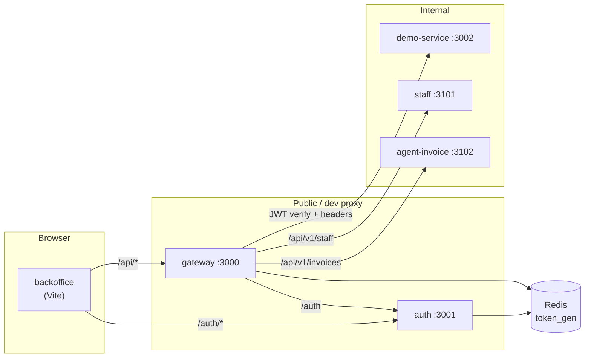

# zero-platform — Code base

Reference implementation ของ **zero-platform**: API backend (auth + gateway + internal services) และ back-office frontend ที่เรียกผ่าน gateway

> [!TIP]
> **TL;DR:** Login ที่ **auth** → เรียก API ผ่าน **gateway** ด้วย JWT → internal services รับ trusted headers เท่านั้น · UI อยู่ที่ **frontend/backoffice** (Vite proxy `/auth` → auth, `/api` → gateway)

## Repository zones

Four top-level areas — same depth, different jobs:

| Zone | Paths | Purpose |
|------|-------|---------|
| **Code** | `backend/`, `frontend/` | Runnable applications |
| **Product docs** | `docs/specs/` | What to build (per-service specs) |
| **Domain standards** | `coding-standard/` | How to build (org rules, vendored) |
| **Agent tooling** | `scripts/`, `.cursor/`, `references/` | Cursor agent-skills + command standards |

```bash
# After clone (or when agent-skills upstream updates):
./scripts/sync-agent-skills.sh
```

Edit slash-command standards in [`scripts/agent-skills-standards/`](./scripts/agent-skills-standards/) — see [scripts/README.md](./scripts/README.md) and [docs/README.md](./docs/README.md).

## Repository layout

```
zero-platform/
├── backend/                      # API monorepo — [backend/README.md](./backend/README.md)
│   ├── auth/                     # IdP — login, JWT/JWKS, token_gen
│   ├── gateway/                  # JWT edge + reverse proxy
│   ├── service/                  # Internal APIs (gateway mesh only)
│   │   ├── agent-invoice/
│   │   ├── branch-report/
│   │   ├── demo-service/         # Sample upstream (/api/v1/me, /api/v1/items)
│   │   ├── smart-report/
│   │   └── staff/
│   ├── docker-compose.yml        # MongoDB + Redis (local)
│   └── RUNBOOK.md
├── frontend/
│   └── backoffice/               # React admin UI
├── docs/
│   └── specs/                    # Service specs — [docs/README.md](./docs/README.md)
├── coding-standard/              # Vendored org standards (auth, gateway, backend, frontend, testing)
├── scripts/
│   ├── sync-agent-skills.sh      # Sync agent-skills → .cursor + references
│   └── agent-skills-standards/   # Related Coding Standards per /command
├── .cursor/                      # Cursor skills, commands, agents (mostly generated)
├── references/                   # Agent-skills checklists (generated by sync)
└── DEPLOY_DIGITALOCEAN.md
```

## System flow



รายละเอียด trust boundary และ sequence diagrams: [backend/ARCHITECTURE.md](./backend/ARCHITECTURE.md)

## Document map

| Area | Entry | เนื้อหา |
| :--- | :--- | :--- |
| **Backend** | [backend/README.md](./backend/README.md) | Services, ports, gateway routes, quick start |
| **Backend ops** | [backend/RUNBOOK.md](./backend/RUNBOOK.md) | Docker, seed DB, smoke test, deploy checklist |
| **Deployment** | [DEPLOY_DIGITALOCEAN.md](./DEPLOY_DIGITALOCEAN.md) | GitHub Actions CI/CD to DigitalOcean |
| **Frontend** | [frontend/backoffice/README.md](./frontend/backoffice/README.md) | UX docs, API mapping, scripts |
| **Frontend ops** | [frontend/backoffice/RUNBOOK.md](./frontend/backoffice/RUNBOOK.md) | Proxy routing, dev setup, troubleshooting |
| **Frontend API** | [frontend/backoffice/docs/api-mapping.md](./frontend/backoffice/docs/api-mapping.md) | UI actions → HTTP endpoints |
| **Product specs** | [docs/README.md](./docs/README.md) | Spec index; files under `docs/specs/` |
| **Domain standards** | [coding-standard/](./coding-standard/) | Vendored org rules (auth, gateway, backend, frontend, testing) |
| **Agent skills** | [scripts/README.md](./scripts/README.md) | `sync-agent-skills.sh`, command standards |
| **Cursor SDLC** | [.cursor/USAGE.md](./.cursor/USAGE.md) | `/spec` … `/ship`, subagents |

## Local ports (full stack)

| Component | Port | Notes |
| :--- | :---: | :--- |
| **gateway** | 3000 | Client / Vite proxy target สำหรับ `/api` |
| **auth** | 3001 | JWKS, login, refresh |
| **demo-service** | 3002 | `/api/v1/me`, `/api/v1/items` |
| **staff** | 3101 | Profile management API |
| **agent-invoice** | 3102 | Invoices and fees management API |
| **MongoDB** | 27017 | `backend/docker compose` |
| **Redis** | 6379 | Session revoke (`token_gen`) |
| **backoffice (Vite)** | 5175 | Vite; proxy ไป auth/gateway |

## Full-stack quick start

### 1. Infrastructure + backend

```bash
cd backend
docker compose up -d

# Terminal 1 — auth
cd auth && npm ci && npm run create-env && npm run init:db && npm run dev

# Terminal 2 — gateway
cd gateway && cp .env.example .env && npm ci && npm run dev

# Terminal 3 — sample upstream (optional)
cd demo-service && cp .env.example .env && npm ci && npm run dev
```

ค่า env สำคัญ: `JWT_JWKS_URL`, `GATEWAY_SECRET` (≥32 ตัว), `REDIS_URL=redis://127.0.0.1:6379/0` — ดู [backend/RUNBOOK.md](./backend/RUNBOOK.md)

### 2. Frontend

```bash
cd frontend/backoffice
npm ci
cp .env.local.example .env.local   # mesh headers สำหรับ dev ตรง staff API (ถ้าต้องการ)
npm run dev
```

Vite proxy ([`vite.config.ts`](./frontend/backoffice/vite.config.ts)):

| Path | Target |
| :--- | :--- |
| `/auth` | `http://127.0.0.1:3001` |
| `/api` | `http://127.0.0.1:3000` |

เปิด UI ที่ URL ที่ `npm run dev` แสดง (ปกติ `http://localhost:5175`) แล้ว login ด้วย user จาก `auth` seed (ดู RUNBOOK)

### 3. Smoke test

```bash
# Token
curl -s -X POST http://127.0.0.1:3001/auth/login \
  -H "Content-Type: application/json" \
  -d '{"username":"admin","password":"ChangeMe!Admin-1","client_kind":"native"}'

# ผ่าน gateway
curl -s http://127.0.0.1:3000/api/v1/me -H "Authorization: Bearer <access_token>"
```

## Prerequisites

| Layer | Requirement |
| :--- | :--- |
| Backend (auth, gateway, demo-service) | Node.js `>=24 <25`, Docker |
| Frontend | Node.js (ดู `frontend/backoffice/package.json`) |
| **Standards** | Vendored [`coding-standard/`](./coding-standard/) in repo — self-contained for CI |

## Quality gates

รัน `npm run ci` (หรือ `lint` / `test`) **ใน directory ของแต่ละ package** — ติดตั้งด้วย `npm ci` ในโฟลเดอร์นั้น (หรือ `bash backend/scripts/install-all-deps.sh` สำหรับทุก service พร้อมกัน)

## Git remote

`git@github-berlin:Chiang-Rai-Technology/zero-platform.git`
