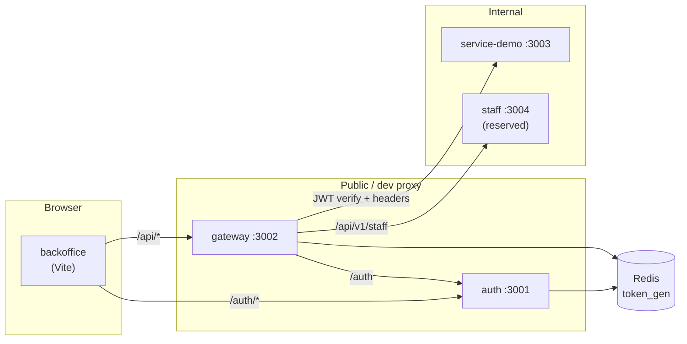

# zero-platform — Code base

Reference implementation ของ **zero-platform**: API backend (auth + gateway + internal services) และ back-office frontend ที่เรียกผ่าน gateway

> [!TIP]
> **TL;DR:** Login ที่ **auth** → เรียก API ผ่าน **gateway** ด้วย JWT → internal services รับ trusted headers เท่านั้น · UI อยู่ที่ **frontend/backoffice** (Vite proxy `/auth` → auth, `/api` → gateway)

## Repository layout

```
zero-platform/
├── backend/                 # API monorepo — อ่าน [backend/README.md](./backend/README.md)
│   ├── auth/                # IdP — login, JWT/JWKS, token_gen
│   ├── gateway/             # JWT edge + reverse proxy
│   ├── service-demo/        # ตัวอย่าง upstream (/api/v1/me, /api/v1/items)
│   ├── items/               # Items service (Express)
│   ├── docker-compose.yml   # MongoDB + Redis (local)
│   ├── ARCHITECTURE.md
│   └── RUNBOOK.md
└── frontend/
    └── backoffice/          # React admin UI — [frontend/backoffice/README.md](./frontend/backoffice/README.md)
```

## System flow



รายละเอียด trust boundary และ sequence diagrams: [backend/ARCHITECTURE.md](./backend/ARCHITECTURE.md)

## Document map

| Area | Entry | เนื้อหา |
| :--- | :--- | :--- |
| **Backend** | [backend/README.md](./backend/README.md) | Services, ports, gateway routes, quick start |
| **Backend ops** | [backend/RUNBOOK.md](./backend/RUNBOOK.md) | Docker, seed DB, smoke test, deploy checklist |
| **Frontend** | [frontend/backoffice/README.md](./frontend/backoffice/README.md) | UX docs, API mapping, scripts |
| **Frontend API** | [frontend/backoffice/docs/api-mapping.md](./frontend/backoffice/docs/api-mapping.md) | UI actions → HTTP endpoints |
| **Standards** | Org `coding-standard/` (parent workspace) | auth, gateway, backend, frontend/backoffice |

## Local ports (full stack)

| Component | Port | Notes |
| :--- | :---: | :--- |
| **auth** | 3001 | JWKS, login, refresh |
| **gateway** | 3002 | Client / Vite proxy target สำหรับ `/api` |
| **service-demo** | 3003 | `/api/v1/me`, `/api/v1/items` |
| **staff** (upstream) | 3004 | อ้างใน `gateway/routes.json` — ยังไม่มี service ใน repo |
| **items** | 3000 | แยกจาก gateway routes ปัจจุบัน |
| **MongoDB** | 27017 | `backend/docker compose` |
| **Redis** | 6379 | Session revoke (`token_gen`) |
| **backoffice (Vite)** | 5173 | Default Vite; proxy ไป auth/gateway |

## Full-stack quick start

### 1. Infrastructure + backend

```bash
cd backend
docker compose up -d

# Terminal 1 — auth
cd auth && npm ci && npm run create-env && npm run init:db && npm run dev

# Terminal 2 — gateway
cd gateway && cp .env.example .env && npm ci && npm run dev

# Terminal 3 — sample upstream (optional)
cd service-demo && cp .env.example .env && npm ci && npm run dev
```

ค่า env สำคัญ: `JWT_JWKS_URL`, `GATEWAY_SECRET` (≥32 ตัว), `REDIS_URL=redis://127.0.0.1:6379/0` — ดู [backend/RUNBOOK.md](./backend/RUNBOOK.md)

### 2. Frontend

```bash
cd frontend/backoffice
npm ci
cp .env.local.example .env.local   # mesh headers สำหรับ dev ตรง staff API (ถ้าต้องการ)
npm run dev
```

Vite proxy ([`vite.config.ts`](./frontend/backoffice/vite.config.ts)):

| Path | Target |
| :--- | :--- |
| `/auth` | `http://127.0.0.1:3001` |
| `/api` | `http://127.0.0.1:3002` |

เปิด UI ที่ URL ที่ `npm run dev` แสดง (ปกติ `http://localhost:5173`) แล้ว login ด้วย user จาก `auth` seed (ดู RUNBOOK)

### 3. Smoke test

```bash
# Token
curl -s -X POST http://127.0.0.1:3001/auth/login \
  -H "Content-Type: application/json" \
  -d '{"username":"admin","password":"ChangeMe!Admin-1","client_kind":"native"}'

# ผ่าน gateway
curl -s http://127.0.0.1:3002/api/v1/me -H "Authorization: Bearer <access_token>"
```

## Prerequisites

| Layer | Requirement |
| :--- | :--- |
| Backend (auth, gateway, service-demo) | Node.js `>=24 <25`, Docker |
| Backend (items) | Node.js + MongoDB (ดู `items/.env.example`) |
| Frontend | Node.js (ดู `frontend/backoffice/package.json`) |

## Quality gates

รัน `npm run ci` (หรือ `lint` / `test`) **ใน directory ของแต่ละ package** — ไม่มี root workspace script รวมทั้ง monorepo

## Git remote

`git@github-berlin:Chiang-Rai-Technology/zero-platform.git`
