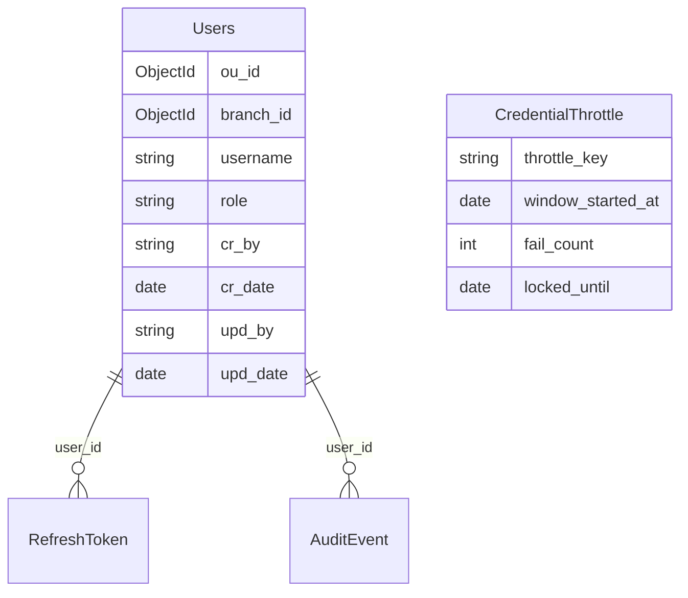

# auth — System Design (Production SoT)

## Metadata

| Field                | Value                                                                                                                                                                            |
| -------------------- | -------------------------------------------------------------------------------------------------------------------------------------------------------------------------------- |
| **Filename**         | `docs/architecture.md`                                                                                                                                                           |
| **Document index**   | [README.md](../README.md)                                                                                                                                                        |
| **Status**           | Active — SoT ของ `auth` (login, refresh, และ JWT issuance แบบ self-hosted IdP)                                                                                                   |
| **Companion docs**   | [`ARCHITECTURE.md`](../../../ARCHITECTURE.md) (ADR / ภาพรวม), [`gateway` production SoT](../../gateway/docs/architecture.md) (`gateway` verify + header contract)                |
| **OpenAPI**          | [`openapi.yaml`](../openapi.yaml) — **SoT เดียว** สำหรับสัญญา HTTP (`npm run spec:lint`, `npm run spec:codes`) — คำอธิบาย normative เพิ่มเติมอยู่ใน section **4–5** ของเอกสารนี้ |
| **Scope**            | เอกสารนี้ **ไม่** แทน `gateway` — client รับ JWT จาก service นี้ แล้วค่อยเรียก `gateway` ตาม [`docs/architecture.md`](../../gateway/docs/architecture.md) ของ `gateway`          |
| **Document version** | `1.3.6`                                                                                                                                                                          |

---

## วิธีอ่านเอกสารนี้ (ลำดับขั้นแนะนำ)

แนะนำให้อ่านตาม **A → F** ในรอบแรก เพื่อเห็นภาพรวมก่อนลงรายละเอียดเชิง normative — หมายเลข section **1–13** เรียงตามลำดับในไฟล์ และใช้อ้างอิงใน checklist / PR ได้คงที่

|           Step           | Read                    | Outcome                                                          |
| :----------------------: | ----------------------- | ---------------------------------------------------------------- |
|      **A — บริบท**       | **1** → **2** → **3**   | ใครทำอะไร → ภาพรวม flow → เป้าหมาย / non-goals                   |
|      **B — สัญญา**       | **4** → **5**           | HTTP API + รูปแบบตอบ/ผิดพลาด + JWT / JWKS คู่ Gateway            |
|   **C — โครง service**   | **6**                   | Runtime, Fastify+ESM, โครงสร้างโฟลเดอร์                          |
| **D — ปลอดภัย + ข้อมูล** | **7** → **8**           | Security, throttle, MongoDB (**8.3** schema · **8.4** `mongosh`) |
|     **E — รันระบบ**      | **9** → **10** → **11** | env, health, audit, CI/CD                                        |
| **F — ดัชนีการตัดสินใจ** | **12** → **13**         | O-01–O-15 ที่ล็อกแล้ว + เอกสารอ้างอิงหลัก                        |

**TL;DR:** `auth` ออก **access JWT + refresh token** → client เรียก `gateway` ด้วย Bearer access → refresh ทำที่ `auth` เท่านั้น (`gateway` ไม่รับผิดชอบ refresh)

---

## Contents (ตามเลข section ในไฟล์)

| #      | Section                                                                                               |
| ------ | ----------------------------------------------------------------------------------------------------- |
| **1**  | บทบาทในระบบ                                                                                           |
| **2**  | End-to-end flow                                                                                       |
| **3**  | Goals & non-goals                                                                                     |
| **4**  | API surface (normative)                                                                               |
| **5**  | JWT contract (สอดคล้อง gateway)                                                                       |
| **6**  | Stack & โครงสร้างแนะนำ                                                                                |
| **7**  | Security (production)                                                                                 |
| **8**  | ข้อมูล & token storage (**8.1** store · **8.2** refresh · **8.3** MongoDB schema · **8.4** `mongosh`) |
| **9**  | Configuration (environment)                                                                           |
| **10** | Observability & operations                                                                            |
| **11** | CI/CD & deployment                                                                                    |
| **12** | Locked decisions (checklist)                                                                          |
| **13** | References                                                                                            |

---

> **ขั้น A — บริบท:** บทบาท → flow → เป้าหมาย

## 1. บทบาทในระบบ

| Layer                                                                             | Responsibility                                                                                                              |
| --------------------------------------------------------------------------------- | --------------------------------------------------------------------------------------------------------------------------- |
| **`auth`**                                                                        | รับ credential, ตรวจสอบ user, **ออก access JWT** และ **refresh token** (ล็อก O-02) รวมถึงทำ revoke / rotation ตาม section 8 |
| **`gateway`** (SoT: [`docs/architecture.md`](../../gateway/docs/architecture.md)) | **ไม่** ทำ login — ทำหน้าที่ **verify** access JWT แล้ว inject headers ไปยัง upstream                                       |

---

## 2. End-to-end flow

```mermaid
sequenceDiagram
  autonumber
  participant C as Client
  participant L as auth
  participant G as gateway
  participant I as Internal API

  C->>+L: HTTPS POST /auth/login (credential)
  L->>L: Verify user, issue tokens
  L-->>-C: access JWT + refresh (channel ตาม O-04)

  C->>+G: HTTPS + Authorization Bearer access JWT
  G->>G: Verify JWT, inject headers + gateway secret
  G->>+I: Proxy (private)
  I->>I: Validate gateway secret, RBAC
  I-->>-G: Response
  G-->>-C: Response

  rect rgb(230, 240, 255)
    Note over C,L: Refresh ทำที่ auth เท่านั้น (O-02); rotation ตาม O-13
    C->>+L: HTTPS POST /auth/refresh (refresh cookie หรือ body ตาม O-04)
    L->>L: Verify refresh hash, rotate, persist DB
    L-->>-C: access JWT ใหม่ + refresh ใหม่ / Set-Cookie ตาม channel
  end

  C->>+G: HTTPS + Authorization Bearer access JWT ใหม่
  G->>G: Verify JWT, inject headers + gateway secret
  G->>+I: Proxy (private)
  I->>I: Validate gateway secret, RBAC
  I-->>-G: Response
  G-->>-C: Response
```

**Refresh:** client ส่ง refresh ไปที่ **`auth`** เท่านั้น (ล็อก O-02) เพื่อแลก access JWT ใหม่ (rotation ตาม O-13) จากนั้นจึงนำ access token ชุดใหม่ไปเรียก `gateway` ต่อ (`gateway` **ไม่** รับผิดชอบ refresh)

---

## 3. Goals & non-goals

### 3.1 Goals

- **ต้อง** ยืนยันตัวตนผู้ใช้ด้วย **username + password** (MVP — ล็อกตาม O-01)
- **ต้อง** ออก **access JWT** ที่ Gateway ตรวจได้ โดย **algorithm + JWKS ต้องสอดคล้องกับ** [`gateway` SoT ส่วน 11.3](../../gateway/docs/architecture.md) — service นี้ล็อก **โหมด (B) asymmetric เท่านั้น (O-08)** และ **ห้าม** ใช้ shared symmetric secret แบบโหมด (A) HS256 สำหรับ access token ที่ Gateway verify
- **ต้อง** รองรับ **refresh token** และ `POST /auth/refresh` (ล็อก O-02) โดย access TTL เป็นไปตาม O-07 และ refresh TTL อ้างอิง section 9

### 3.2 Non-goals

- **ไม่** proxy ไปยัง business upstream (เป็นหน้าที่ Gateway)
- **ไม่** inject `x-gateway-secret` (เป็นหน้าที่ Gateway)
- **ไม่** ทำ authorization ระดับ resource ของ domain (ทำเฉพาะ identity + claim พื้นฐาน เช่น role)

---

> **ขั้น B — สัญญา API + JWT (normative):** ข้อตกลงที่ client และ Gateway ต้องใช้ร่วมกัน

## 4. API surface (normative)

สเปก HTTP แบบ machine-readable มี **ไฟล์เดียว** คือ [`openapi.yaml`](../openapi.yaml) ที่ root ของแพ็กเกจ — CI ใช้ **`spectral lint`** (`npm run spec:lint`) และ **`spec:codes`** อ่านไฟล์นี้ — เมื่อเปลี่ยน path / schema **ต้อง** อัปเดตให้สอดคล้องกับ section **4–5** ในเอกสารนี้

### 4.1 เส้นทางขั้นต่ำ (MVP)

| Method | Path            | Description                                                                                       |
| ------ | --------------- | ------------------------------------------------------------------------------------------------- |
| `POST` | `/auth/login`   | รับ **username** + **password** (JSON body — ล็อกตาม O-01) แล้วตอบ access JWT + metadata ตาม O-05 |
| `POST` | `/auth/refresh` | **ต้อง** — รับ refresh ตาม O-04 แล้วตอบ access JWT ชุดใหม่ (rotation ตาม O-13)                    |
| `POST` | `/auth/logout`  | **ต้อง** — revoke refresh ที่ส่งมา และ revoke **ทั้ง `family_id`** ที่เกี่ยวข้อง (ล็อก O-03)      |

**ต้อง** ใช้ **HTTPS** ใน production; **ห้าม** รับ password ใน query string

### 4.2 Response shape (normative — ล็อก O-05)

**กรณีสำเร็จ (login / refresh):** response body เป็น JSON และ **ไม่** ใช้ envelope ชั้นนอก

| Field           | Required    | Description                                                                                                                      |
| --------------- | ----------- | -------------------------------------------------------------------------------------------------------------------------------- |
| `access_token`  | Yes         | string JWT สำหรับ `Authorization: Bearer`                                                                                        |
| `expires_in`    | Yes         | วินาทีจน access หมดอายุ (สอดคล้อง `ACCESS_TOKEN_TTL_SECONDS`)                                                                    |
| `token_type`    | Yes         | ค่า **`Bearer`**                                                                                                                 |
| `refresh_token` | Conditional | ส่งใน body **เฉพาะ** client แบบ non-browser (mobile, CLI); **ห้าม** ส่ง field นี้เมื่อใช้ cookie เป็น channel หลักสำหรับ refresh |

**กรณีผิดพลาด (4xx/5xx):** **ต้อง** ใช้ **`application/problem+json`** (RFC 7807) อย่างน้อยฟิลด์ `type` (URI), `title`, `status` และ **ควร** มี `detail` ที่ไม่ทำให้ข้อมูลรั่ว (เช่น ไม่เปิดเผยว่า username มีอยู่หรือไม่ในกรณี login ผิด)

**Cookie (เมื่อใช้ refresh channel แบบ cookie — O-04):** **ต้อง** ตั้ง `HttpOnly`, `Secure`, **`SameSite=Lax`** (หรือ `Strict` ถ้า flow รองรับ), ใช้ชื่อ cookie แบบคงที่ใน implementation เช่น `refresh_token` และบันทึกไว้ใน runbook

### 4.3 Error HTTP

| Scenario                                                                                                          | HTTP                                                                                                                                                                                                                                         |
| ----------------------------------------------------------------------------------------------------------------- | -------------------------------------------------------------------------------------------------------------------------------------------------------------------------------------------------------------------------------------------- |
| credential ผิด (`POST /auth/login`)                                                                               | `401 Unauthorized`                                                                                                                                                                                                                           |
| body ไม่ valid                                                                                                    | `400 Bad Request`                                                                                                                                                                                                                            |
| rate limit ทั่วไป (middleware / global — `api-rate-limit-standard.md`)                                            | **`429 Too Many Requests`** — `problem+json` **`type`** **ต้อง** เป็น URI ที่ทีมกำหนดสำหรับ **rate limit** และต้องต่างจากแถวถัดไป                                                                                                            |
| **เฉพาะ IP** ถูก lock จาก **credential throttle** แบบ **`ip:<…>`** แต่บัญชียังไม่เข้าเงื่อนไข `423` (**ล็อก P4**) | **`429 Too Many Requests`** — `problem+json` **`type`** **ต้อง** เป็น URI ที่ทีมกำหนดสำหรับ **IP throttle / abuse** และต้องต่างจาก rate limit ทั่วไป — `detail` ต้องเป็นข้อความ generic (ห้ามบอกว่า username มีในระบบหรือไม่ — สอดคล้อง 4.2) |
| **บัญชี** ถูก lock จาก credential throttle แบบ **`user:<id>`** (ล็อก O-12 / O-06)                                 | **`423 Locked`** — พร้อม `problem+json` อธิบาย                                                                                                                                                                                               |
| **`POST /auth/refresh`** — refresh ไม่ valid / หมดอายุ / ไม่พบ hash (ยังไม่ถึง reuse O-13)                        | **`401 Unauthorized`** — `problem+json` (นับ **`ip:`** throttle ตาม section 7 / 8.3)                                                                                                                                                         |
| **`POST /auth/refresh`** — **reuse** หลัง rotate หรือ revoked (**ล็อก O-13**, section 8.3)                        | **`401 Unauthorized`** — revoke **ทั้ง `family_id`** — `problem+json`; **ควร** นับ **`ip:`** เพิ่มหนึ่งครั้งต่อเหตุการณ์ (กัน brute force)                                                                                                   |

**หมายเหตุ P4:** `423` ใช้เมื่อ **บัญชีผู้ใช้** ถูก lock ตามนโยบาย O-12 ฝั่ง **user key** เท่านั้น ส่วนการอั้นเชิง **abuse ที่ IP** ใช้ **`429`** (แถว credential throttle) เพื่อให้ client backoff และไม่สับสนกับสถานะบัญชีถูกล็อก

**แยก semantics `429`:** มีสองกรณีที่ใช้ HTTP code เดียวกัน ดังนั้น client / observability **ต้อง** ใช้ค่า **`type`** ใน `problem+json` เพื่อแยกอย่างน้อยระหว่าง **rate limit ทั่วไป** กับ **IP credential throttle**; **ห้าม** ใช้ `type` เดียวกันทั้งสองกรณี

---

## 5. JWT contract (สอดคล้อง gateway)

access JWT **ต้อง** มี claims ที่ Gateway แมปไป `x-user-id` / `x-user-role` ได้ตรงกับ env บน Gateway

| Claim                                          | Must match                                                                                                                              |
| ---------------------------------------------- | --------------------------------------------------------------------------------------------------------------------------------------- |
| `sub` (หรือ claim ที่ `JWT_CLAIM_USER_ID` ชี้) | ค่าที่ใส่ใน `x-user-id` และ **ควร** เป็น ASCII printable; **ต้องไม่** เกิน **128** chars มิฉะนั้น Gateway ตอบ `400` ตาม header contract |
| role claim (ที่ `JWT_CLAIM_ROLE` ชี้)          | ค่าที่ใส่ใน `x-user-role` (รูปแบบ section 12.2 ของ [gateway SoT](../../gateway/docs/architecture.md))                                   |
| `iss`, `aud`                                   | **ต้อง** ตรงกับ `JWT_ISSUER` / `JWT_AUDIENCE` บน Gateway ถ้ามีการตรวจ                                                                   |
| `exp`                                          | access TTL — **ล็อก O-07:** **900 วินาที** (15 นาที) ค่าเริ่มต้น production                                                             |

**Algorithm (ล็อก O-08):** **ต้อง** ใช้โหมด **(B) asymmetric (แนะนำ RS256 หรือ ES256) + JWKS** ที่ Gateway ดึง และ **ห้าม** mismatch กับการ verify บน Gateway

**JWKS document path (ล็อก P2):** `auth` **ต้อง** เผยแพร่ JWKS ที่ **`GET /.well-known/jwks.json`** (relative ต่อ public origin ของ service) ค่า **`JWKS_PUBLIC_URL`** (**section 9**) **ต้อง** เป็น URL เต็มที่ path ลงท้าย **`/.well-known/jwks.json`** และ **ต้อง** เท่ากับ **`JWT_JWKS_URL`** บน `gateway` ([gateway SoT section 11.3](../../gateway/docs/architecture.md)) หากเปลี่ยน path **ต้อง** ทำ ADR และแก้ `gateway` พร้อมกัน

**JWT header `kid` (แนะนำเป็น normative เมื่อมีมากกว่าหนึ่ง signing key):** access JWT **ต้อง** ใส่ **`kid`** ใน header ให้ตรงกับคีย์ที่เผยแพร่ใน JWKS เมื่อมี **key rotation** หรือมีหลายคีย์พร้อมกัน และ Gateway **ต้อง** สอดคล้อง [gateway SoT section 11.3b](../../gateway/docs/architecture.md) (cache + refresh JWKS เมื่อ `kid` ไม่รู้จัก)

---

> **ขั้น C — โครง implement:** เลือก stack และโครงโฟลเดอร์ (สอดคล้อง ADR O-09)

## 6. Stack & โครงสร้างแนะนำ

| Topic          | Recommendation                                                                                                                                                                                                                                                       |
| -------------- | -------------------------------------------------------------------------------------------------------------------------------------------------------------------------------------------------------------------------------------------------------------------- |
| **Runtime**    | Node **>=24** — สอดคล้อง [gateway SoT section 12.7](../../gateway/docs/architecture.md)                                                                                                                                                                              |
| **Framework**  | **ล็อก O-09:** **Fastify + ESM** (`"type": "module"` ใน `package.json` ของ service) — แตกจากค่า default **Express + CommonJS** ใน `_engineering-standards/active/backend/architecture/architecture-standard.md` จึง **ต้อง** มี **ADR** บันทึกเหตุผลและผลกระทบต่อทีม |
| **Validation** | **ควร** Joi ตามมาตรฐาน API ของทีม                                                                                                                                                                                                                                    |
| **โครง**       | 4-layer (`route` → `controller` → `service` → `repository`) ตาม architecture standard แม้ framework หลักจะเป็น Fastify                                                                                                                                               |

ตัวอย่างโฟลเดอร์ย่อ (สอดคล้อง lean architecture; นามสกุล `.js` ใช้กับ ESM ได้เมื่อ package เป็น module)

```text
auth/
  package.json          # "type": "module"
  src/
    modules/
      auth/
        auth.route.js
        auth.controller.js
        auth.service.js
        auth.repository.js
        auth.validator.js
    config/
    plugins/
    app.js
    server.js
```

---

> **ขั้น D — ความปลอดภัยและ persistence:** กฎสำหรับ production + MongoDB

## 7. Security (production)

| Topic             | Requirement                                                                                                                                                                                                                                                                                                                                                                                                                                                                                                                                                                                                      |
| ----------------- | ---------------------------------------------------------------------------------------------------------------------------------------------------------------------------------------------------------------------------------------------------------------------------------------------------------------------------------------------------------------------------------------------------------------------------------------------------------------------------------------------------------------------------------------------------------------------------------------------------------------- |
| Password          | **ล็อก O-11:** **ต้อง** hash ด้วย **Argon2id** โดยรับพารามิเตอร์ผ่าน env (section 9) — **ห้าม** เก็บ plaintext                                                                                                                                                                                                                                                                                                                                                                                                                                                                                                   |
| Transport         | **ต้อง** TLS                                                                                                                                                                                                                                                                                                                                                                                                                                                                                                                                                                                                     |
| Logging           | **ห้าม** log password, refresh token เต็ม, access JWT เต็มในระดับ info                                                                                                                                                                                                                                                                                                                                                                                                                                                                                                                                           |
| Rate limit (HTTP) | **ต้อง** มี **middleware จำกัดความถี่แยกต่อ route** สำหรับ **`POST /auth/login`**, **`POST /auth/refresh`**, **`POST /auth/logout`** (คนละ bucket — ห้ามใช้ global เดียวกันทั้งสามเส้นถ้าทำให้ refresh กิน quota ของ login) — **implementation ปัจจุบัน (`auth.route.js`):** login **30**/นาที, refresh **120**/นาที, logout **60**/นาที ต่อ IP — SoT มาตรฐานองค์กร: [`_coding-standards/auth/api.md`](../../../../_coding-standards/auth/api.md) (§ Security) — แยกจาก **credential throttle** (คนละชั้น; `problem+json` **`type`** คนละค่าเมื่อตอบ `429` — ดู 4.3); อ้างอิงเพิ่ม: `api-rate-limit-standard.md` |
| Lockout           | **ล็อก O-12 (+ P1/P4):** **ต้อง** lock ชั่วคราวหลัง **credential ผิด** (`POST /auth/login`) โดยนับแยกทั้ง **ต่อ user** (`user:<_id>`) และ **ต่อ IP** (`ip:<…>`) — **threshold:** **10 ครั้ง** ภายใน **15 นาที** (rolling) และ lock **30 นาที** — **P1:** ถ้า **username ไม่พบในระบบ** **ห้าม** สร้าง `user:` bucket (ไม่มี `_id`) และ **ต้อง** นับผิดเฉพาะ **`ip:`**; **P4:** user bucket ถึง threshold → **`423`**; IP-only bucket ถึง threshold → **`429`** (ดู 4.3) — implementation ต้องกัน race / double-submit                                                                                             |
| Refresh ไม่ valid | สำหรับ **`POST /auth/refresh`** ที่ refresh **ไม่ valid** / หมดอายุ / ไม่พบ `token_hash` (ยังไม่ใช่ reuse O-13) — **ต้อง** นับความพยายามผิด **หนึ่งครั้งต่อ request** ลง **`ip:<normalized_ip>`** เท่านั้น โดยใช้ **window / threshold / `locked_until` / `429` P4** **ชุดเดียวกับ** login ผิด (แชร์ bucket `ip:` กับ login) — **ห้าม** นับ `user:` จากเหตุการณ์นี้เพียงลำพัง (opaque refresh ยังไม่ผูก user ก่อน lookup สำเร็จ); **reuse (O-13):** **401** + revoke family (8.3) และ **ควร** นับ **`ip:`** เพิ่มอีกหนึ่งครั้งต่อเหตุการณ์                                                                       |
| Keys              | private key สำหรับ JWT (**ล็อก O-08**) **ต้อง** มาจาก secret manager — **ห้าม** commit                                                                                                                                                                                                                                                                                                                                                                                                                                                                                                                           |

---

## 8. ข้อมูล & token storage

### 8.1 User store

- **ล็อก O-10:** แหล่งความจริงของ user คือ **MongoDB** — รายละเอียด **schema / index / TTL** อยู่ที่ **section 8.3** และตัวอย่าง `mongosh` สำหรับ `createIndex` อยู่ที่ **section 8.4**
- migration / versioning ของ schema ให้เป็นไปตามมาตรฐานทีม (เช่น สคริปต์ migrate, `createIndexes` ใน deploy pipeline)

### 8.2 Refresh token

| Approach                 | Details                                                                                                                                                                                                                                                |
| ------------------------ | ------------------------------------------------------------------------------------------------------------------------------------------------------------------------------------------------------------------------------------------------------ |
| **Opaque refresh**       | เก็บ **hash** ใน collection `auth_refresh_tokens` พร้อม `user_id`, `expires_at`, `revoked_at`, `family_id`                                                                                                                                             |
| **Rotation (ล็อก O-13)** | **ต้อง** ใช้ one-time refresh — เมื่อใช้ refresh หนึ่งครั้งแล้ว ต้องออกคู่ access+refresh ใหม่ และ **ต้อง** ตรวจ **reuse**; หากพบว่า refresh ถูก revoke แล้วหรือถูกใช้ซ้ำนอกลำดับที่อนุญาต → **revoke ทั้ง family** (`family_id`) และบังคับ login ใหม่ |

### 8.3 MongoDB database design (normative)

**ชื่อ database:** กำหนดผ่าน `DATABASE_URI` (เช่น `auth_login` — ชื่อจริงขึ้นกับ env)

**ชื่อ collection:** ใช้ prefix **`auth_*`** (`auth_users`, `auth_refresh_tokens`, `auth_credential_throttle`, `auth_audit_events`) เพื่อให้รวมหลายโดเมนใน database เดียวได้โดยไม่ชื่อชน — ค่าจริงอยู่ที่ `src/config/mongo-collections.js`

**หลักการทั่วไป**

- เก็บค่าเวลาเป็น **`Date` (UTC)** ใน MongoDB
- **ห้าม** เก็บ refresh token แบบ plaintext — ให้เก็บเฉพาะ **`token_hash`** (แนะนำ **SHA-256** ของ opaque token ที่ส่งให้ client)
- **Username:** application **ต้อง** normalize ก่อน persist/query (แนะนำ `trim` + **lowercase**) แล้วเก็บใน field **`username`** — ไม่ใช้ค่าดิบจาก client เป็น unique key โดยตรง; **Username ห้ามซ้ำกันทั้งระบบ (Globally Unique)** — ไม่ scope ตาม `ou_id` / `branch_id`
- **ควร** ใช้ **MongoDB transaction** (หรือ pattern ที่ atomic เทียบเท่า) สำหรับ **refresh rotation** (อ่าน token เดิม + เขียน token ใหม่ + revoke เดิม) เพื่อกัน race จากการ refresh ซ้ำพร้อมกัน
- **Tenant + Audit fields** — collection `auth_users` **ต้อง** มีฟิลด์ `ou_id`, `branch_id` และ audit fields (`cr_by`, `cr_date`, `cr_prog`, `upd_by`, `upd_date`, `upd_prog`) ตามมาตรฐาน [`tenant-audit.md`](../../../../_coding-standards/backend/tenant-audit.md) โดยข้อมูล user ถูกสร้างและแก้ไขผ่าน **หน้าจัดการ (Admin UI)** ที่ต้อง login ผ่าน `gateway` ก่อน จึงมี injected headers (`x-user-id`, `x-user-ou`, `x-user-branch`) ครบสำหรับ populate audit fields ได้ตามมาตรฐาน
- **Deviation — Operational collections:** collection `auth_refresh_tokens`, `auth_credential_throttle`, และ `auth_audit_events` เป็นข้อมูลเชิงระบบ (operational / transactional) ที่ไม่มีผู้ใช้แก้ไขโดยตรง — **ยกเว้น** ไม่ต้องมีฟิลด์ `ou_id`, `branch_id`, `cr_*`, `upd_*` เพื่อลด schema overhead; ถ้าต้องการเพิ่มในอนาคต **ต้อง** ADR

**Trust boundary — Login flow**

- **`POST /auth/login`** เป็น public endpoint ที่ **ไม่ผ่าน** `gateway` — ระบบค้นหาผู้ใช้ด้วย `username` เท่านั้น (ไม่อ่าน `x-user-ou` / `x-user-branch` จาก header); เมื่อพบแล้ว ให้ดึง `ou_id` และ `branch_id` ของผู้ใช้จาก DB มาประกอบลงใน payload ของ access JWT
- **User Management API** (เช่น `POST /admin/users`, `PATCH /admin/users/:id`) **ต้อง** อยู่หลัง `gateway` เพื่อรับ injected headers — ใช้ `x-user-id` สำหรับ `cr_by` / `upd_by`, ใช้ `x-user-ou` / `x-user-branch` สำหรับ `ou_id` / `branch_id`

**Concurrency control — ETag / `If-Match`**

- API ที่แก้ไขข้อมูลใน collection `auth_users` (เช่น เปลี่ยน password, แก้ role) **ต้อง** ทำ **Optimistic Concurrency Control** ตามมาตรฐาน [`tenant-audit.md` section 3](../../../../_coding-standards/backend/tenant-audit.md#3-concurrency-control) โดยใช้ `upd_date` สร้าง ETag (`W/"<base64url(upd_date.toISOString())>"`) และบังคับ `If-Match` header บน `PATCH` / `PUT` / `DELETE`

---

#### Collection `auth_users`

| Field           | Type     | Required | Description                                                                                                |
| --------------- | -------- | -------- | ---------------------------------------------------------------------------------------------------------- |
| `_id`           | ObjectId | Yes      | primary key                                                                                                |
| `ou_id`         | ObjectId | Yes      | รหัสองค์กร — tenant scoping ตาม [`tenant-audit.md`](../../../../_coding-standards/backend/tenant-audit.md) |
| `branch_id`     | ObjectId | Yes      | รหัสสาขา — tenant scoping ตาม [`tenant-audit.md`](../../../../_coding-standards/backend/tenant-audit.md)   |
| `username`      | string   | Yes      | ค่าหลัง normalize (trim + lowercase) — ใช้ login; **Globally Unique** (ไม่ scope ตาม tenant)               |
| `password_hash` | string   | Yes      | ผล **Argon2id** แบบ encoded string (รวม params ตาม lib) — **ห้าม** plaintext                               |
| `role`          | string   | Yes      | ค่าที่ map ไป JWT role claim (สอดคล้อง `JWT_CLAIM_ROLE` บน Gateway)                                        |
| `cr_by`         | string   | Yes      | ID ผู้สร้าง (`x-user-id`) — **insert only**, immutable                                                     |
| `cr_date`       | Date     | Yes      | วันที่สร้าง (UTC) — **insert only**, immutable                                                             |
| `cr_prog`       | string   | Yes      | route template ที่ใช้สร้าง — **insert only**, immutable                                                    |
| `upd_by`        | string   | Yes      | ID ผู้แก้ไขล่าสุด (`x-user-id`) — refresh ทุก update                                                       |
| `upd_date`      | Date     | Yes      | วันที่แก้ไขล่าสุด (UTC) — refresh ทุก update; ใช้สร้าง ETag                                                |
| `upd_prog`      | string   | Yes      | route template ที่แก้ไขล่าสุด — refresh ทุก update                                                         |

**Membership policy (contract lock):**

- หนึ่ง `auth_users._id` (user) **ต้อง** ผูกได้แค่หนึ่งคู่ `ou_id` + `branch_id` เท่านั้น
- ถ้าต้องการรองรับหลาย OU/Branch ต่อผู้ใช้ในอนาคต ถือเป็น breaking architecture change และต้องทำ ADR ก่อน

**Role scope policy (contract lock):**

- บทบาท OU-level: `Owner`, `Admin` (เข้าถึง OU-level routes และงานกำกับระดับองค์กร)
- บทบาท Branch-level: `Manager`, `Member`, `Billing` (ทำงานเฉพาะ branch ที่ผูกกับผู้ใช้นั้น)
- สิทธิ์ลบ Branch แบบถาวร (`branch:delete`) จำกัด `Owner` เท่านั้น
- `Admin` สามารถจัดการ Branch (create/update/deactivate) และมีสิทธิ์ `billing:manage` เป็นค่า default ทุก OU
- User provisioning ใช้ direct management โดยผู้ดูแลระบบ (create/edit/remove) เท่านั้น — ไม่มี self-signup และไม่มี invite flow ในขอบเขตระบบนี้

**Index (ต้องสร้าง)**

| Index           | Spec                             | Purpose                                 |
| --------------- | -------------------------------- | --------------------------------------- |
| `uniq_username` | `{ "username": 1 }` **unique**   | login lookup + กันซ้ำ (Globally Unique) |
| `by_ou_branch`  | `{ "ou_id": 1, "branch_id": 1 }` | tenant-scoped queries จากหน้าจัดการ     |

---

#### Collection `auth_refresh_tokens`

หนึ่งแถวแทน refresh opaque หนึ่งชิ้น (หลัง hash) ภายใต้ `family_id` เดียวกัน

| Field            | Type     | Required | Description                                                                                   |
| ---------------- | -------- | -------- | --------------------------------------------------------------------------------------------- |
| `_id`            | ObjectId | Yes      | primary key                                                                                   |
| `user_id`        | ObjectId | Yes      | FK → `auth_users._id`                                                                         |
| `family_id`      | ObjectId | Yes      | กลุ่ม rotation เดียวกัน — ใช้ revoke ทั้งกลุ่ม (O-03, O-13)                                   |
| `token_hash`     | string   | Yes      | SHA-256(hex หรือ base64 ตามที่ implement ล็อก) ของ token ที่ออกให้ client                     |
| `expires_at`     | Date     | Yes      | ตาม `REFRESH_TOKEN_TTL_SECONDS` นับจากออก                                                     |
| `revoked_at`     | Date     | Optional | `null` = ยังใช้ได้ (ถ้ายังไม่หมดอายุ); ตั้งเวลาเมื่อ rotate / logout / reuse                  |
| `replaced_by_id` | ObjectId | Optional | FK → `auth_refresh_tokens._id` ของแถวที่แทนที่ (หลัง rotation) — **ควร** ใส่เพื่อ trace chain |
| `created_at`     | Date     | Yes      | สร้างแถว                                                                                      |

**Index (ต้องสร้าง)**

| Index                 | Spec                                                 | Purpose                                                                                                         |
| --------------------- | ---------------------------------------------------- | --------------------------------------------------------------------------------------------------------------- |
| `uniq_token_hash`     | `{ "token_hash": 1 }` **unique**                     | lookup ตอน refresh                                                                                              |
| `by_user_revoked_exp` | `{ "user_id": 1, "revoked_at": 1, "expires_at": 1 }` | revoke ตาม user / cleanup                                                                                       |
| `by_family`           | `{ "family_id": 1 }`                                 | revoke family (logout, reuse attack)                                                                            |
| `ttl_expires_at`      | `{ "expires_at": 1 }`, **`expireAfterSeconds`: 0**   | ลบเอกสารหลัง TTL จริง — เอกสารที่ revoke ก่อนหมดอายุยังอยู่จนถึง `expires_at` (รองรับ reuse detection จนจบอายุ) |

**พฤติกรรมที่ต้อง implement (สรุป)**

1. **Login:** สร้าง `family_id` ใหม่ แล้ว insert `auth_refresh_tokens` หนึ่งแถว (`revoked_at = null`)
2. **Refresh:** `findOne` ด้วย `token_hash` — ถ้าพบแถวที่ **`revoked_at` ไม่ null** (นำ token เก่ามาใช้ซ้ำหลัง rotate) → ถือเป็น **reuse** → `updateMany` ตาม `family_id` เพื่อตั้ง `revoked_at` ทั้งกลุ่ม แล้วตอบ **401**; ถ้าไม่พบแถว → ตอบ **401**; ถ้าพบแถวที่ `revoked_at` เป็น null และ `expires_at` > now → ไปข้อ 3
3. **Refresh สำเร็จ:** ตั้ง `revoked_at` ที่แถวเดิม แล้ว insert แถวใหม่ (`family_id` เดิม, `replaced_by_id` ชี้แถวใหม่)
4. **Logout (O-03):** `updateMany` `{ family_id, revoked_at: null }` เพื่อกำหนด `revoked_at`

---

#### Collection `auth_credential_throttle` (ล็อก O-12)

ใช้เก็บจำนวนครั้งที่ login ผิด แยกตาม **user** และ **IP** โดยหนึ่งเอกสารต่อหนึ่ง `throttle_key`

| Field               | Type     | Required | Description                                                                                                     |
| ------------------- | -------- | -------- | --------------------------------------------------------------------------------------------------------------- |
| `_id`               | ObjectId | Yes      | primary key                                                                                                     |
| `throttle_key`      | string   | Yes      | รูปแบบคงที่: **`user:<auth_users._id hex>`** หรือ **`ip:<normalized_ip>`** (IPv6 normalize ตาม RFC ที่ทีมเลือก) |
| `window_started_at` | Date     | Yes      | จุดเริ่ม rolling window 15 นาที                                                                                 |
| `fail_count`        | int      | Yes      | จำนวนครั้งที่ credential ผิดใน window                                                                           |
| `locked_until`      | Date     | Optional | `null` ถ้าไม่ lock; ถ้าตั้ง = บัญชีหรือ IP ถูก lock จนถึงเวลานี้ (ตามกฎ O-12)                                   |

**Logic (normative ต่อ O-12, P1, P4)**

1. **Rolling window ต่อ `throttle_key`:** เมื่อมีความพยายาม **credential ผิด** สำหรับ key ใด ให้หาเอกสารของ key นั้น; ถ้าไม่มีหรือ `now - window_started_at` > **15 นาที** → reset `window_started_at = now`, `fail_count = 1`; หากยังอยู่ใน window เดิม → `fail_count++`
2. **P1 — username ไม่พบในระบบ:** หลัง normalize แล้ว **ไม่พบ** แถวใน `auth_users` ที่ตรงกัน → **ห้าม** อัปเดต bucket **`user:<…>`** และให้ใช้ข้อ 1 เฉพาะกับ **`ip:<normalized_ip>`** หนึ่งครั้งต่อ request ผิด; การตอบ client **ต้อง** เป็น **`401`** เหมือนกรณี password ผิด (`problem+json` ต้องไม่รั่วว่ามี user หรือไม่ — สอดคล้อง 4.2)
3. **Credential ผิดและพบ user:** ใช้ข้อ 1 กับทั้ง **`user:<auth_users._id hex>`** และ **`ip:<normalized_ip>`** โดยทั้งสอง key ทำงานเป็นอิสระต่อกัน
4. **ถึง threshold:** เมื่อ `fail_count` ถึง **10** ภายใน window ของ key ใด ให้ตั้ง **`locked_until = now + 30 นาที`** บน key นั้น — **P4:** ถ้าเป็น **`user:`** → login ครั้งถัดไปของบัญชีนั้นตอบ **`423 Locked`**; ถ้าเฉพาะ **`ip:`** ถึง threshold และ user key ยังไม่เข้าเงื่อนไข `423` → ตอบ **`429 Too Many Requests`** (ดู 4.3)
5. **Login สำเร็จ:** **ควร** reset / ลด counter ฝั่ง `user:<id>` และ **ควร** พิจารณา reset ฝั่ง `ip:` ของ IP ปัจจุบันเพื่อลด false lock / NAT

**`/auth/refresh` กับ `auth_credential_throttle` (ล็อกรีวิว):** ใช้ **`ip:<normalized_ip>`** ชุดเดียวกับ login สำหรับความพยายามที่ **ไม่ผ่าน** (รวม refresh หมดอายุ / ไม่พบ hash) และสำหรับ **reuse** ตาม O-13 ตามที่ section 7 สรุป — ยัง **ไม่** สร้าง **`user:`** จาก refresh ผิดทั่วไป จนกว่าจะมีนโยบายเพิ่มเติมใน ADR

**Index (ต้องสร้าง)**

| Index               | Spec                               | Purpose        |
| ------------------- | ---------------------------------- | -------------- |
| `uniq_throttle_key` | `{ "throttle_key": 1 }` **unique** | upsert ต่อ key |

---

#### Collection `auth_audit_events` (persist ลง DB — สอดคล้อง O-14)

ถ้าทีมส่ง audit ไปที่ log stack อย่างเดียว (เช่น Loki) ก็ **ทำได้** แต่ถ้าต้อง query ย้อนหลังจาก DB ให้ใช้ collection นี้

| Field             | Type     | Required | Description                                                      |
| ----------------- | -------- | -------- | ---------------------------------------------------------------- |
| `_id`             | ObjectId | Yes      | primary key                                                      |
| `event_type`      | string   | Yes      | เช่น `auth.login`, `auth.refresh`, `auth.logout`                 |
| `ts`              | Date     | Yes      | เวลาเหตุการณ์ (UTC)                                              |
| `outcome`         | string   | Yes      | `success` \| `fail`                                              |
| `request_id`      | string   | Yes      | correlation id                                                   |
| `user_id`         | ObjectId | Optional | มีเมื่อรู้ตัวตนแล้ว                                              |
| `ip_digest`       | string   | Optional | **แนะนำ** เก็บแบบ one-way digest (ไม่เก็บ IP เต็ม) ตามนโยบาย PII |
| `detail_safe`     | object   | Optional | ข้อมูลเสริมที่ปลอดภัย — **ห้าม** ใส่ password / token            |
| `retention_until` | Date     | Yes      | `ts` + **180 วัน** (ล็อก O-14) — ใช้กับ TTL index                |

**Index (ต้องสร้างเมื่อ persist audit ลง MongoDB)**

| Index                 | Spec                                                    | Purpose                             |
| --------------------- | ------------------------------------------------------- | ----------------------------------- |
| `by_request_id`       | `{ "request_id": 1 }`                                   | ค้นตาม correlation                  |
| `ttl_retention_until` | `{ "retention_until": 1 }`, **`expireAfterSeconds`: 0** | ลบอัตโนมัติหลังครบ retention (O-14) |

**ความสัมพันธ์ (สรุป)**



### 8.4 Index bootstrap — ตัวอย่าง `mongosh` (annex)

**ข้อจำกัด:** ตัวอย่างนี้เป็น **สคริปต์อ้างอิง** — ต้องแก้ชื่อ database ให้ตรง `DATABASE_URI` ก่อนรันใน production; ถ้ามี index เดิมชื่อเดียวแต่ใช้ key/options คนละแบบ ต้อง **`dropIndex`** ก่อนสร้างใหม่

**ค่า placeholder:** database **`auth_login`** (เปลี่ยนได้)

```javascript
// mongosh — สร้าง indexes ตาม section 8.3
use auth_login;

db.auth_users.createIndex(
  { username: 1 },
  { unique: true, name: "uniq_username" }
);

db.auth_users.createIndex(
  { ou_id: 1, branch_id: 1 },
  { name: "by_ou_branch" }
);

db.auth_refresh_tokens.createIndex(
  { token_hash: 1 },
  { unique: true, name: "uniq_token_hash" }
);

db.auth_refresh_tokens.createIndex(
  { user_id: 1, revoked_at: 1, expires_at: 1 },
  { name: "by_user_revoked_exp" }
);

db.auth_refresh_tokens.createIndex(
  { family_id: 1 },
  { name: "by_family" }
);

db.auth_refresh_tokens.createIndex(
  { expires_at: 1 },
  { name: "ttl_expires_at", expireAfterSeconds: 0 }
);

db.auth_credential_throttle.createIndex(
  { throttle_key: 1 },
  { unique: true, name: "uniq_throttle_key" }
);

db.auth_audit_events.createIndex(
  { request_id: 1 },
  { name: "by_request_id" }
);

db.auth_audit_events.createIndex(
  { retention_until: 1 },
  { name: "ttl_retention_until", expireAfterSeconds: 0 }
);
```

**ทางเลือก (idempotent / CI):** ใช้ `createIndexes` command หรือ migration tool ชุดเดียวกับ pipeline deploy แล้วเก็บ definition ไว้ใน repo ของทีม (ไม่ใส่ credential ในไฟล์สคริปต์)

---

> **ขั้น E — รันระบบ:** env → observability → deploy

## 9. Configuration (environment)

ห้ามใส่ค่าจริงลงใน repo

| Variable                                                 | Description                                                                                                                                                                                                                                                 |
| -------------------------------------------------------- | ----------------------------------------------------------------------------------------------------------------------------------------------------------------------------------------------------------------------------------------------------------- |
| `PORT`                                                   | พอร์ต service                                                                                                                                                                                                                                               |
| `DATABASE_URI`                                           | MongoDB connection string (**ล็อก O-10**)                                                                                                                                                                                                                   |
| `JWT_PRIVATE_KEY_PEM`                                    | private key สำหรับ sign access JWT (**ล็อก O-08** — asymmetric)                                                                                                                                                                                             |
| `JWKS_PUBLIC_URL`                                        | URL เต็ม (HTTPS) ของ JWKS — **ล็อก P2:** **ต้อง** ลงท้ายด้วย **`/.well-known/jwks.json`** และ **ต้อง** ตรงกับ **`JWT_JWKS_URL`** บน Gateway ([gateway SoT section 11.3](../../gateway/docs/architecture.md)) — ถ้าใช้ path อื่น **ต้อง** ADR + sync Gateway |
| `JWT_ISSUER` / `JWT_AUDIENCE`                            | **ต้อง** ตรงกับที่ Gateway ตรวจ                                                                                                                                                                                                                             |
| `ACCESS_TOKEN_TTL_SECONDS`                               | **ล็อก O-07:** **`900`** (15 นาที) ค่าเริ่มต้น production                                                                                                                                                                                                   |
| `REFRESH_TOKEN_TTL_SECONDS`                              | **`2592000`** (30 วัน) ค่าเริ่มต้น production                                                                                                                                                                                                               |
| `ARGON2_MEMORY_KIB`, `ARGON2_TIME`, `ARGON2_PARALLELISM` | **ล็อก O-11** — ตั้งตาม benchmark + OWASP / นโยบาย security (ไม่ commit ค่าจริง)                                                                                                                                                                            |
| `REFRESH_COOKIE_NAME`                                    | ชื่อ cookie เมื่อใช้ channel cookie (ค่าเริ่มต้น `refresh_token`)                                                                                                                                                                                           |
| `CORS_ORIGINS`                                           | รายการ origin ที่อนุญาตให้ส่ง credential/cookie (ถ้าเป็น browser client)                                                                                                                                                                                    |

---

## 10. Observability & operations

- **ต้อง** มี `GET /healthz` (liveness) และ `GET /readyz` (readiness; ไม่ต้อง auth)
- **ควร** มี metrics อย่างน้อย: login success/fail, refresh success/fail, latency DB
- **Audit (ล็อก O-14):** **ต้อง** เก็บอย่างน้อย **`event_type`**, เวลาเหตุการณ์ (**`timestamp`** ใน log / **`ts`** ใน MongoDB section 8.3), **`outcome`** (success/fail), และ **`request_id`** (correlation); **ถ้ารู้ตัวตนแล้ว** ให้เก็บ **`user_id`**; ส่วน **IP** ให้เก็บตามนโยบาย PII — **แนะนำ** hash/truncate หรือเก็บเฉพาะ /24 ถ้านโยบายห้ามเก็บ IP เต็ม — **ห้าม** เก็บ access JWT / refresh token แบบ plaintext ใน audit
- **Retention (ล็อก O-14):** ค่าเริ่มต้นคือ **180 วัน** — หากต้องปรับตาม compliance องค์กร ให้แก้เอกสารนี้และ bump version อย่างน้อยระดับ patch

---

## 11. CI/CD & deployment

- **ต้อง** มี lint + test + audit ใน CI — สอดคล้องมาตรฐานทีม
- **ต้อง** deploy แยกจาก Gateway เพื่อให้ scale และ rollout ได้อิสระ
- **ล็อก O-15:** path ต่อไปนี้ **ห้าม** expose สู่ public internet หากไม่มีชั้น auth/network แยก (เช่น private network, mTLS, VPN หรือ reverse proxy ภายในเท่านั้น): **`/internal/*`**, **`/admin/*`**, **`/metrics`** (ถ้าเปิด metrics endpoint แยกจาก scrape ภายใน)

---

> **ขั้น F — ดัชนีการตัดสินใจ:** สรุปค่าที่ล็อก (O-01–O-15) และอ้างอิงที่เกี่ยวข้อง

## 12. Locked decisions (checklist)

ค่าด้านล่าง **ล็อกแล้ว** และสอดคล้องกับหมวด normative ด้านบน (เวอร์ชันเอกสาร **1.3.5**)

ถ้าแถวใดมีการเปลี่ยนค่าที่กระทบ client หรือ deploy — **ควร** bump เวอร์ชันเอกสารอย่างน้อยระดับ patch และ sync `CHANGELOG.md` ถ้า repo มี

| ID   | Decision                                                                      | Reference             | Locked value / Notes                                                                                                                                                                                                          |
| ---- | ----------------------------------------------------------------------------- | --------------------- | ----------------------------------------------------------------------------------------------------------------------------------------------------------------------------------------------------------------------------- |
| O-01 | ชนิด credential สำหรับ login (MVP)                                            | 3.1, 4.1              | **ล็อกแล้ว:** username + password (JSON body)                                                                                                                                                                                 |
| O-02 | มี `POST /auth/refresh` ในรอบแรกหรือไม่                                       | 2, 3.1, 4.1           | **ล็อกแล้ว:** **มี** ใน MVP                                                                                                                                                                                                   |
| O-03 | มี `POST /auth/logout` หรือไม่ — revoke ระดับไหน                              | 4.1                   | **ล็อกแล้ว:** **มี** — revoke refresh ที่ส่งมา + **ทั้ง `family_id`**                                                                                                                                                         |
| O-04 | ส่ง refresh: **body** vs **`httpOnly` cookie** (หรือทั้งคู่ + default)        | 4.1, 4.2              | **ล็อกแล้ว:** **ทั้งคู่** — **default สำหรับ browser:** `httpOnly` + `Secure` + `SameSite=Lax` cookie; **non-browser** (mobile, CLI): `refresh_token` ใน JSON body เมื่อ login/refresh                                        |
| O-05 | รูปแบบ JSON response หลัง login / refresh (field names, envelope, error body) | 4.2, 4.3              | **ล็อกแล้ว:** success ไม่มี envelope — `access_token`, `expires_in`, `token_type: Bearer`, และ `refresh_token` ใน body เฉพาะ non-browser; ข้อผิดพลาด **`application/problem+json`**                                           |
| O-06 | HTTP status เมื่อ account ถูก lock (`403` vs `423`)                           | 4.3                   | **ล็อกแล้ว:** **`423 Locked`** (ล็อกบัญชีจาก `user:` throttle); **P4:** ล็อกเฉพาะ **`ip:`** → **`429`**                                                                                                                       |
| O-07 | Access JWT TTL (วินาที) และความสัมพันธ์กับ refresh                            | 5, 9                  | **ล็อกแล้ว:** access **900s** (15m); refresh **30d** (`REFRESH_TOKEN_TTL_SECONDS=2592000`)                                                                                                                                    |
| O-08 | โหมด signing กับ Gateway (**ล็อกแล้ว = (B) เท่านั้น**)                        | 5, 9                  | **(B) asymmetric + JWKS** (RS256 หรือ ES256); **`kid`** เมื่อมีหลายคีย์/rotation; **P2:** path **`/.well-known/jwks.json`** + `JWKS_PUBLIC_URL` / `JWT_JWKS_URL` sync — ไม่ใช้ **(A) HS256** สำหรับ access ที่ Gateway verify |
| O-09 | Stack: **Express + CommonJS** vs **Fastify + ESM** (+ ADR ถ้าผิดมาตรฐานทีม)   | 6                     | **ล็อกแล้ว:** **Fastify + ESM** + **ADR** (แตกจาก architecture standard ที่เป็น Express+CJS)                                                                                                                                  |
| O-10 | User store (เช่น MongoDB / PostgreSQL) + migration / index หลัก               | 8.1, **8.3**, **8.4** | **ล็อกแล้ว:** **MongoDB** — collections / indexes ตาม **section 8.3**; ตัวอย่าง **`mongosh` + `createIndex`** ที่ **section 8.4**                                                                                             |
| O-11 | Password hash: **Argon2id** vs **bcrypt** + พารามิเตอร์ (cost / Argon)        | 7, 9                  | **ล็อกแล้ว:** **Argon2id** — พารามิเตอร์ผ่าน `ARGON2_*` env (tune ตาม hardware policy)                                                                                                                                        |
| O-12 | Account lockout: ต่อ **IP** / ต่อ **user** / ทั้งคู่ + threshold + duration   | 7, 4.3, 8.3           | **ล็อกแล้ว:** **ทั้ง IP และ user** — **10 ครั้ง** / **15 นาที** (rolling) → lock **30 นาที** — **P1:** username ไม่พบ → นับเฉพาะ **`ip:`**; **P4:** user lock → **`423`**, IP-only lock → **`429`**                           |
| O-13 | Refresh: บังคับ **one-time rotation** + ตรวจ reuse ใน MVP หรือไม่             | 8.2                   | **ล็อกแล้ว:** **บังคับ** rotation + reuse detection → reuse แล้ว revoke **ทั้ง family**                                                                                                                                       |
| O-14 | Audit / log: เก็บอะไรบ้าง (user id, IP, event) — retention / PII ตามนโยบาย    | 10                    | **ล็อกแล้ว:** ฟิลด์ขั้นต่ำตาม section 10; retention **180 วัน** default; IP ตามนโยบาย PII                                                                                                                                     |
| O-15 | path ที่ถือเป็น admin / internal — ห้าม public โดยไม่มี auth แยก              | 11                    | **ล็อกแล้ว:** **`/internal/*`**, **`/admin/*`**, **`/metrics`** (ถ้ามี)                                                                                                                                                       |

---

## 13. References

| Path                                                                          | Notes                                                                             |
| ----------------------------------------------------------------------------- | --------------------------------------------------------------------------------- |
| [`gateway` SoT](../../gateway/docs/architecture.md)                           | Gateway verify, headers, JWT modes                                                |
| [`ARCHITECTURE.md`](../../../ARCHITECTURE.md)                                 | Trust boundary, security strategy                                                 |
| `_engineering-standards/active/backend/architecture/architecture-standard.md` | โครง service มาตรฐานทีม (Express+CJS) — service นี้ใช้ Fastify+ESM ตาม O-09 + ADR |
| `_engineering-standards/active/backend/api/api-rate-limit-standard.md`        | Rate limit                                                                        |

_หมายเหตุ:_ path ที่ขึ้นต้นด้วย `_engineering-standards/` ชี้มาตรฐานทีมที่อาจอยู่ **นอก** monorepo นี้ — ใช้เป็น reference เชิงข้อความ; ถ้า clone ไม่มีไฟล์ให้ดูที่ repo มาตรฐานขององค์กร

---

_Document version **1.3.5** — `auth` (self-hosted IdP) SoT._
