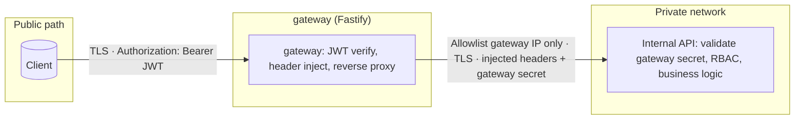
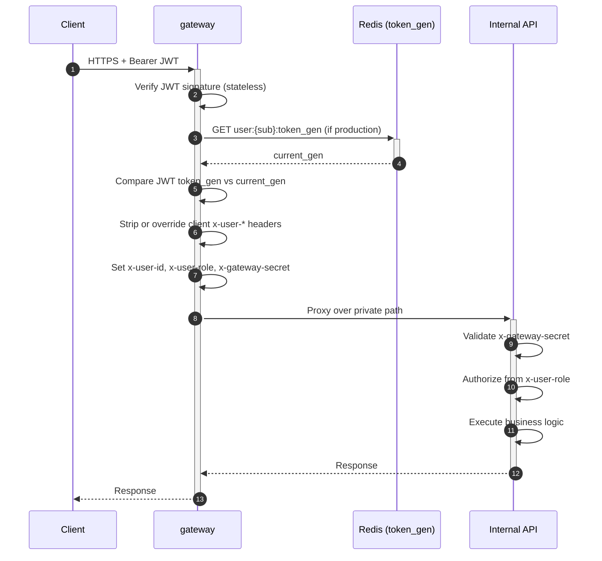
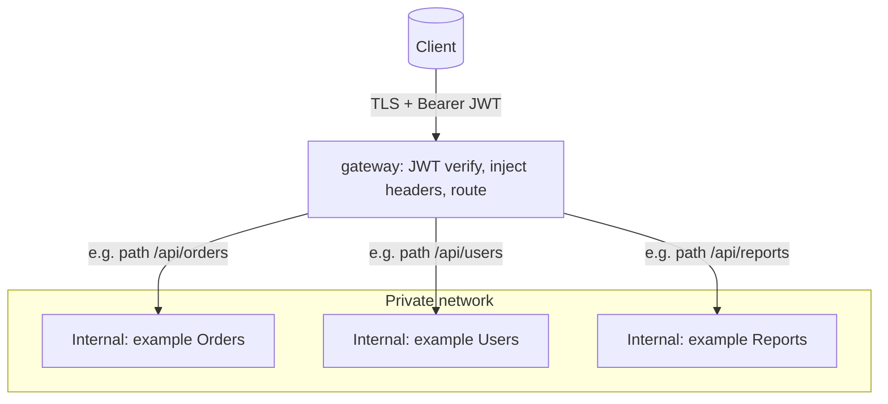
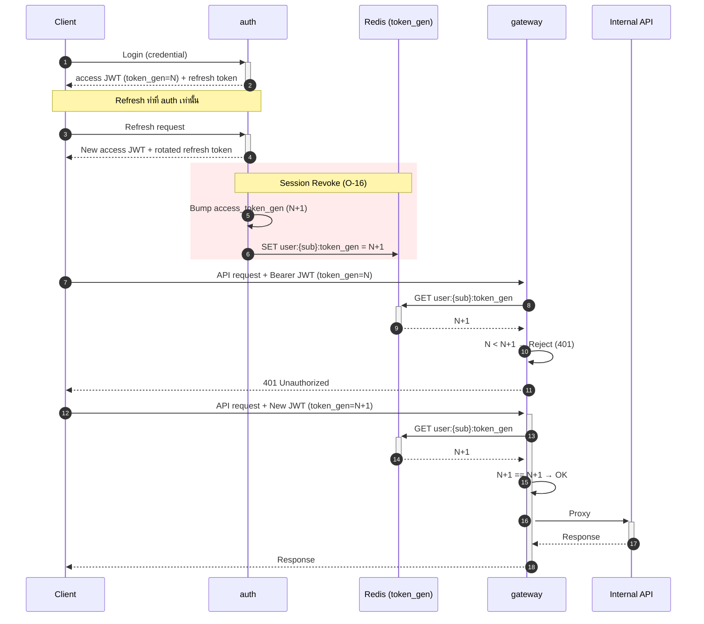

# 🏛️ zero-platform — Architecture ADR

> [!TIP]
> **TL;DR:** `auth` แจก JWT → Client ยิงหา `gateway` → `gateway` ตรวจ JWT (Stateless) + Inject Context Headers → Proxy หา Internal API → Internal API ตรวจ `x-gateway-secret` ก่อนทำงานเสมอ

## 1. System Flow & Trust Boundary

**Trust Boundary:** Internal API จะเชื่อถือ Request **ก็ต่อเมื่อ** มาจาก `gateway` (Private Network) และ `x-gateway-secret` ถูกต้องเท่านั้น ห้ามเชื่อ Client โดยตรง

1. **Client** ส่ง Request พร้อม `Bearer <JWT>`
2. **`gateway`**:
   - ตรวจ Signature ของ JWT
   - **(O-16):** ตรวจ `token_gen` กับ Redis ว่าไม่ถูก Revoke (ถ้าอยู่ในโหมด Production)
   - ลบ/เขียนทับ `x-user-*` headers เพื่อป้องกัน Client ปลอมแปลง
   - แนบ `x-gateway-secret` และ Proxy ไปยัง Internal API
3. **Internal API**:
   - ตรวจ `x-gateway-secret` ก่อนเริ่มทำงานเสมอ
   - ใช้ `x-user-*` (เช่น `x-user-id`, `x-user-role`) เป็น User Context ในการตรวจสอบสิทธิ์ต่อไป

## 2. Components Overview

### 🛡️ `gateway`

- **Stack:** Fastify (Exceptions: รองรับ Throughput สูง, ESM)
- **Rules:**
  - Verify JWT ผ่าน **JWKS** เท่านั้น
  - ห้าม Forward `Authorization` header ไปที่ Internal
  - ตั้งค่า Timeout ป้องกันการค้าง; ถ้าเชื่อมต่อไม่ได้ตอบ `502`/`504`; ถ้า Secret ผิดตอบ `403`

### ⚙️ Internal APIs (เช่น `service-demo`, `items`)

- **Rules:**
  - ห้าม Verify JWT ซ้ำ (ถือว่า Gateway ทำแล้ว)
  - ตรวจสอบ `x-gateway-secret` **ทุกครั้ง**
  - จัดการ Authorization (เช่น RBAC) จาก `x-user-role` เองตาม Business Logic

## 3. Diagrams

แผนภาพด้านล่าง render ได้ใน GitHub, GitLab, VS Code / Cursor (Markdown preview) และ tools ที่รองรับ [Mermaid](https://mermaid.js.org/)

### 3.1 Trust zones & components

### 3.2 Request sequence

### 3.3 Multiple internal services (routing)

เมื่อมีหลาย internal service `gateway` จะทำหน้าที่รวม **auth ไว้จุดเดียว** แล้ว **กระจายตาม route แบบ path-based (`prefix`)** — upstream ทุกตัว **ต้อง** ตรวจ `x-gateway-secret` และทำ authorization ตาม section 3 (Internal API) เหมือนกัน; ใน ADR นี้ **ใช้ secret ชุดเดียวกันทุก upstream** และหากจะเปลี่ยนเป็น secret คนละตัวต่อ service **ต้อง** ทำ decision แยก

ในทางปฏิบัติ ลูกศรทุกเส้นจาก `gateway` ไป internal จะแนบ **ชุด header เดียวกัน** (user context + gateway secret) ตามที่ `gateway` inject หลัง verify JWT แล้ว

### 3.4 Self-hosted IdP: `auth` + `gateway` (ภาพรวม)

_(รายละเอียด IdP, การหมุน Token และ Revocation แบบเต็มอยู่ที่ [`auth` SoT](./auth/docs/architecture.md))_
