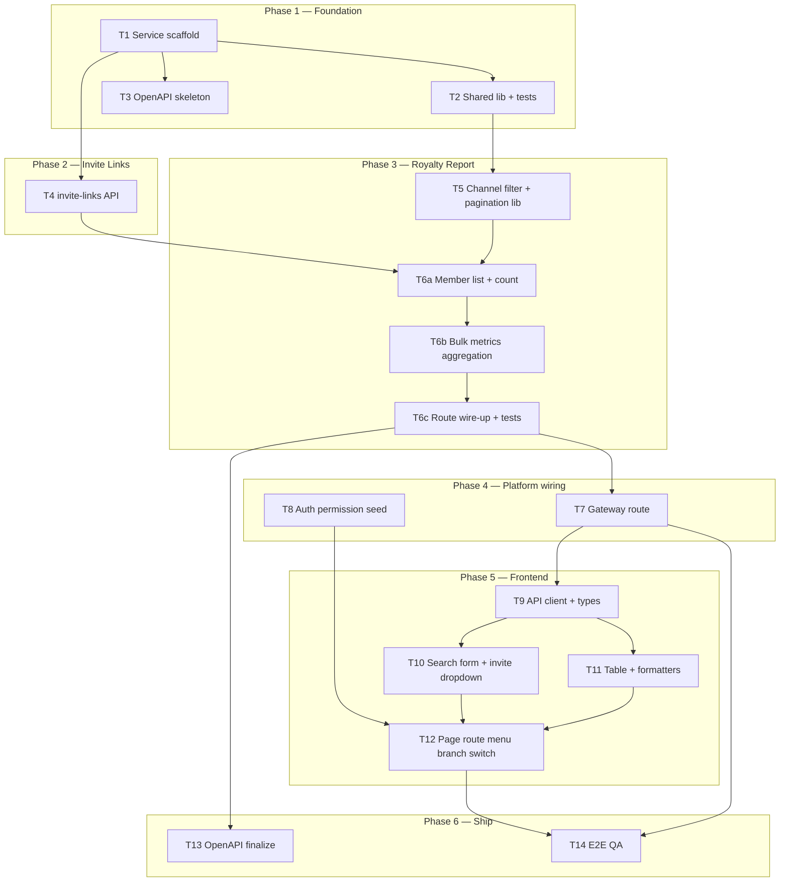
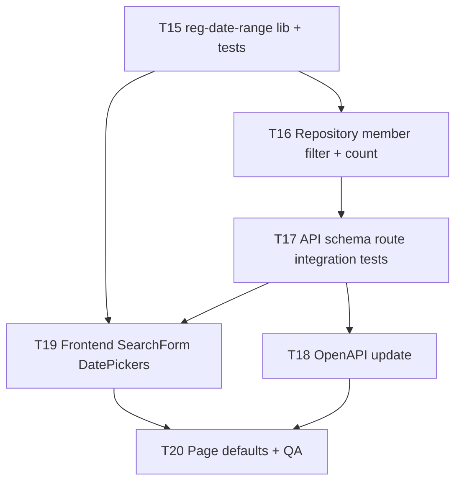

# Implementation Plan: Royalty 21 Times (Branch Report)

> Based on: [_mission-control/SPEC.md](../SPEC.md)  
> Date: 2026-06-29 · **Updated after plan review** · **Phase 7 added 2026-06-29** (reg-date filter)  
> Status: **Phase 1–6 shipped** · **Phase 7 awaiting human approval**

---

## Overview

Deliver **Royalty 21 Times** — a per-member lifetime marketing report scoped to the navbar active branch. Work spans a new **`branch-report`** Fastify service (2 read APIs + MongoDB aggregation), gateway routing, auth permission seed, and a backoffice page under **Branch Report → Marketing → Channel Performance**.

Strategy: **vertical slices** where possible — each slice is testable before moving on. Highest risk (royalty aggregation) is isolated in Phase 3 after invite-links proves the service shell works. **T6 split into T6a/T6b/T6c** to avoid an oversized task and enforce bulk aggregation (no N+1).

---

## Architecture Decisions

| Decision | Rationale |
|---|---|
| New service `branch-report` | Report domain separate from invoice/smart-report; own deploy lifecycle |
| Modular vertical slices (`src/modules/*`) | Matches `coding-standard/backend/2-folder-structure.md` |
| Single MongoDB DB + `ou_id`/`branch_id` filter | Confirmed in spec; no per-branch DB switching |
| Gateway-only client access | Security; JWT → `x-user-*` headers |
| Response: `data[]` + top-level `pagination` | `coding-standard/backend/6-api-response-codes.md` |
| Aggregation in repository layer | Keep service thin; controller handles envelope only |
| **Bulk metrics per page (no N+1)** | Paginate members first; aggregate deposits/withdraw for `$in: [memIds]` in one pass per collection |
| **Backend permission (phase 1)** | Gateway JWT + frontend `ProtectedRoute` guard; add `x-user-permissions` middleware **only if** reference services (`agent-invoice`, `smart-report`) already do — check at T1 |
| Frontend: page + 3 components + api client | Matches SPEC; follow existing backoffice data-fetch pattern (React Query vs `useEffect` — decide at T9) |
| No auto-search on mount | Reduces accidental load on large member collections; invite-links fetch on mount OK (default channel = affiliate) |
| Frontend path | **Canonical:** `pages/branch-report/marketing/ChannelPerformancePage.tsx` (SPEC). Design doc §8 draft path differs — resolve against repo at T12 |

---

## Dependency Graph

**Critical path:** T1 → T4 → T6a → T6b → T6c → T7 → T9 → T10 → T11 → T12 → T14

**Parallel after T1:** T2, T3, T5 alongside T4; T8 alongside T7–T11 once T6c contract stable; T13 after T6c schema known

---

## Phases & Checkpoints

### Phase 1: Backend foundation

| Task | Summary | Size |
|---|---|---|
| T1 | Scaffold `branch-report` service (+ request-id, duplicate-header, error handler) | M |
| T2 | Shared lib (`response`, `constants`, `format-register`) + unit tests | S |
| T3 | `openapi.yaml` skeleton (3.1.0, both paths stubbed) | S |

**Checkpoint CP-1**
- [ ] `npm run dev` starts service; `/healthz` or `/readyz` responds
- [ ] Gateway auth plugin rejects missing `x-gateway-secret`
- [ ] Duplicate critical headers → `400 INVALID_HEADER`
- [ ] `x-request-id` propagated into response envelope
- [ ] Fastify validation errors → standard error envelope via `setErrorHandler`
- [ ] Unit tests pass for `format-register`
- [ ] OpenAPI passes org spectral rules (if configured)

---

### Phase 2: Invite links (first vertical slice)

| Task | Summary | Size |
|---|---|---|
| T4 | `GET /invite-links` full module + integration test | M |

**Checkpoint CP-2** *(direct service — gateway not wired yet)*
- [ ] curl **direct to branch-report** with `x-gateway-secret` + `x-user-ou` + `x-user-branch` returns links sorted by `inviteCode` ASC
- [ ] Query scoped to `ou_id` + `branch_id` from headers only
- [ ] Invalid/missing user context → 403 per standard
- [ ] Standard success envelope (AC-8 partial)

> Gateway E2E for invite-links re-verified at **CP-4** after T7.

---

### Phase 3: Royalty 21 Times API (highest risk)

| Task | Summary | Size |
|---|---|---|
| T5 | Channel filter builder + pagination clamp (pageSize max 100) + tests | S |
| T6a | Member query + total count + pagination (username ASC) | M |
| T6b | Bulk billin / withdraw / deposits[1–21] for page `mem_id`s | M |
| T6c | Route, controller, service orchestration + integration tests | M |

**Implementation note (T6b):** After T6a returns a page of members, fetch metrics with **`$match: { mem_id: { $in: [...] } }`** — never loop per member.

**Checkpoint CP-3**
- [ ] All 3 channel types return expected members (manual sample branch)
- [ ] Row shape: `register` DD/MM/YYYY, `deposits` length 21, `revenue = billin - withdraw - promotion`
- [ ] Pagination envelope correct; pageSize clamped at 100
- [ ] Invalid `inviteLinkId` → `INVALID_PARAM`; affiliate without `inviteLinkId` → `INVALID_PARAM`
- [ ] Invalid `channelType` enum → validation error envelope (AC-8)
- [ ] Cross-branch: different `x-user-branch` → different data (no leakage)

---

### Phase 4: Platform wiring

| Task | Summary | Size |
|---|---|---|
| T7 | Gateway `ROUTES_JSON` entry for `/api/v1/branch-report` | S |
| T8 | Auth permission seed + role assignment | S |

**Checkpoint CP-4**
- [ ] Both APIs callable through gateway with Bearer token (re-confirms CP-2 via gateway)
- [ ] User without permission blocked on frontend route (after T12)

---

### Phase 5: Frontend

| Task | Summary | Size |
|---|---|---|
| T9 | `branchReportApiClient.ts` + `branchReport.ts` types | S |
| T10 | `Royalty21SearchForm` (channel + affiliate select, load invite links) | M |
| T11 | `Royalty21Table` + `royalty21Columns.tsx` + formatter unit tests | M |
| T12 | `ChannelPerformancePage` + route + menu + branch-switch + error states | M |

**Checkpoint CP-5**
- [ ] AC-1–AC-4, AC-7, AC-9 pass in browser (manual)
- [ ] No active branch → warning `Alert`, search disabled
- [ ] API error → `message.error` (or equivalent)
- [ ] `npm test` passes formatter tests
- [ ] `npm run build` succeeds

---

### Phase 6: Complete

| Task | Summary | Size |
|---|---|---|
| T13 | Finalize `openapi.yaml` (schemas, headers, error responses) | S |
| T14 | Full E2E QA with per-AC mapping (AC-1–AC-9) | S |

**Checkpoint CP-6 (Complete)**
- [ ] All SPEC success criteria met
- [ ] Ready for code review / merge

---

## Phase 7: Registration date range filter (amendment 2026-06-29)

> **Depends on:** Phase 1–6 complete (service + UI shipped).  
> **Goal:** Add required Register From / To date pickers (default current month) and filter `member.reg_date` on the royalty API.

### Dependency graph (Phase 7)

**Critical path:** T15 → T16 → T17 → T19 → T20

| Task | Summary | Size |
|---|---|---|
| T15 | `reg-date-range.js`: parse `YYYY-MM-DD`, build UTC bounds, `from ≤ to`, `currentMonthRange()` helper + unit tests | S |
| T16 | Apply `reg_date` filter in `findMembersPage` + `countMembers` (same bounds as channel filter) + repository tests | M |
| T17 | `royalty-21-times.schema.js` required params; service passes range; integration tests (missing, invalid, inverted, happy path) | M |
| T18 | Update `openapi.yaml` query params + examples; `npm run spec:lint` | S |
| T19 | `Royalty21SearchForm`: two `DatePicker`s, required rules, default current month; types + API client params; unit tests | M |
| T20 | `ChannelPerformancePage`: serialize dates, Clear/branch-switch reset to current month; update QA doc AC-10; browser smoke | S |

**Checkpoint CP-7 (Reg-date complete)**
- [ ] API rejects missing / invalid / inverted reg dates → `400 INVALID_PARAM`
- [ ] Member list + `pagination.total` respect `reg_date` bounds (fixture or known branch sample)
- [ ] UI defaults to current month; Search blocked without dates; Clear restores defaults
- [ ] Branch switch resets reg dates to current month
- [ ] `member_referral` search completes faster than unscoped count (manual note on dev DB)
- [ ] OpenAPI + backend tests + frontend tests pass

### Risks (Phase 7)

| Risk | Mitigation |
|---|---|
| Large range still slow on `member_referral` | `reg_date` predicate on every query; propose compound index `{ ou_id, branch_id, referral, reg_date }` — **ask first** before prod |
| Local vs UTC month boundary confusion | Document D2/D3; unit test UTC bound builder; UI uses dayjs local month → `YYYY-MM-DD` strings |
| Breaking existing API clients | Required params — coordinate with any external callers (backoffice only today) |

---

## Parallelization

| Can run in parallel | Must be sequential |
|---|---|
| T2, T3, **T5** while T4 in progress | T6a after T4 + T5 |
| T8 while T7–T11 (after T6c contract frozen) | T6b after T6a; T6c after T6b |
| T10 and T11 after T9 (parallel with each other) | T10–T12 after T9 |
| T13 anytime after T6c schema known | T14 after T12 + T7 + T13 |

---

## Risks and Mitigations

| Risk | Impact | Mitigation |
|---|---|---|
| Royalty aggregation slow on large branches | High | Paginate members first (T6a); bulk `$in` queries (T6b); profile on dev DB; cap pageSize 100 |
| N+1 queries per member | High | Explicit T6b rule: one aggregation pass per collection per page |
| 21-deposit pivot complexity | Med | T6c fixture: member with 3 deposits → cols 1–3 populated |
| Reference services not in workspace | Med | Copy patterns from `coding-standard` + SPEC; compare `agent-invoice` at T1 for plugins |
| Auth permission not seeded in dev | Med | T8 seed; document dev role assignment |
| `bill_date` +7 confusion | Med | No `$dateAdd`; repository comments; fixture test in T6c |
| Frontend path mismatch (SPEC vs design §8) | Low | Resolve at T12 start against backoffice folder conventions |

---

## Open Questions

_None — all resolved in SPEC (O1–O4). Permission middleware: decide at T1 by inspecting reference services._

---

## References

- [SPEC.md](../SPEC.md)
- [docs/royalty-21-times.md](../../docs/royalty-21-times.md)
- [docs/design/royalty-21-times-ui.md](../../docs/design/royalty-21-times-ui.md)
- [erd/README.md](../../erd/README.md)
- `coding-standard/backend/4-request-headers.md`
- `coding-standard/backend/5-security-and-validation.md`

---

## Approval

- [x] Plan review completed (2026-06-29) — phase 1
- [x] Phase 1–6 implemented and QA’d
- [ ] **Phase 7 (reg-date) approved by product / tech lead**
- [ ] Ready for `/code-build` on Phase 7
