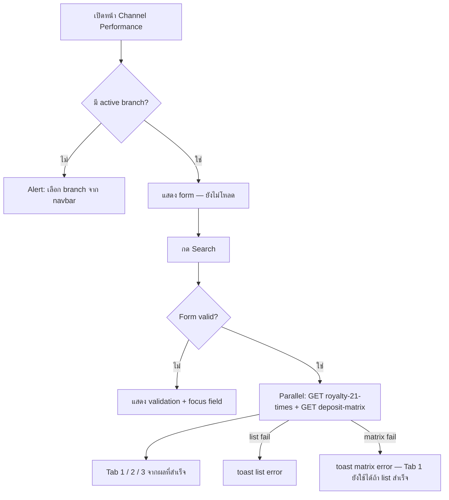

# Royalty 21 Times — Frontend UI Design

> Spec backend: [../royalty-21-times.md](../royalty-21-times.md)  
> Matrix tabs: [../../_mission-control/SPEC-deposit-matrix-tabs.md](../../_mission-control/SPEC-deposit-matrix-tabs.md)  
> **Runtime FE:** `frontend/backoffice-next` — **shadcn/ui** (`Tabs`, form filters, data-table). Historical antd snippets below are legacy reference only — do not introduce Ant Design Tabs on this page.

## 1. Page identity

| Item        | Value                                               |
| ----------- | --------------------------------------------------- |
| Report name | Royalty 21 Times                                    |
| Menu path   | **Branch Report → Marketing → Channel Performance** |
| Breadcrumb  | Branch Report / Marketing / Channel Performance     |
| Route       | `/branch-report/channel-performance`                |
| Permission  | `branch-report:marketing:channel-performance:read`  |
| UI language | English                                             |
| UI kit      | shadcn/ui (no Excel orange/pink header clone)       |

รายงาน **แยกหน้า** — ไม่รวมกับ Channel Summary / Trend 3 Months

## 2. Wireframe (with Deposit Matrix Tabs)

```
┌─ ListPageCard: Royalty 21 Times ───────────────────────────────────────────┐
│ Search form (shared) … [ Search ] [ Clear ]                                │
│ ┌ Tabs (shadcn) ─────────────────────────────────────────────────────────┐ │
│ │ [ Member detail ] [ Deposit count ] [ Deposit % ]                      │ │
│ ├────────────────────────────────────────────────────────────────────────┤ │
│ │ Tab 1: member table + pagination                                       │ │
│ │ Tab 2: Rank × 1..21 × SUM (counts)                                     │ │
│ │ Tab 3: Rank × 1..21 × SUM (percents xx.xx%)                            │ │
│ └────────────────────────────────────────────────────────────────────────┘ │
└────────────────────────────────────────────────────────────────────────────┘
```

### Mermaid — user flow (amended)



## 2b. Tabs behavior

| Rule                  | Detail                                                           |
| --------------------- | ---------------------------------------------------------------- |
| Labels                | `Member detail` · `Deposit count` · `Deposit %`                  |
| Search                | Above tabs; one criteria set for all tabs                        |
| Fetch                 | Eager parallel on Search; loading until **both** settle          |
| Clear / branch switch | Reset member table **and** matrix state                          |
| Permission            | Same `…channel-performance:read` — no new key                    |
| Component             | `DepositMatrixTable` under `components/branch-report/marketing/` |

---

## 3. Legacy Ant Design component map (reference only)

> Prefer `backoffice-next` patterns (`Royalty21SearchForm`, `Royalty21Table`, `@/components/ui/tabs`).

### 3.1 Page container (legacy antd sketch)

```tsx
<Card
  title={
    <Typography.Title level={4} style={{ margin: 0 }}>
      Royalty 21 Times
    </Typography.Title>
  }
  bordered={false}
>
  {/* SearchForm + Tabs: Member detail | Deposit count | Deposit % */}
</Card>
```

- Search อยู่เหนือ tabs; ใช้ shadcn `Tabs` / `TabsList` / `TabsTrigger` / `TabsContent`

### 3.2 Search form

| Field          | Component     | Props สำคัญ                                                               |
| -------------- | ------------- | ------------------------------------------------------------------------- |
| Channel Type   | `Radio.Group` | `optionType="button"`, `block={false}`, `options` 3 รายการ                |
| Affiliate Link | `Select`      | `showSearch`, `optionFilterProp="label"`, `loading`, `allowClear={false}` |
| Search         | `Button`      | `type="primary"`, `htmlType="submit"`                                     |
| Clear          | `Button`      | `htmlType="reset"` — reset form + ล้าง table                              |

```tsx
<Form
  form={form}
  layout="horizontal"
  labelCol={{ flex: "140px" }}
  wrapperCol={{ flex: 1 }}
  onFinish={handleSearch}
  initialValues={{ channelType: "affiliate_link" }}
>
  <Form.Item
    name="channelType"
    label="Channel Type"
    rules={[{ required: true, message: "Please select channel type" }]}
  >
    <Radio.Group
      optionType="button"
      options={[
        { label: "Affiliate Link", value: "affiliate_link" },
        { label: "Member Referral", value: "member_referral" },
        { label: "Direct", value: "direct" },
      ]}
      onChange={() => form.setFieldValue("inviteLinkId", undefined)}
    />
  </Form.Item>

  <Form.Item
    noStyle
    shouldUpdate={(prev, cur) => prev.channelType !== cur.channelType}
  >
    {({ getFieldValue }) =>
      getFieldValue("channelType") === "affiliate_link" ? (
        <Form.Item
          name="inviteLinkId"
          label="Affiliate Link"
          rules={[{ required: true, message: "Please select affiliate link" }]}
        >
          <Select
            showSearch
            placeholder="Select affiliate link"
            optionFilterProp="label"
            options={inviteLinkOptions}
            loading={inviteLinksLoading}
            style={{ minWidth: 320 }}
          />
        </Form.Item>
      ) : null
    }
  </Form.Item>

  <Form.Item wrapperCol={{ offset: 140 }}>
    <Flex gap="middle">
      <Button type="primary" htmlType="submit" loading={tableLoading}>
        Search
      </Button>
      <Button htmlType="reset" onClick={handleClear}>
        Clear
      </Button>
    </Flex>
  </Form.Item>
</Form>
```

**Conditional field:** ใช้ `Form.Item` + `shouldUpdate` — affiliate dropdown แสดงเฉพาะ `channelType === 'affiliate_link'`

**Radio vs Select:** antd แนะนำ `Radio` เมื่อ options < 5 — Channel Type มี 3 ค่า

### 3.3 Result table

**28 คอลัมน์:** Username, Register, Billin, Withdraw, Promotion, Revenue, 1–21

| กลุ่ม    | คอลัมน์   |   width | fixed  | align | format                            |
| -------- | --------- | ------: | ------ | ----- | --------------------------------- |
| Identity | Username  |     140 | `left` | left  | text                              |
| Identity | Register  |     110 | `left` | left  | `DD/MM/YYYY` จาก API              |
| Summary  | Billin    |     110 | —      | right | ตัวเลข + ทศนิยม 2                 |
| Summary  | Withdraw  |     110 | —      | right | ตัวเลข                            |
| Summary  | Promotion |     100 | —      | right | **`-`** (phase 1 — ไม่ใช้ค่า API) |
| Summary  | Revenue   |     110 | —      | right | ทศนิยม 2 ตลอด                     |
| Deposits | 1 … 21    | 80 each | —      | right | `0` → **`-`**                     |

```tsx
<Table<Royalty21Row>
  rowKey="username"
  size="small"
  bordered
  loading={tableLoading}
  columns={columns}
  dataSource={rows}
  pagination={{
    current: page,
    pageSize,
    total,
    showSizeChanger: true,
    pageSizeOptions: ["20", "50", "100"],
    showTotal: (t) => `Total ${t} members`,
  }}
  scroll={{ x: "max-content", y: "calc(100vh - 320px)" }}
  sticky
  locale={{
    emptyText: hasSearched ? (
      <Empty description="No members found for selected channel" />
    ) : (
      <Empty description="Select channel and click Search" />
    ),
  }}
  onChange={handleTableChange}
/>
```

**Pattern จาก antd Table demo `fixed-columns-header`:**

- `scroll.x: 'max-content'` — คอลัมน์ 1–21 เลื่อนแนวนอน
- `fixed: 'left'` ที่ Username (+ Register ถ้าต้องการ)
- `sticky` — header ติดด้านบนเมื่อ scroll แนวตั้ง
- `size="small"` — แสดงข้อมูลหนาแน่น

**Pattern จาก antd Table demo `ajax`:**

- `loading` บน Table
- `pagination` controlled — `onChange` ส่ง `page` / `pageSize` ไป API
- ไม่ sort ฝั่ง client รอบแรก (API default `username ASC`)

### 3.4 Column builder (deposits 1–21)

```tsx
const depositColumns: ColumnsType<Royalty21Row> = Array.from(
  { length: 21 },
  (_, i) => ({
    title: String(i + 1),
    dataIndex: ["deposits", i],
    key: `deposit_${i + 1}`,
    width: 80,
    align: "right" as const,
    render: (value: number | undefined) => formatDeposit(value ?? 0),
  }),
);
```

## 4. Data & API integration

### 4.1 Endpoints

| Action        | Method | Path                                     | Notes                                       |
| ------------- | ------ | ---------------------------------------- | ------------------------------------------- |
| Invite links  | GET    | `/api/v1/branch-report/invite-links`     | active branch scope; sort `invite_code` ASC |
| Search report | GET    | `/api/v1/branch-report/royalty-21-times` | paginated                                   |

Standard envelope: `{ success, code, message, data, requestId }` — ดู [backend spec](../royalty-21-times.md)

**Invite link option mapping:**

```typescript
// label: "{inviteCode} — {username}"
options={links.map((l) => ({
  value: l.id,
  label: `${l.inviteCode} — ${l.username}`,
}))}
```

### 4.2 Query params (search)

```typescript
interface Royalty21Query {
  channelType: "affiliate_link" | "member_referral" | "direct";
  inviteLinkId?: string; // required when affiliate_link
  page?: number; // default 1
  pageSize?: number; // default 50, max 100
}
```

**ไม่ส่ง `branchId`** — branch มาจาก JWT ผ่าน gateway

### 4.3 Response mapping

```typescript
interface ApiEnvelope<T> {
  success: boolean;
  code: string; // "SUCCESS" | "INVALID_PARAM" | ...
  message: string | null;
  data: T;
  pagination?: { page: number; pageSize: number; total: number };
  requestId: string;
}

interface InviteLinkItem {
  id: string;
  inviteCode: string;
  username: string;
  description: string;
}

interface Royalty21Row {
  username: string;
  register: string;
  billin: number;
  withdraw: number;
  promotion: number;
  revenue: number;
  deposits: number[];
}

// GET royalty-21-times → data: Royalty21Row[], pagination: { page, pageSize, total }
// GET invite-links     → data: InviteLinkItem[] (no pagination)
```

### 4.4 React Query / fetch pattern

```typescript
const { data, isLoading, error, refetch } = useQuery({
  queryKey: ["royalty-21-times", searchParams, page, pageSize],
  queryFn: async () => {
    const res = await branchReportApi.getRoyalty21Times({
      ...searchParams,
      page,
      pageSize,
    });
    return { rows: res.data, pagination: res.pagination };
  },
  enabled: hasSearched,
});
```

เมื่อ user เปลี่ยน branch จาก navbar → **reset form, clear table, reload invite links**, แสดง message info "Branch changed — please search again"

## 5. UI states

| State            | แสดงผล                                                              |
| ---------------- | ------------------------------------------------------------------- |
| Initial          | Form พร้อม, Tabs ว่าง, empty “Run Search to load report”            |
| Validation error | inline / toast + focus invalid field                                |
| Loading (search) | Search disabled/loading จนกว่า list **และ** matrix settle           |
| Success + data   | Tab 1 table + pagination; Tabs 2–3 matrix                           |
| Success + empty  | Empty “No members…” / zero matrix                                   |
| API error        | toast แยก list vs matrix (partial failure OK)                       |
| No active branch | warning Alert — select branch from navbar                           |
| Branch switched  | Clear results + matrix, info “Branch changed — please search again” |

## 6. Formatting & locale

UI labels: **English**

```typescript
/** Billin, Withdraw, Revenue — ทศนิยม 2 ตลอด */
function formatSummary(value: number): string {
  return value.toLocaleString("en-US", {
    minimumFractionDigits: 2,
    maximumFractionDigits: 2,
  });
}

/** คอล. 1–21: ค่า 0 → "-" */
function formatDeposit(value: number): string {
  if (value === 0) return "-";
  return formatSummary(value);
}

/** Promotion phase 1: แสดง "-" เสมอ */
function formatPromotion(): string {
  return "-";
}
```

- Register: แสดง string จาก API ตรงๆ (`DD/MM/YYYY`, UTC date)
- Default Channel Type: `affiliate_link` (`initialValues`)

## 7. Accessibility & UX notes

- `Form.Item` label ชัดเจน — Channel Type required mark
- Affiliate `Select`: `showSearch` + `optionFilterProp="label"` (antd FAQ — ใช้ label filter เมื่อใช้ `options` prop)
- Table wide: horizontal scroll + fixed Username — ผู้ใช้ไม่หลงในคอล. 1–21
- ไม่ auto-search on mount — ลด load MongoDB โดยไม่จำเป็น
- `scrollToFirstRowOnChange` (Table prop) — optional เมื่อ paginate

## 8. File structure (frontend)

```
frontend/backoffice-next/src/
  views/branch-report/marketing/
    ChannelPerformancePage.tsx
  components/branch-report/marketing/
    Royalty21SearchForm.tsx
    Royalty21Table.tsx
    DepositMatrixTable.tsx       # count | percent modes
    royalty21Columns.tsx
  lib/
    branchReportApiClient.ts     # getRoyalty21Times, getDepositMatrix, getInviteLinks
  types/
    branchReport.ts
```

## 9. Out of scope (UI รอบแรก)

- Export Excel
- Username search / filter
- Column sort ฝั่ง client (รอ backend รองรับ `sortBy`)
- Branch dropdown ในหน้า
- Promotion column จริง (phase 2 — ตอนนี้แสดง `-` เสมอ)
- Cost metrics

## 10. Decisions log (confirmed)

| ID  | Decision                                                              |
| --- | --------------------------------------------------------------------- |
| B1  | `GET /invite-links` — fields: `inviteCode`, `username`, `description` |
| B2  | Active branch scope; sort `invite_code` ASC                           |
| B3  | Standard API envelope (`SUCCESS`, `data` + `pagination`)              |
| F1  | Menu: Branch Report → Marketing → Channel Performance                 |
| F2  | Dropdown label: `{inviteCode} — {username}`                           |
| F3  | Deposit col `0` → `-`                                                 |
| F4  | antd default table header                                             |
| F5  | Promotion → `-`                                                       |
| F6  | Billin/Withdraw/Revenue → 2 decimal places                            |
| F7  | English UI                                                            |
| X1  | Promotion phase 1 = `-`                                               |
| X2  | Branch switch → reset + reload invite links                           |
| X3  | Default channel = `affiliate_link`                                    |
| O1  | Gateway `/api/v1/branch-report` → `branch-report:PORT`                |
| O2  | Permission `branch-report:marketing:channel-performance:read`         |
| O3  | pageSize default 50, max 100 (clamp)                                  |
| O4  | OpenAPI `openapi.yaml` at service root                                |

## 11. Reference

- Backend spec: [../royalty-21-times.md](../royalty-21-times.md)
- Ant Design Table server-side: [ajax demo](https://ant.design/components/table#table-demo-ajax)
- Ant Design Table fixed columns: [fixed-columns-header demo](https://ant.design/components/table#table-demo-fixed-columns-header)
- Navbar branch: `AuthContext.switchBranch` → `POST /auth/me/active-branch`
