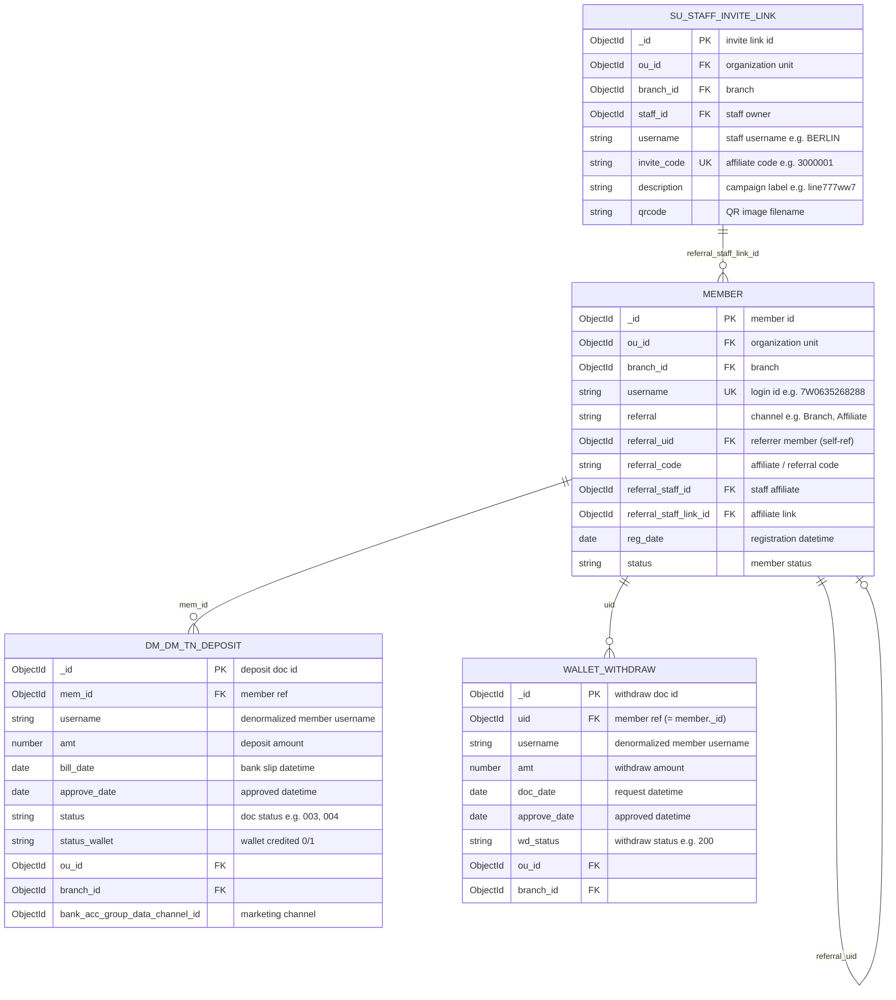

# gpp_777ww — ERD & Data Dictionary

> Database: **gpp_777ww** (MongoDB) — **DB เดียว** สำหรับทุก branch ใน cluster  
> Tenant scope: filter **`ou_id` + `branch_id`** จาก active branch (JWT/gateway) ทุก query  
> Scope: `member`, `su_staff_invite_link`, `dm_dm_tn_deposit`, `wallet_withdraw`  
> Generated: 2026-06-29 from live schema sampling (n=100 per collection)

## Database connection (branch-report service)

| Aspect | Decision |
|---|---|
| Connection | `MONGODB_URI` + `MONGODB_DB_BRANCH` (env คงที่ เช่น `gpp_777ww`) |
| Per-branch DB | **ไม่ใช้** — ไม่ lookup/switch DB ตาม navbar |
| Tenant isolation | `{ ou_id, branch_id }` จาก `request.userContext` ในทุก query |

```javascript
// base scope — ใส่ทุก $match ที่อ่าน branch data
{
  ou_id: ObjectId(userContext.ouId),
  branch_id: ObjectId(userContext.branchId),
}
```

## Collection overview

| Collection | Documents | Role |
|---|---:|---|
| `member` | 5,398,283 | สมาชิก — ข้อมูลลงทะเบียน, referral channel, profile |
| `su_staff_invite_link` | 2,982 | Affiliate invite link ของ staff (BO) |
| `dm_dm_tn_deposit` | 18,765,956 | รายการฝากเงิน (Bill In) |
| `wallet_withdraw` | 3,296,570 | รายการถอนเงิน (Withdraw) |

## Recommended indexes (Royalty 21 Times)

> ยังไม่ deploy บน Atlas — ใช้เป็นแผนสำหรับ DBA / ops เมื่อ query ช้า

**`member`** — list + count + sort by `username`:

```javascript
// member_referral / direct
{ ou_id: 1, branch_id: 1, referral: 1, reg_date: 1, username: 1 }

// affiliate_link
{ ou_id: 1, branch_id: 1, referral_staff_link_id: 1, reg_date: 1, username: 1 }
```

**`dm_dm_tn_deposit`** / **`wallet_withdraw`** — bulk metrics ต่อหน้า:

```javascript
{ ou_id: 1, branch_id: 1, mem_id: 1, status: 1 }       // deposits
{ ou_id: 1, branch_id: 1, uid: 1, wd_status: 1 }       // withdraws
```

**`su_staff_invite_link`** — dropdown:

```javascript
{ ou_id: 1, branch_id: 1, invite_code: 1 }
```

## Entity relationship diagram



## Key relationships

| From | Field | To | Field | Cardinality | Notes |
|---|---|---|---|:---:|---|
| `dm_dm_tn_deposit` | `mem_id` | `member` | `_id` | N:1 | ฝากของสมาชิก; `mem_id` อาจเป็น `null` กรณียัง match สมาชิกไม่ได้ |
| `wallet_withdraw` | `uid` | `member` | `_id` | N:1 | ถอนของสมาชิก |
| `member` | `referral_uid` | `member` | `_id` | N:1 | Member referral (สมาชิกแนะนำสมาชิก) |
| `member` | `referral_staff_link_id` | `su_staff_invite_link` | `_id` | N:1 | Affiliate invite link ที่สมาชิกสมัครผ่าน |
| `member` | `referral_staff_id` | `su_staff_invite_link` | `staff_id` | N:1 | Staff เจ้าของ link (denormalized บน member) |
| `su_staff_invite_link` | `staff_id` | *(external)* | — | N:1 | BO staff user |
| `dm_dm_tn_deposit` | `ou_id`, `branch_id` | `member` | `ou_id`, `branch_id` | — | Org scope ร่วมกัน |
| `wallet_withdraw` | `ou_id`, `branch_id` | `member` | `ou_id`, `branch_id` | — | Org scope ร่วมกัน |

## Branch Report mapping (Marketing Channel Performance)

> **3 รายงานแยกกัน** — แต่ละรายงานมี spec ไฟล์ของตัวเองใน [docs/](../docs/)

| รายงาน | Spec | สถานะ |
|---|---|---|
| Royalty 21 Times | [royalty-21-times.md](../docs/royalty-21-times.md) | confirmed |
| Channel Summary (Matrix 1) | [channel-summary.md](../docs/channel-summary.md) | outline |
| Trend 3 Months (Matrix 2) | [trend-3-months.md](../docs/trend-3-months.md) | concept |

### Royalty 21 Times

| Report metric | Primary source | Join / filter hints | Phase |
|---|---|---|---|
| Royalty 21 Times | `member` ⋈ deposits | ดู [royalty-21-times.md](../docs/royalty-21-times.md) | **1** |

### Channel Summary (Matrix 1)

| Report metric | Primary source | Join / filter hints | Phase |
|---|---|---|---|
| Bill In (Deposit Amount) | `dm_dm_tn_deposit` | `status` สำเร็จ; sum `amt` by `bill_date` **(+7 stored)** | **2** |
| Revenue | derived | Bill In − Withdraw per channel/month | **2** |
| Register Count | `member` | `reg_date` by month **(UTC)**; group by channel | **2** |
| Member Bill In | `dm_dm_tn_deposit` | count distinct `mem_id` where `status` สำเร็จ; วันที่จาก `bill_date` (+7 stored) | **2** |
| Member Royalty | derived | TBD — Deposit Count / Deposit Day Count | **2** |
| Cost* / Register Cost* / Cost Bill In* / Rev/Cost* | — | ข้าม | 3 |
| Affiliate Link grouping | `member` ⋈ `su_staff_invite_link` | `referral_staff_link_id = su_staff_invite_link._id` | **2** |
| Member Referral grouping | `member` | `referral_uid` not null | **2** |
| Direct grouping | `member` | `referral = "Branch"` | **2** |

### Trend 3 Months (Matrix 2) — out of scope

| Report metric | Notes |
|---|---|
| Bill In 1/2/3, Revenue 1/2/3 | เดือน M, M-1, M-2 |
| Rev/Cost 1, 1+2, 1+2+3 | ต้องมี Cost* ก่อน |

### Shared rules (ทุกรายงาน)

| Metric | Source | Filter |
|---|---|---|
| Withdraw | `wallet_withdraw` | `wd_status = "200"`; `approve_date` **(UTC)** |

## Success status filters (Branch Report)

ใช้ filter นี้เมื่อคำนวณ Bill In, Withdraw, Revenue และ metrics ที่ derive จากยอดเงิน

### Deposit — `dm_dm_tn_deposit.status` = สำเร็จ

```javascript
const DEPOSIT_SUCCESS_STATUS = ["001", "002", "004", "006", "007", "008", "009", "010"];
// { status: { $in: DEPOSIT_SUCCESS_STATUS } }
```

| Code | ใช้ใน report |
|---|---|
| `001`, `002`, `004`, `006`, `007`, `008`, `009`, `010` | นับเป็น deposit สำเร็จ (Bill In) |

### Withdraw — `wallet_withdraw.wd_status` = สำเร็จ

```javascript
const WITHDRAW_SUCCESS_STATUS = "200";
// { wd_status: WITHDRAW_SUCCESS_STATUS }
```

| Code | ใช้ใน report |
|---|---|
| `200` | นับเป็น withdraw สำเร็จ |

## Search Criteria

> รายละเอียดเต็มอยู่ใน spec แต่ละรายงาน — สรุปด้านล่าง

### Royalty 21 Times

| Criteria | Source | Notes |
|---|---|---|
| **Branch (active)** | `x-user-ou` + `x-user-branch` | **ไม่รับ query param** — จาก JWT/navbar via gateway |
| Channel Type | query `channelType` | `affiliate_link` \| `member_referral` \| `direct` |
| Affiliate Link | query `inviteLinkId` | required เมื่อ affiliate |

**Member filter**

| channelType | MongoDB filter |
|---|---|
| `affiliate_link` | `{ referral_staff_link_id: inviteLinkId }` |
| `member_referral` | `{ referral: "Member" }` |
| `direct` | `{ referral: "Branch" }` |

ทุก query บังคับ scope: `{ ou_id, branch_id }` จาก `request.userContext`

> **ไม่ใช้ Report Month** — lifetime metrics

### Active branch flow (navbar → API)

```
Navbar Select → POST /auth/me/active-branch
             → JWT claims: ou_id, branch_id (active), home_branch_id
             → Authorization: Bearer <JWT>
             → Gateway inject: x-user-ou, x-user-branch, x-user-id, ...
             → branch-report userContext plugin
```

Reference: `frontend/backoffice/src/contexts/AuthContext.tsx` · `backend/gateway/src/plugins/inject-context.js` · `backend/service/smart-report/src/plugins/user-context.js`

### Channel Summary

| Criteria | UI | Notes |
|---|---|---|
| Branch (active) | navbar (session) | ไม่ใช่ search field — จาก JWT/gateway headers |
| Report Month | month picker | required |
| Channel Type | multi-select | default = ทั้งหมด |
| Affiliate Link | dropdown | **ทุก link**; แสดงเมื่อเลือก Affiliate Link |

### Implicit (ทุกรายงาน)

| Rule | Value | Scope |
|---|---|---|
| Deposit สำเร็จ | `status ∈ ["001","002","004","006","007","008","009","010"]` | all |
| Withdraw สำเร็จ | `wd_status = "200"` | all |
| Direct | `referral = "Branch"` | Royalty 21 Times, Channel Summary |
| Member Referral | `referral = "Member"` | Royalty 21 Times |
| Affiliate Link | `referral_staff_link_id` only | Royalty 21 Times |
| Member status | ทุก status | Royalty 21 Times |
| Channel attribution | channel ตอนสมัคร (`member` fields) | all |

## Date & Timezone rules

> **date ทั้งหมดเป็น UTC ยกเว้น `bill_date` ที่ใน DB เป็น +7 อยู่แล้ว** — ห้าม `$dateAdd +7` ซ้ำ

| Field | Storage | May/2025 filter example | Metrics |
|---|---|---|---|
| `bill_date` | **+7 (stored)** | `$gte: 2025-05-01T00:00:00Z`, `$lt: 2025-06-01T00:00:00Z` บนค่า DB โดยตรง | Channel Summary: Bill In; Royalty 21 Times: sort คอล. 1–21 |
| `reg_date` | UTC | `$gte: 2025-05-01T00:00:00Z`, `$lt: 2025-06-01T00:00:00Z` | Channel Summary: Register Count; Royalty 21 Times: แสดง `DD/MM/YYYY` |
| `approve_date` (withdraw) | UTC | `$gte: 2025-05-01T00:00:00Z`, `$lt: 2025-06-01T00:00:00Z` | Channel Summary: Withdraw, Revenue |

```javascript
// ❌ ผิด — bill_date เป็น +7 ใน DB แล้ว
{ $dateAdd: { startDate: "$bill_date", unit: "hour", amount: 7 } }

// ✓ Bill In — filter เดือน May/2025
{ bill_date: { $gte: ISODate("2025-05-01T00:00:00Z"), $lt: ISODate("2025-06-01T00:00:00Z") } }

// ✓ Register / Withdraw — filter เดือน May/2025 (UTC)
{ reg_date: { $gte: ISODate("2025-05-01T00:00:00Z"), $lt: ISODate("2025-06-01T00:00:00Z") } }
{ approve_date: { $gte: ISODate("2025-05-01T00:00:00Z"), $lt: ISODate("2025-06-01T00:00:00Z") } }
```

> `approve_date` ของ deposit **ไม่ใช้** เป็นวันที่ report — ใช้ `bill_date` เท่านั้น

## Files

| File | Description |
|---|---|
| [erd.md](./erd.md) | ERD แบบละเอียด พร้อม index และ nested objects |
| [data-dictionary.md](./data-dictionary.md) | Data dictionary ทุก field แยกตาม collection |
| [royalty-21-times.md](../docs/royalty-21-times.md) | Spec Royalty 21 Times (confirmed) |
| [channel-summary.md](../docs/channel-summary.md) | Spec Channel Summary (outline) |
| [trend-3-months.md](../docs/trend-3-months.md) | Spec Trend 3 Months (concept) |
