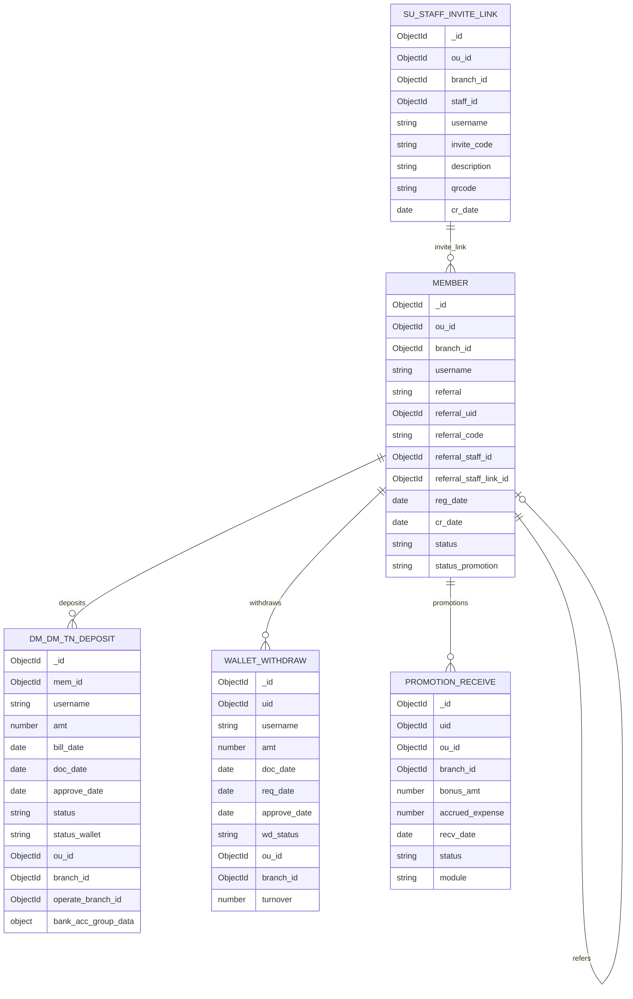

# ERD — gpp_777ww (detail)

> **Tenant scope:** DB เดียว (`gpp_777ww`) — แยก branch ด้วย `ou_id` + `branch_id` ในทุก query (จาก JWT active branch)

## Logical model

```
┌─────────────────────────────────────────────────────────────────────────────┐
│                              member                                         │
│  PK: _id                                                                    │
│  UK: ou_id + username                                                       │
├─────────────────────────────────────────────────────────────────────────────┤
│  Org:     ou_id, branch_id, agent_id                                        │
│  Profile: username, f_name, m_name, l_name, tel, email, gender, birthdate   │
│  Referral: referral, referral_uid ──► member._id (self)                   │
│            referral_code, referral_staff_id                                 │
│            referral_staff_link_id ──► su_staff_invite_link._id            │
│  Dates:   reg_date, cr_date, last_login_date                                │
│  Status:  status, status_promotion, online_status                           │
└───────┬─────────────────┬─────────────────────┬───────────────────┬───────────────────────────┘
        │ 1:N             │ 1:N                 │ 1:N               │ N:1
        │ mem_id          │ uid                 │ uid               │ referral_staff_link_id
        ▼                 ▼                     ▼                   ▼
┌───────────────────┐ ┌───────────────────┐ ┌───────────────────┐ ┌─────────────────────────────┐
│ dm_dm_tn_deposit  │ │ wallet_withdraw   │ │ promotion_receive │ │   su_staff_invite_link      │
│ PK: _id           │ │ PK: _id           │ │ PK: _id           │ │   PK: _id                   │
├───────────────────┤ ├───────────────────┤ ├───────────────────┤ ├─────────────────────────────┤
│ FK: mem_id        │ │ FK: uid           │ │ FK: uid           │ │ FK: staff_id (BO staff)     │
│ Amount: amt       │ │ Amount: amt       │ │ Amount: bonus_amt │ │ invite_code, description    │
│ Dates: bill_date  │ │ Dates: approve_   │ │ Accrued: accrued_ │ │ username (staff), qrcode    │
│   (+7 stored)     │ │   date (UTC)      │ │   expense         │ │ ou_id, branch_id            │
│ Status: status    │ │ Status: wd_status │ │ Dates: recv_date  │ └─────────────────────────────┘
└───────────────────┘ └───────────────────┘ │   (UTC)           │
                                            │ Status: status    │
                                            │ Module: module    │
                                            │   (promotion|point)│
                                            └───────────────────┘
```

## Mermaid (field-level)



## Nested / embedded documents

### member.external

```
external
└── promotion
    ├── status   (string)  e.g. "200"
    └── date     (date)
```

### dm_dm_tn_deposit.exchange_rate

```
exchange_rate
├── currency                  (string)
├── source_amt                (number)
├── target_amt                (number)
├── buying_rate               (number)
├── selling_rate              (number)
└── ref_id_setting_currency   (ObjectId)
```

### dm_dm_tn_deposit.bank_acc_group_data

```
bank_acc_group_data
├── group_id    (ObjectId[] | null)
└── channel_id  (ObjectId)   ← marketing channel for deposit routing
```

### wallet_withdraw.length_date

```
length_date
├── date_from  (date)
├── date_to    (date)
└── type       (string[])
```

### wallet_withdraw.lock_in_out[]

```
lock_in_out[]
├── _id, ref_id, type, game_comp, game_id, ref_wt_id
├── date_in, date_out, amt_in, amt_out
├── vb, nw, nw_diff, status, first_log, warning, hidden_freespin
```

### wallet_withdraw.detail_payment

```
detail_payment
├── transaction_id, remaining_amount, amount, status, complete, provider
└── withdraw_detail[]
    ├── id, status, amount, bill_date
    ├── from_bank, from_acc_no, from_acc_name, desc, bill_slip
```

## Indexes (query-relevant for branch report)

### member

| Index                            | Fields                     | Report use                     |
| -------------------------------- | -------------------------- | ------------------------------ |
| `cr_date_-1`                     | cr_date ↓                  | member created timeline        |
| `ou_id_1_branch_id_1_reg_date_1` | ou_id, branch_id, reg_date | register count by branch/month |
| `referral_code_1_cr_date_-1`     | referral_code, cr_date ↓   | affiliate code performance     |
| `referral_uid_1`                 | referral_uid               | member referral tree           |
| `referral_staff_link_id_1`       | referral_staff_link_id     | affiliate link grouping        |
| `referral_staff_id_1`            | referral_staff_id          | staff affiliate                |

> Royalty 21 อ่าน `member` ด้วย `{ ou_id, branch_id, channel…, reg_date }` แล้ว **`sort({ username: 1 })`** + paginate  
> Recommended (ยังไม่ยืนยันบน Atlas):  
> `{ ou_id: 1, branch_id: 1, referral: 1, reg_date: 1, username: 1 }`  
> `{ ou_id: 1, branch_id: 1, referral_staff_link_id: 1, reg_date: 1, username: 1 }`  
> `{ ou_id: 1, branch_id: 1, referral: 1, referral_uid: 1, reg_date: 1, username: 1 }`

### dm_dm_tn_deposit

| Index                                                                                                         | Fields                           | Report use                                            |
| ------------------------------------------------------------------------------------------------------------- | -------------------------------- | ----------------------------------------------------- |
| `mem_id_1_bill_date_1_status_1`                                                                               | mem_id, bill_date, status        | per-member deposit history; Royalty 21 cols 1–21 sort |
| `mem_id_1_approve_date_1_status_1`                                                                            | mem_id, approve_date, status     | legacy index (report ใช้ `bill_date` แทน)             |
| `bill_date_1_status_1_status_wallet_1`                                                                        | bill_date, status, status_wallet | **monthly** bill-in aggregation                       |
| `ou_id_1_branch_id_1_bill_date_1__id_1`                                                                       | ou_id, branch_id, bill_date      | branch-level deposit by report date (**monthly**)     |
| `ou_id_1_branch_id_1_status_1_approve_date_1_bank_acc_group_data.group_id_1_bank_acc_group_data.channel_id_1` | …channel_id                      | deposit by marketing channel                          |

> Royalty 21 **Billin lifetime** ไม่ใช้ `bill_date` ใน `$match` — recommended: `{ ou_id: 1, branch_id: 1, mem_id: 1, status: 1 }`

### wallet_withdraw

| Index                                                           | Fields                                    | Report use                                 |
| --------------------------------------------------------------- | ----------------------------------------- | ------------------------------------------ |
| `uid_1_approve_date_1_sub_doc_type_1_wd_status_1_amt_1`         | uid, approve_date, wd_status, amt         | per-member withdraw                        |
| `approve_date_1_wd_status_1_sub_doc_type_1`                     | approve_date, wd_status                   | **monthly** withdraw aggregation (UTC)     |
| `ou_id_1_branch_id_1_approve_date_1_sub_doc_type_1_wd_status_1` | ou_id, branch_id, approve_date, wd_status | branch-level withdraw report (**monthly**) |
| `uid_1_doc_date_1_wd_status_1`                                  | uid, doc_date, wd_status                  | member withdraw timeline                   |

> Royalty 21 **Withdraw lifetime** ไม่ใช้ `approve_date` ใน `$match` — recommended: `{ ou_id: 1, branch_id: 1, uid: 1, wd_status: 1 }`

### su_staff_invite_link

| Index                 | Fields           | Report use                 |
| --------------------- | ---------------- | -------------------------- |
| `invite_code_1`       | invite_code      | lookup affiliate code      |
| `staff_id_1_ou_id_1`  | staff_id, ou_id  | links per staff            |
| `ou_id_1_branch_id_1` | ou_id, branch_id | branch-scoped invite links |

### promotion_receive

| Index (recommended)                           | Fields                                | Report use                                 |
| --------------------------------------------- | ------------------------------------- | ------------------------------------------ |
| `ou_id_1_branch_id_1_uid_1_status_1_module_1` | ou_id, branch_id, uid, status, module | per-member promotion (Royalty 21 lifetime) |
| `uid_1_recv_date_1_status_1_module_1`         | uid, recv_date, status, module        | monthly promotion by `recv_date` (UTC)     |

> Join: `member.referral_staff_link_id = su_staff_invite_link._id` (index `referral_staff_link_id_1` on member)
> Join: `promotion_receive.uid = member._id`

## Success status filters (Branch Report)

### Channel filter + member list (Royalty 21)

รายชื่อสมาชิกก่อนดึง metrics — **ไม่ filter `member.status`**

| channelType       | Filter เพิ่มจาก `ou_id` + `branch_id`            |
| ----------------- | ------------------------------------------------ |
| `affiliate_link`  | `referral_staff_link_id` = invite link           |
| `member_referral` | `referral: "Member"` + `referral_uid` (referrer) |
| `direct`          | `referral: "Branch"`                             |

- `reg_date` ในช่วง Register From–To (UTC inclusive)
- sort **`username` ASC** แล้ว paginate

### Deposit — `dm_dm_tn_deposit.status`

รายการฝากที่ถือว่า **สำเร็จ** สำหรับ Bill In / Member Bill In / Member Royalty:

```javascript
const DEPOSIT_SUCCESS_STATUS = [
  "001",
  "002",
  "004",
  "006",
  "007",
  "008",
  "009",
  "010",
];

// MongoDB filter
{
  status: {
    $in: DEPOSIT_SUCCESS_STATUS;
  }
}
```

| Code               | Report   |
| ------------------ | -------- |
| `001`              | สำเร็จ ✓ |
| `002`              | สำเร็จ ✓ |
| `004`              | สำเร็จ ✓ |
| `006`              | สำเร็จ ✓ |
| `007`              | สำเร็จ ✓ |
| `008`              | สำเร็จ ✓ |
| `009`              | สำเร็จ ✓ |
| `010`              | สำเร็จ ✓ |
| อื่นๆ (e.g. `003`) | ไม่นับ   |

> ไม่ใช้ `status_wallet` เป็นเงื่อนไขสำเร็จ — ใช้เฉพาะ `status` ตามรายการด้านบน

**`bill_date`:** ค่าใน DB เป็น **+7 อยู่แล้ว** (ห้าม `$dateAdd +7` ซ้ำ)

| ใช้ใน                    | `bill_date`                     |
| ------------------------ | ------------------------------- |
| Royalty 21 **Billin**    | **ไม่ filter** (lifetime)       |
| Royalty 21 **คอล. 1–21** | **sort ASC** เท่านั้น (`$topN`) |
| Channel Summary (อนาคต)  | filter ตามเดือน                 |

```javascript
// รายเดือน May/2025 — ใช้ค่า bill_date ใน DB โดยตรง (ไม่ใช่ Royalty 21)
{ bill_date: { $gte: ISODate("2025-05-01T00:00:00Z"), $lt: ISODate("2025-06-01T00:00:00Z") } }

// member.reg_date / withdraw.approve_date — UTC
{ reg_date: { $gte: ISODate("2025-05-01T00:00:00Z"), $lt: ISODate("2025-06-01T00:00:00Z") } }
```

### Withdraw — `wallet_withdraw.wd_status`

รายการถอนที่ถือว่า **สำเร็จ**:

```javascript
const WITHDRAW_SUCCESS_STATUS = "200";

// MongoDB filter
{
  wd_status: WITHDRAW_SUCCESS_STATUS;
}
```

| Code  | Report   |
| ----- | -------- |
| `200` | สำเร็จ ✓ |
| อื่นๆ | ไม่นับ   |

**`approve_date`:** UTC ใน DB (ไม่ offset)

| ใช้ใน                   | `approve_date`            |
| ----------------------- | ------------------------- |
| Royalty 21 **Withdraw** | **ไม่ filter** (lifetime) |
| Channel Summary (อนาคต) | filter ตามเดือน           |

```javascript
// รายเดือน May 2025 (UTC) — ไม่ใช่ Royalty 21
{ approve_date: { $gte: ISODate("2025-05-01T00:00:00Z"), $lt: ISODate("2025-06-01T00:00:00Z") } }
```

### Promotion — `promotion_receive`

รายการโปรโมชันที่ถือว่า **สำเร็จ** (คอลัมน์ Promotion ใน Royalty 21):

```javascript
const PROMOTION_SUCCESS_STATUS = "200";
const PROMOTION_MODULES = ["promotion", "point"];

// MongoDB filter
{
  status: PROMOTION_SUCCESS_STATUS,
  module: { $in: PROMOTION_MODULES },
}
```

| Field                | Notes                                                                          |
| -------------------- | ------------------------------------------------------------------------------ |
| `uid`                | = `member._id`                                                                 |
| `ou_id`, `branch_id` | มีบน DB จริง — Royalty 21 **บังคับ** ใน `$match` (tenant)                      |
| `bonus_amt`          | ยอดโบนัส                                                                       |
| `accrued_expense`    | ค่าใช้จ่ายค้าง — หักออกจากโบนัส                                                |
| `recv_date`          | **UTC** — ใช้ filter รายเดือน; Royalty 21 ใช้ **lifetime** (ไม่ filter วันที่) |
| `status`             | `"200"` = สำเร็จ                                                               |
| `module`             | นับเฉพาะ `"promotion"` \| `"point"`                                            |

**สูตร Promotion:**

```javascript
pro_amt = round(sum(bonus_amt) - sum(accrued_expense));
```

> Revenue ใน Royalty 21 = `Billin - Withdraw` (**ไม่หัก** Promotion)

```javascript
// Lifetime per member (Royalty 21)
db.promotion_receive.aggregate([
  {
    $match: {
      ou_id,
      branch_id,
      uid: { $in: memIds },
      status: "200",
      module: { $in: ["promotion", "point"] },
    },
  },
  {
    $group: {
      _id: "$uid",
      pro_amt: { $sum: "$bonus_amt" },
      pro_accrued: { $sum: "$accrued_expense" },
    },
  },
  {
    $project: {
      promotion: {
        $round: [{ $subtract: ["$pro_amt", "$pro_accrued"] }, 0],
      },
    },
  },
]);

// Monthly (เมื่อต้อง filter ช่วง) — recv_date UTC
// { recv_date: { $gte: ISODate("2025-05-01T00:00:00Z"), $lt: ISODate("2025-06-01T00:00:00Z") } }
```

### ตัวอย่าง aggregation

> **สำคัญ — สองโหมดคนละรายงาน**
>
> | โหมด         | ใช้ใน                           | filter วันที่บน deposit / withdraw / promotion                    |
> | ------------ | ------------------------------- | ----------------------------------------------------------------- |
> | **Lifetime** | Royalty 21 Times (โค้ดปัจจุบัน) | **ไม่มี** — รวมทุกธุรกรรมสำเร็จของสมาชิกที่ผ่าน `reg_date` filter |
> | **รายเดือน** | Channel Summary / Trend (อนาคต) | มี — `bill_date` / `approve_date` / `recv_date` ตามเดือน          |

#### Lifetime (Royalty 21) — ตามโค้ดปัจจุบัน

```javascript
// ไม่มี bill_date / approve_date / recv_date ใน $match
// scope: ou_id + branch_id + memIds ของหน้า (page)
// Revenue = billin - withdraw (ไม่หัก promotion)

// Billin
db.dm_dm_tn_deposit.aggregate([
  {
    $match: {
      ou_id,
      branch_id,
      mem_id: { $in: memIds },
      status: { $in: ["001", "002", "004", "006", "007", "008", "009", "010"] },
    },
  },
  { $group: { _id: "$mem_id", billin: { $sum: "$amt" } } },
]);

// Withdraw
db.wallet_withdraw.aggregate([
  {
    $match: {
      ou_id,
      branch_id,
      uid: { $in: memIds },
      wd_status: "200",
    },
  },
  { $group: { _id: "$uid", withdraw: { $sum: "$amt" } } },
]);

// คอลัมน์ 1–21 — 21 รายการแรกเรียง bill_date ASC (lifetime ฝากสำเร็จ)
db.dm_dm_tn_deposit.aggregate([
  {
    $match: {
      ou_id,
      branch_id,
      mem_id: { $in: memIds },
      status: { $in: ["001", "002", "004", "006", "007", "008", "009", "010"] },
    },
  },
  {
    $group: {
      _id: "$mem_id",
      deposits: {
        $topN: { n: 21, sortBy: { bill_date: 1 }, output: "$amt" },
      },
    },
  },
]);

// Promotion — ดูตัวอย่าง Lifetime ในหัวข้อ Promotion ด้านบน
```

#### รายเดือน (ตัวอย่าง Channel Summary — ไม่ใช่ Royalty 21)

```javascript
// Bill In by month (bill_date = +7 stored)
db.dm_dm_tn_deposit.aggregate([
  {
    $match: {
      status: { $in: ["001", "002", "004", "006", "007", "008", "009", "010"] },
      bill_date: {
        $gte: ISODate("2025-05-01T00:00:00Z"),
        $lt: ISODate("2025-06-01T00:00:00Z"),
      },
      mem_id: { $ne: null },
    },
  },
  {
    $group: {
      _id: { $dateToString: { format: "%Y-%m", date: "$bill_date" } },
      bill_in: { $sum: "$amt" },
      deposit_count: { $sum: 1 },
    },
  },
]);

// Withdraw by month (approve_date UTC)
db.wallet_withdraw.aggregate([
  {
    $match: {
      wd_status: "200",
      approve_date: {
        $gte: ISODate("2025-05-01T00:00:00Z"),
        $lt: ISODate("2025-06-01T00:00:00Z"),
      },
    },
  },
  {
    $group: {
      _id: { $dateToString: { format: "%Y-%m", date: "$approve_date" } },
      withdraw: { $sum: "$amt" },
    },
  },
]);
```

## Other status reference

| Collection          | Field           | Sample values        | Notes                                       |
| ------------------- | --------------- | -------------------- | ------------------------------------------- |
| `member`            | `status`        | `1`                  | active member                               |
| `member`            | `referral`      | `Branch`             | direct / branch registration                |
| `dm_dm_tn_deposit`  | `status_wallet` | `0`, `1`             | wallet credited flag (ไม่ใช้ filter สำเร็จ) |
| `dm_dm_tn_deposit`  | `status_msg`    | `1`                  | message/process flag                        |
| `wallet_withdraw`   | `status_msg`    | `1`                  | message/process flag                        |
| `promotion_receive` | `status`        | `200`                | สำเร็จเมื่อ `"200"`                         |
| `promotion_receive` | `module`        | `promotion`, `point` | นับในรายงานเฉพาะสองค่านี้                   |
