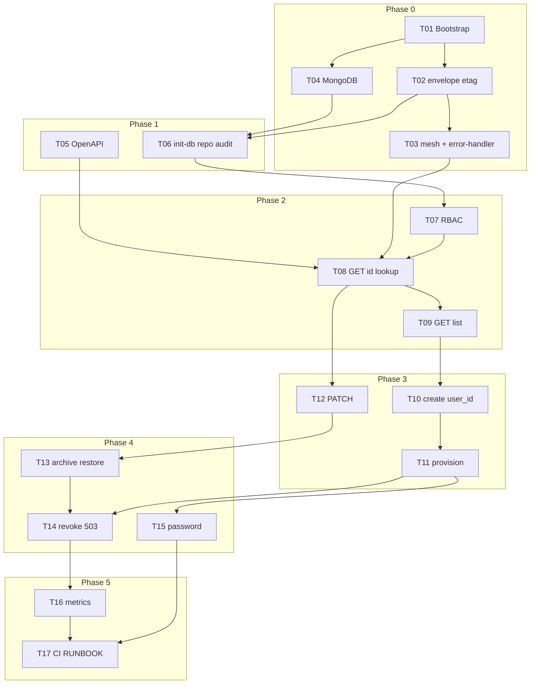

# Implementation Plan: staff service (MVP)

> **Spec:** [`../SPEC.md`](../SPEC.md)  
> **Status:** Approved for `/build` (post-review 2026-05-28)  
> **Scope:** Backend `backend/service/staff` เท่านั้น — **frontend นอกรอบนี้**

---

## Overview

Bootstrap แพ็กเกจ **staff** (Fastify + MongoDB ESM) ให้เป็น internal API จัดการ `staff_profiles` ตาม docs SoT — mesh headers จาก gateway, outbound ไป auth สำหรับ provision / password / revoke, Custom JSON envelope + OpenAPI 3.1

**Reference implementation:** `backend/service/demo-service` (structure, envelope, etag, gateway-secret, error-handler, CI scripts)  
**Outbound contract:** `backend/auth/src/modules/internal/internal.route.js`  
**Note:** `auth_audit_events` มีแค่ชื่อ collection ใน auth config — staff ต้อง implement `audit-writer` เอง (T06)

---

## Architecture Decisions

| Decision                          | Choice                                                                       | Rationale                                                                                                           |
| :-------------------------------- | :--------------------------------------------------------------------------- | :------------------------------------------------------------------------------------------------------------------ |
| **Module layout**                 | Single feature `profiles/` (route → controller → service → repository)       | MVP มี domain เดียว — [`2-folder-structure.md`](../../../../../../../coding-standard/backend/2-folder-structure.md) |
| **Plugins (not lib/middlewares)** | `src/plugins/` สำหรับ gateway, user-context, error-handler, mongodb, metrics | ตรง `demo-service` + SPEC                                                                                           |
| **DB**                            | Shared MongoDB กับ auth (`MONGODB_URI`, `DB_NAME` เดียวกัน)                  | [`database-erd.md`](../../docs/database-erd.md)                                                                     |
| **Auth boundary**                 | staff ไม่เก็บ password; `auth-internal.client.js` maps problem+json          | [`technical-architecture.md` §6](../../docs/technical-architecture.md)                                              |
| **Lookup**                        | `GET /profiles?user_id=` (ไม่ใช่ path `/by-user`)                            | Decisions ใน SPEC                                                                                                   |
| **Provision**                     | `username` + `password` แยกจาก `code`                                        | [`business-domain.md` §6.1](../../docs/business-domain.md)                                                          |
| **Concurrency**                   | ETag จาก `upd_date` + `If-Match` → 412                                       | [`database-erd.md`](../../docs/database-erd.md)                                                                     |
| **Archive failure**               | Mongo archived ก่อน; revoke fail → 503 ไม่ rollback                          | [`business-domain.md` §6.2](../../docs/business-domain.md)                                                          |
| **Error handling early**          | Global error-handler ใน T03 (ก่อน route integration)                         | ลด rework จาก review                                                                                                |
| **Contract-first**                | `openapi.yaml` + `codes.yaml` ก่อน slice ใหญ่                                | Spectral ใน CI                                                                                                      |
| **Tests**                         | `node --test`; `mesh-headers` test helper                                    | [`1-tech-stack.md`](../../../../../../../coding-standard/backend/1-tech-stack.md)                                   |

---

## Dependency Graph

**Critical path:** T01 → T02 → T03 → T04 → T06 → T08 → T10 → T11 → T14 → T17

---

## Task List (summary)

| Phase                       | Tasks   | Checkpoint                                                |
| :-------------------------- | :------ | :-------------------------------------------------------- |
| **0. Foundation**           | T01–T04 | CP0: server, healthz/readyz, mesh **401**, error envelope |
| **1. Contract & DB**        | T05–T06 | CP1: spec:lint + init:db + audit writer                   |
| **2. Read slice**           | T07–T09 | CP2: lookup + get + list                                  |
| **3. Write slice**          | T10–T12 | CP3: create + patch                                       |
| **4. Lifecycle & outbound** | T13–T15 | CP4–CP5: archive/revoke/password                          |
| **5. Hardening & ship**     | T16–T17 | CP6: metrics + `npm run ci`                               |

รายละเอียด: [`todo.md`](./todo.md) — **17 tasks** (รวม error-handler ใน T03; ไม่มี task แยก T16 เดิม)

---

## Vertical Slice Strategy

| Slice                | Tasks   | Outcome                      |
| :------------------- | :------ | :--------------------------- |
| **Read**             | T08–T09 | lookup, by-id, list + RBAC   |
| **Create link**      | T10     | profile + existing user      |
| **Create provision** | T11     | profile + auth user          |
| **Patch**            | T12     | admin + self + normalization |
| **Lifecycle**        | T13–T14 | archive/restore + revoke 503 |
| **Password**         | T15     | admin reset                  |

---

## Checkpoints

### CP0: Foundation (after T04)

- [ ] `npm run dev` — listen `:3004`
- [ ] `GET /healthz` → 200; `GET /readyz` → 200 เมื่อ Mongo up
- [ ] Business route ไม่มี secret → **401** `GATEWAY_SECRET_REJECTED`
- [ ] Validation error → 400 envelope (T03 error-handler)
- [ ] `npm run lint` ผ่าน

### CP1: Contract & persistence (after T06)

- [ ] `npm run spec:lint` ผ่าน
- [ ] `npm run init:db` — indexes 4 ตัว
- [ ] `audit-writer` insert smoke test

### CP2: Read paths (after T09)

- [ ] `GET /profiles?user_id=` — object + ETag; mixed params → 400
- [ ] `GET /profiles/{id}` — scope + 404
- [ ] `GET /profiles` list — pagination; `staff` → 403; `status=all|archived`

### CP3: Mutations (after T12)

- [ ] POST create + `user_id` → 201; reject username/password in body
- [ ] POST provision → auth → 201; username lowercase
- [ ] PATCH merge-patch + 412; own ignores `code`

### CP4: Lifecycle (after T14)

- [ ] archive/restore admin-only + audit events
- [ ] archive + revoke fail → 503 + `staff_auth_revoke_pending_total` (after T16)

### CP5: Password (after T15)

- [ ] `POST .../password` → 204; 403 own profile

### CP6: Ship-ready (after T17)

- [ ] `npm run ci` ผ่าน
- [ ] Manual gateway checklist ใน RUNBOOK
- [ ] Human sign-off

---

## Risks and Mitigations

| Risk                                | Impact | Mitigation                                               |
| :---------------------------------- | :----- | :------------------------------------------------------- |
| auth internal API ไม่ตรง docs       | High   | `internal.route.js` + integration; mock axios            |
| **No audit module in auth to copy** | Med    | T06 `audit-writer.js` + test against `auth_audit_events` |
| Shared DB — test pollution          | Med    | separate `DB_NAME` for test; truncate in harness         |
| `$lookup` + regex search ช้า        | Med    | ERD indexes; defer Atlas Search                          |
| Archive 503 partial state           | Med    | `STAFF_AUTH_REVOKE_PENDING` + metric T16                 |
| OpenAPI drift                       | Med    | update openapi in same task as route                     |
| Error handler สาย (แก้แล้ว)         | —      | รวมใน T03                                                |

---

## Open Questions

ไม่มี — ปิดใน SPEC [Decisions](../SPEC.md#decisions-resolved)

---

## Out of Scope (reminder)

- `frontend/backoffice` — แยก PR
- แก้ `gateway/routes.json` (มี `/api/v1/staff` → 3004 แล้ว)
- แก้ auth ยกเว้น bug blocking internal calls

---

## Changelog

| Date       | Author | Change                                                             |
| :--------- | :----- | :----------------------------------------------------------------- |
| 2026-05-28 | Agent  | Initial plan                                                       |
| 2026-05-28 | Agent  | Post-review: T03 +error-handler; T06 audit; 17 tasks; CP/phase fix |
