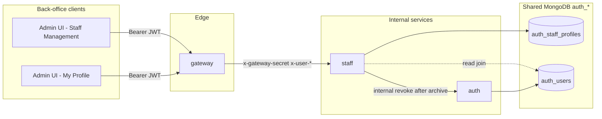
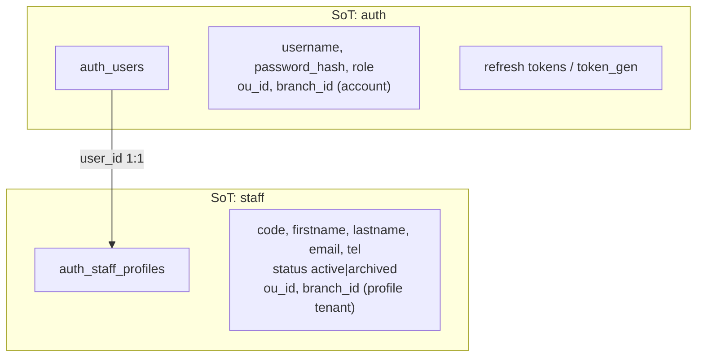
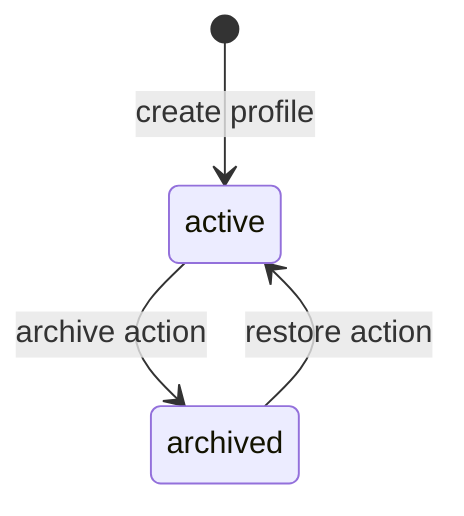
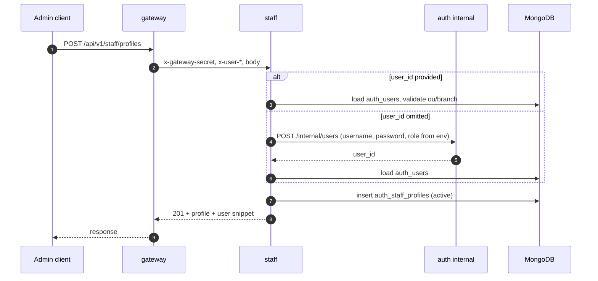
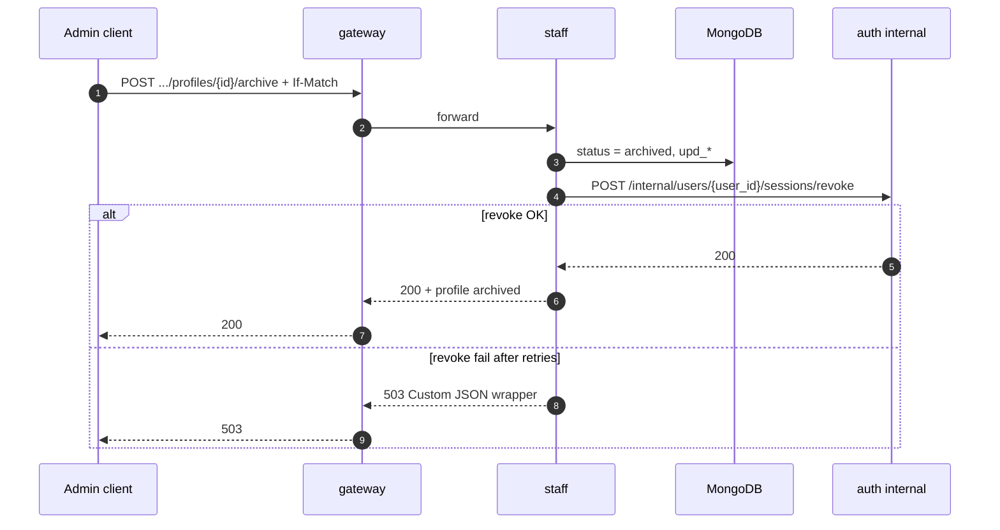
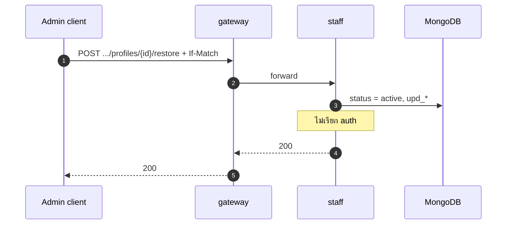
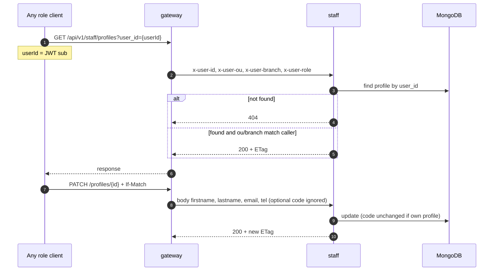

# staff — Business domain (SoT)

> **Package status:** **spec only** — ยังไม่มี `package.json`, `src/`, หรือ `openapi.yaml` ใน repo; เอกสารนี้ล็อก design intent ก่อน bootstrap

เอกสารนี้เป็น **Source of Truth ฝั่งธุรกิจ (business / product)** ของ service **`staff`** — สรุปว่าเก็บข้อมูลอะไร ใครทำอะไรได้ flow หลัก และ **รูปแบบ HTTP ที่ตั้งใจ** (รายละเอียด normative จะอยู่ที่ **`openapi.yaml`** เมื่อ bootstrap)

| ชั้น SoT | เอกสาร |
| :--- | :--- |
| **Business (ไฟล์นี้)** | ขอบเขตผลิตภัณฑ์, ฟิลด์ธุรกิจ, RBAC, lifecycle, diagrams, HTTP intent |
| **Technical design** | [`technical-architecture.md`](./technical-architecture.md) — trust boundary, mesh, outbound auth env, `src/`, operations |
| **Persistence** | [`database-erd.md`](./database-erd.md) — MongoDB, indexes, field constraints |
| **HTTP contract** | **`openapi.yaml`** (root แพ็กเกจ) — bootstrapped |

---

## 1. บทบาทและขอบเขต (MVP)

**staff** เป็น **back-office internal API** สำหรับ **admin** จัดการ **โปรไฟล์พนักงาน** ที่ผูกกับบัญชี login (`auth_users`)

| ใน scope (MVP) | นอก scope (MVP) |
| :--- | :--- |
| CRUD โปรไฟล์ (admin) | Invitations / self-signup |
| **Self-service:** อ่าน/แก้โปรไฟล์ตัวเอง (`GET ?user_id`, `PATCH` own) | แก้ `Staff Code` ตัวเอง (ละเว้น `code` เมื่อ own profile) |
| List / search / filter / sort + pagination (admin) | ย้ายสาขา (`branch_id` immutable) |
| Soft delete (`archived`) + restore (admin UI) | แก้ `role` ที่ staff |
| สร้าง profile + **provision** `auth_users` (+ **admin กำหนดรหัสเริ่มต้น**) | Hard delete แถว profile |
| **Admin:** ตั้ง/reset รหัสผ่านผ่าน staff API → auth internal | Self-service เปลี่ยนรหัส (เรียก **auth** โดยตรงจาก UI) |
| Trigger **auth** ตัด session หลัง archive | |
| Join แสดง `username`, `role` จาก auth | |



> ทุก API ธุรกิจจาก client **ผ่าน gateway** — sequence archive/restore อยู่ §6

---

## 2. แยกความรับผิดชอบข้อมูล (staff vs auth)



| ข้อมูล | เก็บที่ | staff API |
| :--- | :--- | :--- |
| บัญชี login (`username`, credential, `role`) | **auth** | อ่าน join เท่านั้น |
| โปรไฟล์พนักงาน (`code`, ชื่อ, ติดต่อ, `status`) | **staff** | create / read / update / archive / restore |
| ตัด session หลัง archive | **auth** (internal API) | staff **เรียก** หลัง persist archive |

**Login (MVP):** **`username` + password** ที่ auth — **`email` ใน profile ไม่ใช่** credential login

---

## 3. โมเดลธุรกิจ — `auth_staff_profiles`

### 3.1 ฟิลด์ (ล็อกแล้ว)

| ฟิลด์ | Required | กฎธุรกิจ |
| :--- | :---: | :--- |
| `user_id` | yes | ผูก `auth_users._id` — **หนึ่ง user หนึ่ง profile** |
| `ou_id`, `branch_id` | yes | ตรงกับ user เป้าหมาย — **immutable** หลังสร้าง |
| `status` | yes | **`active`** \| **`archived`** |
| `code` | yes | รหัสพนักงานในสาขา — **unique ต่อ (`ou_id`, `branch_id`)** |
| `firstname` | yes | ดู [§3.4](#34-validation-mvp) |
| `lastname` | yes | ดู [§3.4](#34-validation-mvp) |
| `email` | yes | ติดต่อ — **ไม่** unique ใน MVP (อนุญาตซ้ำได้) |
| `tel` | yes | ติดต่อ — normalize E.164 ตอน persist |

**ไม่เก็บใน MVP:** `display_name`, `job_title`, `department`, `employment_status`

### 3.2 จาก auth (แสดงใน API — ไม่ persist ซ้ำ)

| ฟิลด์ | ใช้ทำอะไร |
| :--- | :--- |
| `username` | อ้างอิงบัญชี + ค้นหา (`q`) |
| `role` | แสดงสิทธิ์ระบบ (`platform_admin`, `branch_admin`, `staff`, …) |

### 3.3 รูปแบบทรัพยากร (logical — ก่อน OpenAPI)

```json
{
  "id": "<profile ObjectId>",
  "user_id": "<auth_users ObjectId>",
  "ou_id": "<ObjectId>",
  "branch_id": "<ObjectId>",
  "status": "active",
  "code": "EMP-001",
  "firstname": "Somchai",
  "lastname": "Example",
  "email": "somchai@example.invalid",
  "tel": "+66812345678",
  "user": {
    "username": "somchai.e",
    "role": "staff"
  }
}
```

- **ห้าม** คืน `cr_*`, `upd_*` ใน response ตามมาตรฐานทีม
- **ETag** จาก `upd_date` — ใช้กับ **`If-Match`** บน `PATCH` และ action archive/restore ([`technical-architecture.md`](./technical-architecture.md))

### 3.4 Validation (MVP)

| ฟิลด์ | กฎ |
| :--- | :--- |
| `code` | string 1–32; trim; **unique** ภายใต้ `(ou_id, branch_id)` |
| `firstname`, `lastname` | string 1–128; trim; อย่างน้อยหนึ่งตัวอักษรหลัง trim |
| `email` | RFC 5322-style validation; max 254; **เก็บ lowercase** หลัง normalize |
| `tel` | เก็บ **E.164** (ขึ้นต้น `+` + digits); max 16 ตัวอักษรหลัง normalize |
| `status` | enum `active` \| `archived` เท่านั้น |

รายละเอียด BSON / index: [`database-erd.md`](./database-erd.md)

### 3.5 Password rules (business — normative)

รหัสผ่านเป็น SoT ของ **auth เท่านั้น** — staff **ไม่** hash / ไม่ persist `password_hash`

| Rule | Value |
| :--- | :--- |
| Minimum length | **16** characters |
| Maximum length | **256** characters |
| Complexity (MVP) | ความยาวเท่านั้น — ถ้าต้องการ uppercase/digit ให้ ADR แยก |
| Confirm field | UI ต้องมี **Confirm password** และต้องตรงกันก่อน submit |
| Transport | HTTPS only; **ห้าม** ส่ง password ใน query string |

**Admin create:** `password` required เมื่อ provision บัญชีใหม่ (ไม่ส่ง `user_id`) — ส่งต่อ auth `POST /internal/users`  
**Admin reset:** ส่ง `password` ใน `POST .../profiles/{id}/password` — ไม่ต้องรู้รหัสเดิม  
**Self-service:** ผู้ใช้เปลี่ยนรหัสตัวเองผ่าน **auth** โดยตรง (`POST /auth/me/password`) — ไม่ผ่าน staff

---

## 4. Lifecycle — `status`



| Transition | ผลทางธุรกิจ | auth |
| :--- | :--- | :--- |
| → **active** (create) | มีโปรไฟล์ใน back-office | — |
| **active** → **archived** | ออกจากระบบ (soft delete) | **revoke refresh** หลัง persist Mongo |
| **archived** → **active** | กลับมาใช้งาน | **ไม่** เปิด session เก่า — user **login ใหม่** |
| Admin **reset password** | รหัสผ่านใหม่ทันที | **revoke refresh** + bump `token_gen` — user ต้อง login ใหม่ |
| **Self change password** | รหัสผ่านใหม่ (My Profile) | เหมือนกัน — ป้องกัน session hijack หลัง compromise |
| Admin **PATCH** profile fields | แก้ข้อมูลโปรไฟล์ | **ไม่** กระทบ session |

หลัง **archive:** เรียก auth revoke — session เดิมใช้ต่อไม่ได้ (refresh ใหม่ไม่ได้จนกว่าจะ login ใหม่หลัง restore)

หลัง **restore:** **ไม่คืน** session — user ต้อง login ใหม่เอง

หลัง **password change (admin/self):** bump `token_gen` + revoke refresh tokens — access token ที่ออกก่อนหน้าใช้ไม่ได้ทันทีที่ gateway ตรวจสอบ `token_gen`

**ไม่ใช้** `deleted_at` / `deleted_by` — เวลา/actor ใช้ **`upd_*`** + `auth_audit_events`

---

## 5. HTTP operations (intent — ก่อน OpenAPI)

Prefix ตั้งใจ: **`/api/v1/staff/profiles`** (ปรับได้เมื่อ bootstrap `openapi.yaml` — ต้อง sync เอกสารนี้)

| Method | Path (intent) | หมายเหตุ |
| :--- | :--- | :--- |
| `POST` | `/api/v1/staff/profiles` | สร้าง profile |
| `GET` | `/api/v1/staff/profiles` | **list** (admin): `q`, `status`, `branch_id`, pagination — **ไม่** ส่ง `user_id` |
| `GET` | `/api/v1/staff/profiles?user_id={userId}` | **lookup** รายคน: `auth_users._id` — admin **หรือ** self (`userId` = JWT `sub`); คืน **หนึ่ง** profile (ไม่ใช่ list) |
| `GET` | `/api/v1/staff/profiles/{id}` | read by profile `_id` |
| `PATCH` | `/api/v1/staff/profiles/{id}` | แก้ฟิลด์ธุรกิจ — **`If-Match`**; **own profile:** ละเว้น `code` แม้ส่งใน body |
| `POST` | `/api/v1/staff/profiles/{id}/archive` | soft delete — **`If-Match`** — **ไม่** รับ body เปลี่ยน `status` ทาง PATCH |
| `POST` | `/api/v1/staff/profiles/{id}/restore` | คืน `active` — **`If-Match`** |
| `POST` | `/api/v1/staff/profiles/{id}/password` | admin ตั้งรหัสใหม่ — **spec only** — ดู [`technical-architecture.md` §5.1](./technical-architecture.md#51-password-endpoints) |

**ห้าม** ใช้ `PATCH` เปลี่ยน `status` โดยตรง — ใช้ action **archive** / **restore** เท่านั้น  
**ห้าม** ส่ง `password` ใน `PATCH` profile — ใช้ action **password** แยก

---

## 6. Flow หลัก (sequence)

### 6.1 สร้างโปรไฟล์

**ผู้เรียก (product):** `platform_admin`, `branch_admin` (หน้า Staff Management)

**Body (required):** `code`, `firstname`, `lastname`, `email`, `tel`  
**Body (optional):** `user_id` — ถ้า **ไม่ส่ง** staff จะ provision บัญชีใหม่ที่ auth  
**Body (required เมื่อ provision):** `username` (global unique สำหรับ login), `password` (min 16) — ส่งต่อ auth `POST /internal/users` — **spec only**



**Provision (เมื่อไม่มี `user_id`):**
- `username` = จาก request body (**required**, normalized lowercase, globally unique)
- `role` = `STAFF_PROVISION_DEFAULT_ROLE` (default `staff`)
- `password` = จาก request body (**required**, min 16)
- รายละเอียด: [§3.5 password rules](./business-domain.md#35-password-rules-business--normative), [`technical-architecture.md` §5.1](./technical-architecture.md#51-password-endpoints); `.env.example` สร้างเมื่อ bootstrap (ไม่ใช้ `STAFF_PROVISION_INITIAL_PASSWORD` ใน production)

### 6.2 Archive



**ลำดับล็อก:** Mongo archive **ก่อน** → auth revoke **หลัง** — env outbound ดู [`technical-architecture.md` § Outbound auth](./technical-architecture.md#6-outbound-auth)

#### เมื่อ archive สำเร็จแต่ revoke ล้ม (หลัง retry)

| สถานะจริง | พฤติกรรม API (ล็อก intent) |
| :--- | :--- |
| Mongo | `status` = **`archived`** แล้ว (ไม่ rollback ใน MVP) |
| Response | **`503`** + Custom JSON wrapper — ข้อความว่า profile archived แต่ session revoke ยังไม่สำเร็จ; ลงทะเบียน **`code`** ใน `codes.yaml` ตอนมี OpenAPI (เช่น `STAFF_AUTH_REVOKE_PENDING`) |
| การแก้ | retry จาก client / runbook ยิง auth revoke ด้วย `user_id`; metric + alert |

### 6.3 Restore



### 6.4 Self-service — โปรไฟล์ตัวเอง (My Profile)

**ผู้เรียก:** ทุก role ที่ login (รวม `staff`, `platform_admin`, …) — ใช้จากหน้า **My Profile** ฝั่ง frontend (`GET .../profiles?user_id={sub}`)

**เงื่อนไข:** ต้องมีแถว `auth_staff_profiles` ที่ `user_id` = `x-user-id` แล้ว — มิฉะนั้น **`404 RESOURCE_NOT_FOUND`** (เช่น admin ที่ยังไม่เคยถูกสร้าง profile)



| การกระทำ | Self-service (own) | Admin |
| :--- | :--- | :--- |
| `GET` ?user_id / by-id | ได้ (scope ou/branch) | ได้ตาม RBAC |
| `PATCH` | `firstname`, `lastname`, `email`, `tel` — **`code` ไม่เปลี่ยน** | `code` + ฟิลด์ติดต่อ (ตาม UI lock) |
| `GET` list | **403** (at implementation: `resolveListScope`) | ได้ |
| `POST` create | product: admin เท่านั้น | ได้ |
| archive / restore | product: admin UI; API ใช้ scope เดียวกับ read | ได้ |
| `POST .../password` | — | admin ใน scope |

### 6.5 Admin reset password (spec)

```mermaid
sequenceDiagram
  autonumber
  participant Admin as Admin UI
  participant GW as gateway
  participant ST as staff
  participant AU as auth internal

  Admin->>GW: POST .../profiles/{id}/password
  GW->>ST: mesh + {password, revoke_sessions?}
  ST->>ST: assertAdminRole, assertProfileScope (not own profile)
  ST->>AU: POST /internal/users/{user_id}/password
  Note over AU: bumps token_gen; revokes refresh when revoke_sessions true (default)
  ST-->>GW: 204
  GW-->>Admin: 204
```

---

## 7. RBAC (product)

| Role | ขอบเขตข้อมูล | List / query | Create / lifecycle | Own profile (self-service) |
| :--- | :--- | :--- | :--- | :--- |
| **`platform_admin`** | ทุกสาขาใน **`ou_id`** ตรง `x-user-ou` | list + optional `branchId` filter | create, archive, restore, patch คนอื่น | `GET ?user_id`, `PATCH` (ไม่แก้ `code`) |
| **`branch_admin`** | เฉพาะ **`branch_id`** = `x-user-branch` | list บังคับสาขา | เหมือน platform ภายในสาขา | เหมือนกัน |
| **`staff`** (และ role อื่นที่ไม่ใช่ admin) | — | **403** list | product: ไม่ใช้จาก UI | **`GET ?user_id`**, **`GET/{id}`**, **`PATCH`** โปรไฟล์ตัวเองเท่านั้น |

**Scope check (at implementation):** `assertProfileScope` — ถ้า `profile.user_id` = `x-user-id` อนุญาตเมื่อ `ou_id` / `branch_id` ตรง caller; มิฉะนั้นต้องเป็น `platform_admin` หรือ `branch_admin` ในขอบเขตสาขา

---

## 8. List / search / filter (business)

ใช้กับ **`GET /api/v1/staff/profiles`** เมื่อ **ไม่** ส่ง `user_id` (โหมด list — admin เท่านั้น)  
ถ้าส่ง **`user_id`** → โหมด lookup รายคน — ดู [§5](./business-domain.md#5-http-operations-intent--ก่อน-openapi) และ [`technical-architecture.md` §5](./technical-architecture.md#get-apiv1staffprofiles--list-vs-lookup-spec)

| พารามิเตอร์ | พฤติกรรม |
| :--- | :--- |
| **`user_id`** | **lookup เท่านั้น** — ห้ามใช้ร่วมกับ `q` / pagination ของ list |
| **`status`** | filter — default **`active`**; ค่า `archived` หรือ `all` ตาม OpenAPI |
| **`branch_id`** | **`platform_admin`:** optional filter; **`branch_admin`:** บังคับตรง context |
| **`q`** | case-insensitive substring บน **`code`**, **`firstname`**, **`lastname`**, **`username`** (join) |
| **`sort`** | default **`upd_date` desc**; รองรับ `code`, `firstname`, `lastname`, `upd_date` |
| **pagination** | ตาม [`7-openapi-contract.md`](../../../../../../coding-standard/backend/7-openapi-contract.md) และ [`6-api-response-codes.md`](../../../../../../coding-standard/backend/6-api-response-codes.md) |

การค้นหา (at implementation): prefix/regex บน indexed fields หรือ Atlas Search ในอนาคต — ดู [`database-erd.md`](./database-erd.md)

---

## 9. Create / update / lifecycle rules

| Operation | ฟิลด์ / ข้อกำหนด |
| :--- | :--- |
| **POST create** | `code`, `firstname`, `lastname`, `email`, `tel`, **`username`** / **`password`** (required เมื่อ provision) — **`user_id` optional** |
| **POST .../password** | `password` (+ optional `revoke_sessions`) — admin only — **spec only** |
| **PATCH (admin)** | `code`, `firstname`, `lastname`, `email`, `tel` + **`If-Match`** — **ไม่** รวม password |
| **PATCH (own profile)** | `firstname`, `lastname`, `email`, `tel` + **`If-Match`** — **`code` ใน body ถูกละเว้น** |
| **POST archive** | **`If-Match`** เท่านั้น (ไม่มี body ธุรกิจ) |
| **POST restore** | **`If-Match`** เท่านั้น |
| **ห้าม client เปลี่ยน** | `user_id`, `ou_id`, `branch_id`, `status` (ยกเว้นผ่าน archive/restore) |

---

## 10. Audit (business events)

### 10.1 Staff profile events

| `event_type` | เมื่อ |
| :--- | :--- |
| `staff.profile_create` | สร้าง profile |
| `staff.profile_update` | แก้ฟิลด์ธุรกิจ |
| `staff.profile_archive` | archive |
| `staff.profile_restore` | restore |

เก็บใน **`auth_audit_events`**

### 10.2 Password events (บันทึกโดย auth)

| `event_type` | เมื่อ | บันทึกโดย |
| :--- | :--- | :--- |
| `auth.password_changed` | self-service (`POST /auth/me/password`) สำเร็จ | auth |
| `auth.password_reset_by_service` | admin reset ผ่าน staff internal สำเร็จ | auth |

ลงทะเบียนใน `auth/codes.yaml` และ `service/staff/codes.yaml` (เมื่อ bootstrap แพ็กเกจ) ตามขอบเขต

---

## 11. Out of scope (password — this domain)

- Forgot-password / email reset link
- Password history (ห้ามใช้รหัสเดิม N ครั้ง)
- 2FA
- แก้ `username` / `role` จาก staff UI (ยังเป็น auth SoT)

---

## 12. Related documents

- [`../../../README.md`](../../../README.md) — backend monorepo index
- [`technical-architecture.md`](./technical-architecture.md)
- [`database-erd.md`](./database-erd.md)
- [`../../../auth/docs/session-revoke-token-gen-changes.md`](../../../auth/docs/session-revoke-token-gen-changes.md)
- [`../../../ARCHITECTURE.md`](../../../ARCHITECTURE.md)

## Last updated

2026-05-28 — Lookup เป็น `GET /profiles?user_id=` (แทน path `by-user`); archive 503 ใช้ Custom JSON wrapper; sync กับ technical-architecture
2026-05-28 — Sync สถานะ **spec only** ทั้งเอกสาร; แก้ path coding-standard; ลบคำว่า implemented
2026-05-27 — รวม password business rules ในไฟล์นี้ (§3.5, §4, §10.2, §11) แทนเอกสารแยก
2026-05-26 — Password management spec (admin create/reset, link auth); My Profile self-service via auth
2026-05-26 — Self-service My Profile (GET ?user_id, PATCH own, `code` immutable); POST create optional `user_id` + auth provision
2026-05-21 — ล็อก `GET .../profiles?user_id={userId}` ใน MVP
