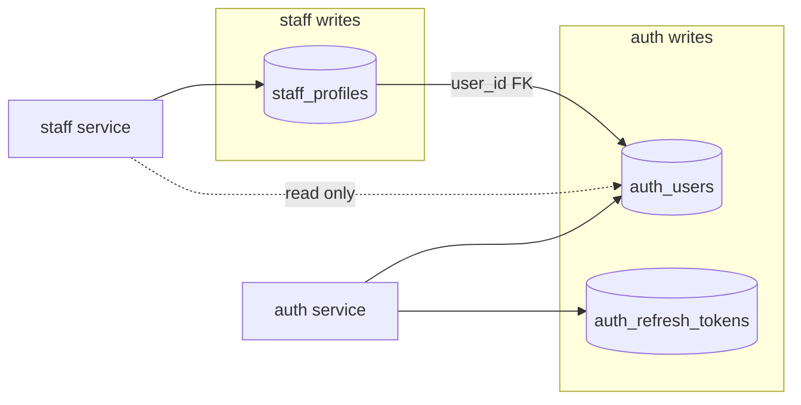
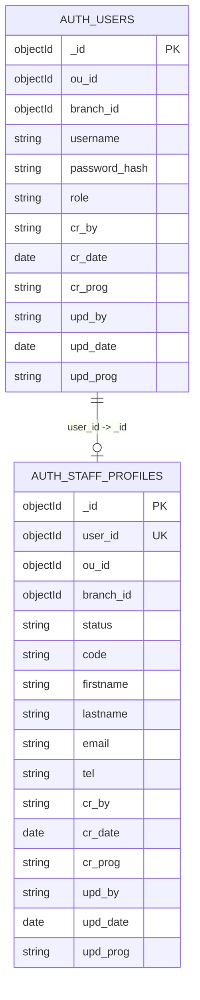

# staff — MongoDB ERD & persistence notes

> **Package status:** **spec only** — ยังไม่มี `package.json` หรือ migration scripts ใน repo

**SoT ฝั่ง persistence** สำหรับ **`staff_profiles`** — ความหมายธุรกิจและ HTTP อยู่ [`./business-domain.md`](./business-domain.md)

| ชั้น SoT                  | เอกสาร                                                       |
| :------------------------ | :----------------------------------------------------------- |
| **Business**              | [`./business-domain.md`](./business-domain.md)               |
| **Technical**             | [`./technical-architecture.md`](./technical-architecture.md) |
| **Persistence (ไฟล์นี้)** | ERD, constraints, indexes, search                            |

สอดคล้อง [`11-database-connection.md`](../../../../../../coding-standard/backend/11-database-connection.md), [`12-data-management.md`](../../../../../../coding-standard/backend/12-data-management.md)

> **Database:** ร่วมกับ auth ได้ — prefix `auth_*` ตาม [`../../../auth/src/config/mongo-collections.js`](../../../auth/src/config/mongo-collections.js)

## Data ownership



## ER diagram (logical)



## Collection: `staff_profiles`

### Field definitions

| Field           | BSON        | Required | Constraints (MVP)                                                                          |
| :-------------- | :---------- | :------: | :----------------------------------------------------------------------------------------- |
| `_id`           | ObjectId    |   yes    | PK                                                                                         |
| `user_id`       | ObjectId    |   yes    | FK → `auth_users._id`; **unique**                                                          |
| `ou_id`         | ObjectId    |   yes    | immutable; ตรง user + tenant                                                               |
| `branch_id`     | ObjectId    |   yes    | immutable                                                                                  |
| `status`        | string      |   yes    | `active` \| `archived`                                                                     |
| `code`          | string      |   yes    | 1–32 chars; **unique** with `ou_id`+`branch_id`                                            |
| `firstname`     | string      |   yes    | 1–128                                                                                      |
| `lastname`      | string      |   yes    | 1–128                                                                                      |
| `email`         | string      |   yes    | max 254; lowercase; **not unique** in MVP                                                  |
| `tel`           | string      |   yes    | E.164, max 16                                                                              |
| `cr_*`, `upd_*` | string/date |   yes    | [`12-data-management.md`](../../../../../../coding-standard/backend/12-data-management.md) |

**Out of scope:** `display_name`, `job_title`, `department`, `employment_status`

**API response:** ห้าม expose `cr_*`, `upd_*` ดิบ

### Uniqueness & validation

| Rule                      | Enforcement                                |
| :------------------------ | :----------------------------------------- |
| 1 user → 1 profile        | index `uniq_user_id`                       |
| 1 code ต่อ OU+สาขา        | index `uniq_ou_branch_code`                |
| Duplicate `email` / `tel` | **อนุญาต** ใน MVP                          |
| `status` enum             | แนะนำ MongoDB `$jsonSchema` + OpenAPI enum |

### Join `auth_users`

- `$lookup` บน DB เดียวกัน — projection เฉพาะ `username`, `role` สำหรับ list/read
- staff service account ต้อง **read** `auth_users`

### Cross-service: archive / restore

| Operation | Mongo                            | auth                                                                               |
| :-------- | :------------------------------- | :--------------------------------------------------------------------------------- |
| Archive   | `$set status: archived`, `upd_*` | revoke หลัง persist — [`./technical-architecture.md`](./technical-architecture.md) |
| Restore   | `$set status: active`, `upd_*`   | ไม่เรียก auth                                                                      |

### Optimistic concurrency

- **`upd_date`** → ETag `W/"<base64url(iso)>"`
- **`If-Match`** บน `PATCH`, `POST .../archive`, `POST .../restore`

## Indexes

| Name                    | Keys                                                  | Type       | Purpose                                   |
| :---------------------- | :---------------------------------------------------- | :--------- | :---------------------------------------- |
| `uniq_user_id`          | `{ user_id: 1 }`                                      | unique     | 1:1 user; lookup `GET /profiles?user_id=` |
| `uniq_ou_branch_code`   | `{ ou_id: 1, branch_id: 1, code: 1 }`                 | unique     | business key                              |
| `list_by_branch_status` | `{ ou_id: 1, branch_id: 1, status: 1, upd_date: -1 }` | non-unique | list ต่อสาขา + filter status              |
| `list_archived_by_ou`   | `{ ou_id: 1, status: 1, upd_date: -1 }`               | non-unique | archived list (platform_admin ข้ามสาขา)   |

### Search (`q` parameter)

MVP แนะนำ **case-insensitive regex** บนฟิลด์ที่มี index รองรับ list ก่อน แล้ว filter ใน application หรือ:

- **`code`:** ใช้ index `uniq_ou_branch_code` prefix ถ้า `q` สั้นและตรงรูปแบบรหัส
- **`firstname` / `lastname`:** compound index ถ้าโหลด list สูง — **optional** `{ ou_id: 1, branch_id: 1, lastname: 1, firstname: 1 }` เมื่อมีปัญหา performance
- **`username`:** ค้นหาหลัง `$lookup` หรือ pre-query `auth_users` ด้วย regex แล้วจำกัด `user_id` `$in` — ระวัง performance

**ไม่บังคับ** Atlas Search ใน MVP

### Schema validation (แนะนำ)

```javascript
// ตัวอย่าง — ปรับชื่อ DB/collection ตาม env
db.runCommand({
  collMod: "staff_profiles",
  validator: {
    $jsonSchema: {
      bsonType: "object",
      required: [
        "user_id",
        "ou_id",
        "branch_id",
        "status",
        "code",
        "firstname",
        "lastname",
        "email",
        "tel",
        "cr_by",
        "cr_date",
        "cr_prog",
        "upd_by",
        "upd_date",
        "upd_prog",
      ],
      properties: {
        status: { enum: ["active", "archived"] },
        code: { bsonType: "string", minLength: 1, maxLength: 32 },
        firstname: { bsonType: "string", minLength: 1, maxLength: 128 },
        lastname: { bsonType: "string", minLength: 1, maxLength: 128 },
        email: { bsonType: "string", maxLength: 254 },
        tel: { bsonType: "string", maxLength: 16 },
      },
    },
  },
  validationLevel: "moderate",
});
```

## Collection: `auth_users` (auth-owned)

- Read/join only — [`../../../auth/src/modules/auth/auth.repository.js`](../../../auth/src/modules/auth/auth.repository.js)
- ห้าม staff แก้ `password_hash` / `role`

## Audit

- `auth_audit_events` — `staff.profile_*` ตาม [`./business-domain.md` §10](./business-domain.md#10-audit-business-events)

## Connection

- Singleton client / pool — [`11-database-connection.md`](../../../../../../coding-standard/backend/11-database-connection.md)

## Related documents

- [`./business-domain.md`](./business-domain.md)
- [`./technical-architecture.md`](./technical-architecture.md)

## Last updated

2026-05-28 — อ้างอิง lookup `GET /profiles?user_id=` ที่ index `uniq_user_id`
2026-05-28 — Sync **spec only**; แก้ path coding-standard; ชื่อไฟล์ `docs/database-erd.md` (ไม่ใช่ `docs/db/`)
2026-05-21 — แยก persistence notes จาก business domain
