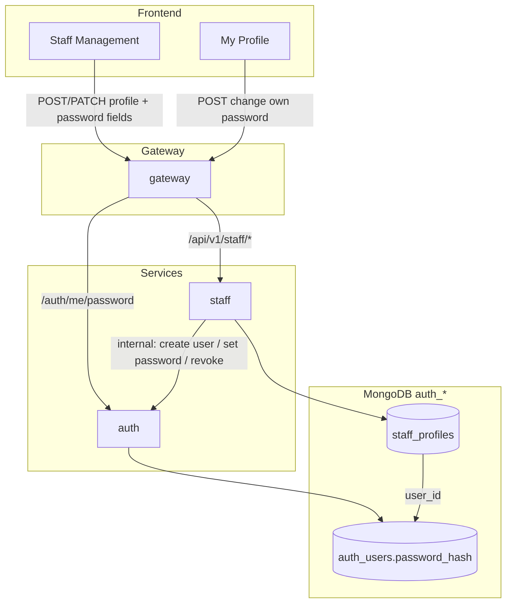

# staff — architecture (package SoT)

> **Package status:** **spec only** — ยังไม่มี `package.json`, `src/`, หรือ `openapi.yaml` ใน repo

ไฟล์นี้เป็น **technical design** ของ service **`staff`** — ขอบเขตผลิตภัณฑ์, ฟิลด์, lifecycle, RBAC, HTTP intent, และ sequence ธุรกิจอยู่ที่ [`business-domain.md`](./business-domain.md) เท่านั้น

| ชั้น SoT                | เอกสาร                                                                                                                                 |
| :---------------------- | :------------------------------------------------------------------------------------------------------------------------------------- |
| **Business**            | [`business-domain.md`](./business-domain.md)                                                                                           |
| **Technical (ไฟล์นี้)** | trust boundary, mesh, outbound auth env, probes/metrics, `src/` layout, operations                                                     |
| **Persistence**         | [`database-erd.md`](./database-erd.md)                                                                                                 |
| **HTTP contract**       | **`openapi.yaml`** — สร้างเมื่อ bootstrap ([`2-folder-structure.md`](../../../../../../coding-standard/backend/2-folder-structure.md)) |

## Contents

1. [Business SoT index](#1-business-sot-index)
2. [Service role (technical)](#2-service-role-technical)
3. [Trust boundary](#3-trust-boundary)
4. [Request path](#4-request-path)
5. [HTTP surface (infra)](#5-http-surface-infra)
6. [Outbound auth](#6-outbound-auth)
7. [Gateway routing](#7-gateway-routing)
8. [Source layout](#8-source-layout-target)
9. [Operations](#9-operations)
10. [Related documents](#10-related-documents)

## 1. Business SoT index

| หัวข้อ                                    | [`business-domain.md`](./business-domain.md)                                                                                                            |
| :---------------------------------------- | :------------------------------------------------------------------------------------------------------------------------------------------------------ |
| ขอบเขต MVP, context diagram               | [§1](./business-domain.md#1-บทบาทและขอบเขต-mvp)                                                                                                         |
| staff vs auth                             | [§2](./business-domain.md#2-แยกความรับผิดชอบข้อมูล-staff-vs-auth)                                                                                       |
| ฟิลด์ / validation                        | [§3](./business-domain.md#3-โมเดลธุรกิจ--staff_profiles)                                                                                           |
| lifecycle / `status`                      | [§4](./business-domain.md#4-lifecycle--status)                                                                                                          |
| HTTP intent                               | [§5](./business-domain.md#5-http-operations-intent--ก่อน-openapi)                                                                                       |
| `GET` list vs `?user_id` lookup           | [§5 GET](./technical-architecture.md#get-apiv1staffprofiles--list-vs-lookup-spec) · [business §8](./business-domain.md#8-list--search--filter-business) |
| sequences (create, archive, restore, 503) | [§6](./business-domain.md#6-flow-หลัก-sequence)                                                                                                         |
| self-service (My Profile)                 | [§6.4](./business-domain.md#64-self-service--โปรไฟล์ตัวเอง-my-profile)                                                                                  |
| password policy + session behavior        | [§3.5](./business-domain.md#35-password-rules-business--normative), [§4](./business-domain.md#4-lifecycle--status)                                      |
| password API design (technical)           | [§5.1](#51-password-endpoints)                                                                                                                          |
| RBAC                                      | [§7](./business-domain.md#7-rbac-product)                                                                                                               |
| list / search                             | [§8](./business-domain.md#8-list--search--filter-business)                                                                                              |
| create / update rules                     | [§9](./business-domain.md#9-create--update--lifecycle-rules)                                                                                            |
| audit events                              | [§10](./business-domain.md#10-audit-business-events)                                                                                                    |

## 2. Service role (technical)

- **Internal API** หลัง **gateway** — ไม่ verify JWT; ใช้ mesh headers (§ [Trust boundary](#3-trust-boundary))
- **Outbound:** เรียก **auth** internal — provision user ตอน create (ไม่มี `user_id`), set password (admin reset), และ revoke session หลัง archive / password change



| Layer        | Responsibility                                                                                      |
| :----------- | :-------------------------------------------------------------------------------------------------- |
| **auth**     | Hash (argon2), store `password_hash`, validate `current_password`, bump `token_gen`, revoke refresh |
| **staff**    | RBAC ตาม profile scope; รับ `password` จาก admin UI แล้วเรียก auth internal — **ไม่** เก็บรหัสผ่าน  |
| **frontend** | Form UX, confirm field, client-side policy hints — ส่งเฉพาะช่วงที่ต้องการเปลี่ยน                    |

## Trust boundary

อ้างอิง [`../../../ARCHITECTURE.md`](../../../ARCHITECTURE.md)

| Mechanism                                             | Rule                                                                                                                |
| :---------------------------------------------------- | :------------------------------------------------------------------------------------------------------------------ |
| **`x-gateway-secret`**                                | บังคับบน business routes — [`4-request-headers.md`](../../../../../../coding-standard/backend/4-request-headers.md) |
| **`x-user-id`**, **`x-user-ou`**, **`x-user-branch`** | tenant + audit — [`12-data-management.md`](../../../../../../coding-standard/backend/12-data-management.md)         |
| **`x-user-role`**                                     | RBAC enforcement — กฎ product ดู [`business-domain.md` §7](./business-domain.md#7-rbac-product)                     |
| **`Authorization`**                                   | gateway **ไม่ forward** Bearer ไป staff                                                                             |

**Tenant headers → BSON:** `x-user-ou` / `x-user-branch` hex 24 → `ObjectId`

**Production path:** client → gateway (verify JWT) → staff

## Request path

- **Context (components):** [`business-domain.md` §1](./business-domain.md#1-บทบาทและขอบเขต-mvp)
- **Business sequences:** [`business-domain.md` §6](./business-domain.md#6-flow-หลัก-sequence)

## 5. HTTP surface (infra)

| Area         | Path                     | Notes                                                                                               |
| :----------- | :----------------------- | :-------------------------------------------------------------------------------------------------- |
| Probes       | `/healthz`, `/readyz`    | Mongo ping ที่ `readyz`                                                                             |
| Business API | `/api/v1/staff/profiles` | operations — [`business-domain.md` §5](./business-domain.md#5-http-operations-intent--ก่อน-openapi) |
| Metrics      | `/metrics`               | ถ้าเปิด — private network                                                                           |

**Errors / pagination:** Custom JSON wrapper (`{ success, code, message, data }`), registry ใน **`codes.yaml`**, list ตาม [`6-api-response-codes.md`](../../../../../../coding-standard/backend/6-api-response-codes.md) — สร้างพร้อม **`openapi.yaml`**

#### `GET /api/v1/staff/profiles` — list vs lookup (spec)

| Query                                    | Caller                                               | Response                                                  |
| :--------------------------------------- | :--------------------------------------------------- | :-------------------------------------------------------- |
| _(ไม่มี `user_id`)_                      | `platform_admin` / `branch_admin`                    | **list** — `data` เป็น array + `pagination`               |
| `user_id={hex}`                          | admin ใน scope **หรือ** self (`user_id` = JWT `sub`) | **lookup** — `data` เป็น object เดียว; ไม่มี `pagination` |
| `user_id` + list params (`q`, `page`, …) | —                                                    | **`400 INVALID_PARAM`** — ห้ามผสมโหมด                     |

### 5.1 Password endpoints

#### `POST /api/v1/staff/profiles` — create with password (spec)

**Body (provision path — ไม่ส่ง `user_id`):** ต้องมี `username` + `password` ตาม [`business-domain.md` §6.1](./business-domain.md#61-สร้างโปรไฟล์)

```json
{
  "code": "EMP-001",
  "firstname": "Somchai",
  "lastname": "Example",
  "email": "somchai@example.invalid",
  "tel": "+66812345678",
  "username": "somchai.e",
  "password": "InitialSecurePass1234!"
}
```

| Field      |         Required         | Notes                                                                                           |
| :--------- | :----------------------: | :---------------------------------------------------------------------------------------------- |
| `username` | **yes** (provision path) | global unique; normalized lowercase; ส่งต่อ `POST /internal/users`                              |
| `password` | **yes** (provision path) | min 16; ส่งต่อ `POST /internal/users`                                                           |
| `user_id`  |            no            | ถ้าส่ง — ผูก user เดิม; **ไม่** ส่ง `username` / `password`; **ไม่** เปลี่ยน password ใน create |

**Responses:** `201` + profile — **ห้าม** คืน `password` ใน response  
**RBAC:** `platform_admin` | `branch_admin` เท่านั้น

---

#### `POST /api/v1/staff/profiles/{id}/password` — admin reset (spec)

**Purpose:** Admin ตั้งรหัสผ่านใหม่ให้พนักงาน (ไม่ต้องรู้รหัสเดิม)

**Headers:** `Authorization`, `Content-Type: application/json`

```json
{
  "password": "NewSecurePass1234!",
  "revoke_sessions": true
}
```

| Field             | Required | Default | Notes                                                                                          |
| :---------------- | :------: | :------ | :--------------------------------------------------------------------------------------------- |
| `password`        |   yes    | —       | นโยบาย [`business-domain.md` §3.5](./business-domain.md#35-password-rules-business--normative) |
| `revoke_sessions` |    no    | `true`  | เรียก auth revoke หลังเปลี่ยนรหัสสำเร็จ                                                        |

**RBAC:** `assertProfileScope` เหมือน `PATCH` — admin ใน scope; **ห้าม** ใช้กับ own profile (แนะนำ frontend ซ่อน section นี้เมื่อแก้ตัวเอง)

**Flow:**

1. staff โหลด profile → ได้ `user_id`
2. `POST /internal/users/{user_id}/password` (auth)
3. ถ้า `revoke_sessions` → `POST /internal/users/{user_id}/sessions/revoke`

| HTTP  | `code` (staff envelope) | When              |
| :---- | :---------------------- | :---------------- |
| `204` | —                       | สำเร็จ            |
| `400` | `INVALID_PARAM`         | validation        |
| `403` | `INVALID_USER_CONTEXT`  | นอก scope         |
| `404` | `RESOURCE_NOT_FOUND`    | ไม่มี profile     |
| `503` | `SERVICE_UNAVAILABLE`   | auth internal ล้ม |

---

#### `POST /auth/me/password` — self-service (spec — auth service)

**Purpose:** ผู้ใช้เปลี่ยนรหัสผ่านตัวเอง (My Profile) — **route นี้ผ่าน auth โดยตรง ไม่ผ่าน staff**

**Headers:** `Authorization: Bearer <access_token>`

```json
{
  "current_password": "OldSecurePass1234!",
  "new_password": "NewSecurePass1234!"
}
```

**Rules:**

- `sub` จาก JWT = `auth_users._id` ที่จะอัปเดต
- ต้อง verify `current_password` กับ `password_hash` — ผิด → `401` `LOGIN_INVALID_CREDENTIALS`
- ห้าม `new_password` เหมือน `current_password` → `400` `AUTH_INVALID_REQUEST`
- หลังสำเร็จ: อัปเดต hash, bump `token_gen`, revoke refresh tokens

**Response (success):** `204 No Content`  
**Rate limit:** แนะนำ ≤ **10** req/min ต่อ user/IP

**Gateway:** route `/auth/me/password` → auth (ตาม spec auth — bootstrap พร้อม auth); client ส่ง Bearer โดยตรง ไม่ใช้ mesh secret

## 6. Outbound auth

การประสาน archive / provisioning ทางธุรกิจ: [`business-domain.md` §6](./business-domain.md#6-flow-หลัก-sequence)

**`token_gen` (access JWT invalidation):** SoT **auth**; gateway ตาม [`session-revoke-token-gen-changes.md`](../../../auth/docs/session-revoke-token-gen-changes.md)

| Variable                       | Purpose                                                                |
| :----------------------------- | :--------------------------------------------------------------------- |
| `AUTH_INTERNAL_BASE_URL`       | base URL ของ auth (private mesh) — default dev `http://127.0.0.1:3001` |
| `AUTH_INTERNAL_SERVICE_SECRET` | Bearer secret — **ไม่ reuse** `GATEWAY_SHARED_SECRET`                  |
| `STAFF_PROVISION_DEFAULT_ROLE` | role ของ user ที่ provision (default `staff`)                          |

**Internal APIs (staff → auth):**

| Call                 | When                                                           | Path                                                          |
| :------------------- | :------------------------------------------------------------- | :------------------------------------------------------------ |
| Provision user       | `POST` create โดยไม่มี `body.user_id`                          | `POST /internal/users` (body includes `username`, `password`) |
| Set password (admin) | `POST .../profiles/{id}/password` — **spec only**              | `POST /internal/users/{user_id}/password`                     |
| Revoke sessions      | หลัง archive หรือหลัง password reset (เมื่อ `revoke_sessions`) | `POST /internal/users/{user_id}/sessions/revoke`              |

Client (เมื่อ bootstrap): `src/clients/auth-internal.client.js`

| สถานะ                 | หมายเหตุ                                                                                                                   |
| :-------------------- | :------------------------------------------------------------------------------------------------------------------------- |
| **Revoke retry**      | staff ตอบ `503` เมื่อ Mongo archive สำเร็จแต่ revoke ล้ม — ดู [`business-domain.md` §6.2](./business-domain.md#62-archive) |
| **Provision failure** | `503` / `409` / `400` ตาม auth response — ไม่ insert profile                                                               |

### 6.1 `POST /internal/users/{user_id}/password` (spec — admin set password)

**Caller:** staff service (`Bearer AUTH_INTERNAL_SERVICE_SECRET`)

```json
{
  "password": "NewSecurePass1234!",
  "revoke_sessions": true,
  "reason": "staff.admin_password_reset",
  "correlation_id": "<request-id>"
}
```

| Field             | Required | Notes                                              |
| :---------------- | :------: | :------------------------------------------------- |
| `password`        |   yes    | argon2 hash + persist                              |
| `revoke_sessions` |    no    | default `true` — bump `token_gen` + revoke refresh |
| `reason`          |    no    | audit                                              |
| `correlation_id`  |    no    | trace                                              |

**Responses:** `204`; errors Custom JSON wrapper (`AUTH_USER_NOT_FOUND`, `AUTH_INVALID_REQUEST`, …)

## 7. Gateway routing

อ้างอิง [`../../../gateway/routes.json`](../../../gateway/routes.json) และ [`../../../README.md`](../../../README.md)

| Client prefix   | Upstream (default dev)  | `stripPrefix` | Business paths                                                                                                                 |
| :-------------- | :---------------------- | :-----------: | :----------------------------------------------------------------------------------------------------------------------------- |
| `/api/v1/staff` | `http://127.0.0.1:3004` |    `false`    | `/api/v1/staff/profiles` และ subpaths — [`business-domain.md` §5](./business-domain.md#5-http-operations-intent--ก่อน-openapi) |

- **Longest prefix:** ต้องอยู่ก่อน catch-all `/api` ถ้ามีในอนาคต
- **Default `PORT`:** **3004** (หลีก `3001` auth, `3002` gateway, `3003` crud demo)
- **Mesh:** `GATEWAY_SHARED_SECRET` ต้องตรง `GATEWAY_SECRET` ของ gateway

## 8. Source layout (target)

```text
src/
├── app.js
├── server.js
├── config/
├── lib/
│   ├── audit/
│   │   └── tests/unit-test/
│   ├── clients/
│   ├── middlewares/
│   │   └── tests/unit-test/
│   ├── observability/
│   └── utils/
├── modules/
│   └── profiles/
│       └── tests/
│           ├── unit-test/
│           └── integration-test/
└── plugins/
```

**Test convention:** ไฟล์ test วางตาม `<layer>/tests/<type>/` ทุก layer — ไม่จำกัดแค่ `modules/` ตาม org SoT `testing.md §1` (SoT ระบุ `modules/<feature>/tests/` เป็น canonical; layer อื่นขยาย pattern เดิมโดย PR review)

## 9. Operations

| รายการ                                                   | สถานะ / ค่าเริ่มต้น (dev)                                                                              |
| :------------------------------------------------------- | :----------------------------------------------------------------------------------------------------- |
| `PORT`                                                   | **3004** (ดู § [Gateway routing](#7-gateway-routing))                                                  |
| `MONGODB_URI`, `DB_NAME`                                 | กำหนดตอน implement — มักใช้ DB เดียวกับ auth (`auth_*`)                                                |
| `GATEWAY_SHARED_SECRET`                                  | ตรง `GATEWAY_SECRET` ใน gateway `.env`                                                                 |
| `AUTH_INTERNAL_BASE_URL`, `AUTH_INTERNAL_SERVICE_SECRET` | outbound auth (§ [Outbound auth](#6-outbound-auth))                                                    |
| `STAFF_PROVISION_DEFAULT_ROLE`                           | role สำหรับ auto-provision `auth_users` on create without `user_id`                                    |
| Create `password` in body                                | **required** (min 16) เมื่อไม่ส่ง `user_id` — ส่งต่อ auth `POST /internal/users` (ไม่ใช้ env รหัสร่วม) |
| Gateway route                                            | ล็อกใน [`gateway/routes.json`](../../../gateway/routes.json) — prefix `/api/v1/staff`                  |
| `openapi.yaml`, `openapi-via-gateway.yaml`, `codes.yaml` | bootstrapped — sync กับ `src/` เมื่อเปลี่ยน HTTP surface                                               |
| `.env.example`                                           | สร้างเมื่อ bootstrap แพ็กเกจ (ดู § [Outbound auth](#6-outbound-auth))                                  |

## 10. Error codes (to register)

| Service | `code`                           | HTTP | When                               |
| :------ | :------------------------------- | :--- | :--------------------------------- |
| auth    | `AUTH_PASSWORD_POLICY_VIOLATION` | 400  | ความยาว/รูปแบบไม่ผ่าน              |
| auth    | `AUTH_PASSWORD_UNCHANGED`        | 400  | new = current                      |
| staff   | _(reuse)_ `INVALID_PARAM`        | 400  | confirm ไม่ผ่านที่ staff validator |
| staff   | _(reuse)_ `SERVICE_UNAVAILABLE`  | 503  | auth internal down                 |

ลงทะเบียนใน `auth/codes.yaml` และ `service/staff/codes.yaml` ตามขอบเขต — สร้างพร้อม **`openapi.yaml`**

## 11. Related documents

- [`../../../README.md`](../../../README.md) — backend monorepo index
- [`business-domain.md`](./business-domain.md)
- [`database-erd.md`](./database-erd.md)
- [`../../../auth/docs/session-revoke-token-gen-changes.md`](../../../auth/docs/session-revoke-token-gen-changes.md)
- [`../../../gateway/docs/session-revoke-token-gen-changes.md`](../../../gateway/docs/session-revoke-token-gen-changes.md)
- [`../../../auth/src/config/mongo-collections.js`](../../../auth/src/config/mongo-collections.js)
- [`../../../ARCHITECTURE.md`](../../../ARCHITECTURE.md)

## Last updated

2026-05-28 — `GET ?user_id` list vs lookup; create body รวม `username`; Custom JSON wrapper; แก้ลิงก์ backend README
2026-05-28 — Sync สถานะ **spec only**; แก้ path coding-standard; ลบคำว่า implemented
2026-05-27 — รวม password technical spec ในไฟล์นี้ (§2 diagram, §5.1, §6.1, §10)
2026-05-26 — Password management spec (`POST .../password`, create `password` in body)
2026-05-26 — Outbound auth provision (`POST /internal/users`); self-service My Profile cross-ref [`business-domain.md` §6.4](./business-domain.md#64-self-service--โปรไฟล์ตัวเอง-my-profile)
2026-05-25 — §8 Source layout: expand tree + document test convention for non-module layers (`audit/`, `middlewares/`)
2026-05-25 — MVP profiles API spec + audit (`auth_audit_events`) + outbound revoke + metric `staff_auth_revoke_pending_total`
