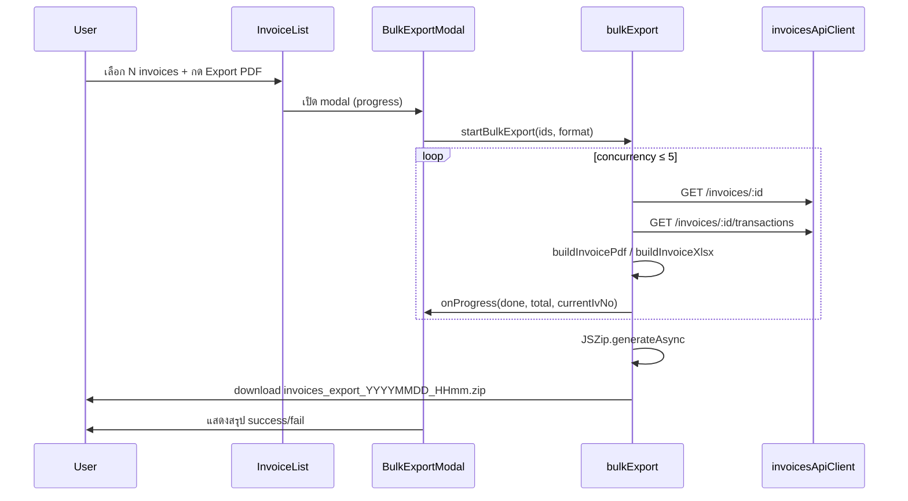

# Spec: Bulk Invoice Operations (Invoice List)

## Assumptions (ข้อสมมติฐาน)

1. **"โหลดหลาย invoice"** หมายถึง **export ไฟล์ PDF/Excel** จากหน้า `/invoices` โดยไม่ต้องเข้า detail ทีละใบ (ไม่ใช่ generate invoice หลายเดือนในรอบนี้)
2. ผู้ใช้เป้าหมายคือ **เจ้าหน้าที่ backoffice / finance** ที่มีสิทธิ์ `invoices:list` และ `invoices:read`
3. การ export รอบแรกทำ **ฝั่ง client** (ดึง detail + transactions แล้วสร้างไฟล์) — ไม่เพิ่ม backend endpoint ใน Phase 1
4. รองรับเฉพาะ **เบราว์เซอร์ยุคใหม่** (Chrome, Firefox, Edge ล่าสุด) — ไม่รองรับ IE
5. จำนวน invoice ที่เลือก export ต่อครั้งมี **ขีดจำกัดสูงสุด 50 รายการ** เพื่อป้องกัน browser OOM / timeout
6. รูปแบบไฟล์ผลลัพธ์: **ZIP** ที่บรรจุไฟล์ละ `invoice_{iv_no}.pdf` หรือ `invoice_{iv_no}.xlsx` (ไม่รวมหลายใบเป็นไฟล์เดียว)

→ หากข้อใดไม่ถูกต้อง โปรดแก้ไขก่อนอนุมัติ Spec

---

## Objective

### ปัญหา

หน้า [Invoice List](https://zero.168bits.com/invoices) ปัจจุบัน export PDF/Excel ได้เฉพาะที่ `/invoices/:id` ทำให้ผู้ใช้ต้องเปิด detail ทีละใบเมื่อต้องการดาวน์โหลดหลาย invoice

### เป้าหมาย

เพิ่มความสามารถ **เลือกหลาย invoice จากตาราง** แล้ว **export เป็น ZIP** พร้อม progress feedback และจัดการกรณีบางรายการล้มเหลว

### User Stories

| ID | ในฐานะ | ฉันต้องการ | เพื่อที่จะ |
|----|--------|-----------|-----------|
| US-1 | เจ้าหน้าที่ finance | เลือกหลาย invoice จากตาราง list | export ทีเดียวโดยไม่ต้องเข้า detail ทีละใบ |
| US-2 | เจ้าหน้าที่ finance | เห็น progress ขณะ export | รู้ว่าระบบยังทำงานอยู่และเหลือกี่รายการ |
| US-3 | เจ้าหน้าที่ finance | ได้ ZIP ที่มีไฟล์แยกตาม `iv_no` | นำไปส่งต่อหรือเก็บ archive ได้สะดวก |
| US-4 | เจ้าหน้าที่ finance | เห็นรายการที่ export ไม่สำเร็จ | retry เฉพาะรายการที่ fail ได้ |

### Delivery Phases (ขอบเขตตามที่ตกลง)

| Phase | ฟีเจอร์ | Scope ใน Spec นี้ |
|-------|---------|------------------|
| **P0** | Row selection + bulk export PDF/Excel (ZIP) | ✅ Phase 1 — implement |
| **P1** | Progress modal + retry รายการที่ fail | ✅ Phase 1 — implement |
| **P2** | Multi-month generate + async job (backend) | ❌ Out of scope — ไม่ทำ |
| **P3** | Bulk Mark PAID / Cancel | ✅ Phase 1 extension — implement |

---

## Tech Stack

| Layer | Technology |
|-------|------------|
| Framework | React 19 + TypeScript (strict) |
| Build | Vite 8 |
| UI | Ant Design 6 + `@ant-design/icons` |
| Routing | react-router-dom 7 |
| HTTP | axios (`invoicesApiClient.ts`) |
| Export (existing) | `jspdf`, `jspdf-autotable`, `xlsx` |
| Export (new) | `jszip` — สร้าง ZIP ฝั่ง client |
| Testing | vitest + @testing-library/react |

**Backend (Phase 1):** ไม่เปลี่ยน — ใช้ API ที่มีอยู่:

- `GET /api/v1/invoices` — list (มีอยู่แล้ว)
- `GET /api/v1/invoices/:id` — detail
- `GET /api/v1/invoices/:id/transactions` — transactions

**Permissions:** ใช้สิทธิ์เดิม `invoices:list` (หน้า list) + `invoices:read` (ดึง detail/transactions ตอน export)

---

## Commands

```bash
# Dev
cd code-base/zero-platform/frontend/backoffice
npm run dev

# Test
npm test
npm test -- src/pages/Invoices

# Lint
npm run lint

# Build
npm run build
```

---

## Project Structure

```
frontend/backoffice/
├── _mission-control/
│   └── SPEC.md                          ← เอกสารนี้
├── src/
│   ├── lib/
│   │   └── invoicesApiClient.ts         ← (อาจเพิ่ม helper fetch หลาย id)
│   ├── pages/Invoices/
│   │   ├── index.tsx                    ← เพิ่ม rowSelection + action bar
│   │   ├── InvoiceDetail.tsx            ← refactor: แยก export logic ออก
│   │   ├── utils.ts                     ← format helpers (มีอยู่)
│   │   ├── export/
│   │   │   ├── buildInvoicePdf.ts       ← NEW: สร้าง PDF blob จาก invoice + txns
│   │   │   ├── buildInvoiceXlsx.ts      ← NEW: สร้าง XLSX blob
│   │   │   ├── bulkExport.ts            ← NEW: orchestrate fetch + zip
│   │   │   └── bulkExport.test.ts       ← NEW: unit tests
│   │   ├── components/
│   │   │   ├── BulkExportBar.tsx        ← NEW: floating action bar
│   │   │   └── BulkExportModal.tsx      ← NEW: progress + retry UI
│   │   └── hooks/
│   │       └── useInvoices.ts           ← ไม่แตะ (bulk export เรียก invoicesApiClient ตรง ไม่ผ่าน hook นี้)
│   └── types/
│       └── invoice.ts
└── docs/
    └── sitemap-and-flows.md             ← อัปเดต flow 2.x (หลัง implement)
```

---

## Functional Design

### 1. Row Selection (P0)

- เพิ่ม `rowSelection` บน Ant Design `Table` ในหน้า `/invoices`
- `preserveSelectedRowKeys: true` — คงการเลือกขณะเปลี่ยนหน้า pagination
- Checkbox แต่ละแถว + checkbox header (เลือกทั้งหมด**ในหน้าปัจจุบัน**)
- จำกัดสูงสุด **50 รายการ** — เมื่อเลือกครบ แสดง warning และไม่ให้เลือกเพิ่ม

### 2. Bulk Action Bar (P0)

เมื่อ `selectedRowKeys.length > 0` แสดง bar ลอยด้านล่างกลางจอ:

```
┌──────────────────────────────────────────────────────────────┐
│  เลือกแล้ว 3 รายการ   [Export PDF]  [Export Excel]  [ยกเลิก] │
└──────────────────────────────────────────────────────────────┘
```

- ปุ่ม disabled ขณะ export กำลังทำงาน
- ปุ่ม "ยกเลิก" = clear selection (ไม่ใช่ cancel job ที่กำลังรัน — ใช้ Cancel ใน modal แทน)
- **Permission gating:** แสดงปุ่ม Export เฉพาะเมื่อ `usePermission('invoices:read')` เป็น true เพราะ bulk export เรียก `GET /invoices/:id` + `/transactions` ซึ่งต้องสิทธิ์ `invoices:read` (หน้า list guard ด้วย `invoices:list` เท่านั้น) — **ถ้าไม่มีสิทธิ์ให้ซ่อนปุ่ม** (ไม่ใช่ disable); ยังเลือกแถวได้แต่ไม่มีปุ่ม export ใน action bar

### 3. Bulk Export Flow (P0)



**Concurrency:** ดึง detail + transactions พร้อมกันไม่เกิน **5 invoice** ต่อรอบ (pool)

**ZIP naming:**

- PDF: `invoices_export_20260624_1430.zip`
- Excel: `invoices_export_20260624_1430.zip` (ภายในเป็น `.xlsx` แยกไฟล์)

**Export content:** ใช้ layout และข้อมูลเดียวกับ `InvoiceDetail.tsx` (`handleExportPDF` / `handleExportExcel`) — refactor เป็น shared module ไม่ duplicate logic

### 4. Progress Modal (P1)

Modal แสดงระหว่าง export:

| องค์ประกอบ | รายละเอียด |
|-----------|-----------|
| Progress bar | `done / total` |
| รายการล่าสุด | ชื่อ `iv_no` ที่กำลังประมวลผล |
| สถานะรายการ | ✓ สำเร็จ / ✗ ล้มเหลว (พร้อม error message สั้นๆ) |
| ปุ่ม Cancel | ยกเลิกงานที่เหลือ (AbortController) — ดาวน์โหลด ZIP เฉพาะรายการที่สำเร็จแล้ว (ถ้ามี) |
| ปุ่ม Retry failed | หลังจบ — retry เฉพาะ id ที่ fail |
| ปุ่ม Close | ปิด modal + clear selection (optional — ถามใน Open Questions) |

### 5. Error Handling

| กรณี | พฤติกรรม |
|------|----------|
| API 404 สำหรับ invoice หนึ่งใบ | บันทึกเป็น failed, ดำเนินการต่อ |
| Network error | บันทึกเป็น failed, ดำเนินการต่อ |
| ทุกรายการ fail | ไม่สร้าง ZIP, แสดง error summary |
| บางรายการ fail | สร้าง ZIP เฉพาะรายการสำเร็จ + แสดง warning |
| User cancel กลางทาง | หยุด queue, ZIP จากรายการที่เสร็จแล้ว (ถ้ามี ≥ 1) |
| รายการที่ถูก abort ขณะ in-flight | จัดเป็นสถานะ `cancelled` (ไม่ใช่ `failed`) — ไม่แสดงเป็น error และ retry ได้ |
| Retry failed | สร้าง ZIP **ชุดใหม่** เฉพาะรายการที่ retry สำเร็จ (ไม่ merge กับ ZIP เดิมที่ดาวน์โหลดไปแล้ว) |

### 6. Future Phases (documented, not Phase 1)

#### P2 — Multi-month Generate + Async Job

- ขยาย modal "Create Invoice" รองรับ `RangePicker picker="month"`
- Backend: `POST /api/v1/invoices/generate-batch` + job polling
- เหตุผลเลื่อน: `generate.service.js` คำนวณ fee แบบ sequential — งานหลายเดือน × หลาย branch ต้อง background job

#### P3 — Bulk Mark PAID / Cancel

- เพิ่มปุ่มใน action bar
- เรียก `PUT /api/v1/invoices/:id/status` แบบ parallel (concurrency ≤ 5)
- Confirm modal + partial success summary
- อนุญาตเฉพาะ transition ที่ backend รองรับ (READY → PAID, READY/PENDING/MISSING_FEE/ERROR → VOID)

#### Select All Matching Filter

- ปุ่ม "เลือกทั้งหมดตาม filter (N รายการ)" ข้าม pagination
- ต้อง API หรือส่ง filter params — out of scope Phase 1

---

## Code Style

ปฏิบัติตาม `coding-standard/frontend/backoffice/`:

- Single quotes, 2 spaces, semicolons
- ห้าม `any` — กำหนด type ชัดเจน
- แยก API client (`lib/`), hooks (`hooks/`), presentational components (`components/`)
- Export logic เป็น pure functions รับ `(invoice, transactions)` คืน `Blob`

**ตัวอย่าง signature ที่คาดหวัง:**

```typescript
// src/pages/Invoices/export/buildInvoicePdf.ts
import type { Invoice, InvoiceTransaction } from '../../../types/invoice';

export function buildInvoicePdf(
  invoice: Invoice,
  transactions: InvoiceTransaction[],
): Blob {
  // ใช้ jsPDF + autoTable — logic ย้ายมาจาก InvoiceDetail
  // สำคัญ: คืน Blob ด้วย doc.output('blob') (ไม่ใช่ doc.save ที่ download ทันที)
}
```

> **หมายเหตุการแปลง Blob (สำคัญ):** โค้ดเดิมใช้ `doc.save()` และ `XLSX.writeFile()` ซึ่ง trigger download ทันที — เมื่อแยกเป็น builder ที่คืน `Blob` ต้องเปลี่ยนเป็น:
> - PDF: `doc.output('blob')`
> - XLSX: `const buf = XLSX.write(wb, { bookType: 'xlsx', type: 'array' }); new Blob([buf], { type: 'application/vnd.openxmlformats-officedocument.spreadsheetml.sheet' })`
>
> การ download จริง (single export + ZIP) ทำผ่าน `triggerBlobDownload(blob, filename)` ที่จุดเดียว

```typescript
// src/pages/Invoices/export/bulkExport.ts
export type BulkExportFormat = 'pdf' | 'xlsx';

export type BulkExportItemStatus = 'success' | 'failed' | 'cancelled';

export interface BulkExportProgress {
  done: number;
  total: number;
  currentIvNo?: string;
  results: Array<{ id: string; ivNo: string; status: BulkExportItemStatus; error?: string }>;
}

export interface BulkExportOptions {
  invoiceIds: string[];
  format: BulkExportFormat;
  concurrency?: number; // default 5
  signal?: AbortSignal;
  onProgress?: (progress: BulkExportProgress) => void;
}

export async function runBulkExport(options: BulkExportOptions): Promise<Blob | null>;
```

`InvoiceDetail.tsx` เรียก `buildInvoicePdf` / `buildInvoiceXlsx` แทน inline logic — single source of truth

---

## Testing Strategy

| ระดับ | ไฟล์ | ครอบคลุม |
|-------|------|----------|
| Unit | `export/buildInvoicePdf.test.ts` | สร้าง blob, header fields, empty transactions |
| Unit | `export/buildInvoiceXlsx.test.ts` | โครงสร้าง sheet, totals row |
| Unit | `export/bulkExport.test.ts` | concurrency, partial failure, abort, empty selection |
| Component | `components/BulkExportModal.test.tsx` | แสดง progress, retry, cancel |
| Hook/Page | `test/useInvoices.test.ts` (ขยาย) | integration กับ mock API |

**Mock:** mock `invoicesApiClient` ด้วย vitest — ไม่ยิง API จริงใน unit test

**Manual verify:**

1. เลือก 2–3 invoice → Export PDF → ได้ ZIP เปิดได้
2. เลือก invoice ที่ไม่มีสิทธิ์/ไม่มีอยู่ → partial failure แสดงถูกต้อง
3. กด Cancel กลางทาง → หยุดและได้ ZIP บางส่วน
4. เปลี่ยนหน้า pagination → selection คงอยู่
5. เลือกเกิน 50 → ถูก block

**Coverage target:** export modules ≥ 80% statements; ไม่บังคับ coverage ทั้งโปรเจกต์

---

## Boundaries

### Always

- Refactor export logic จาก `InvoiceDetail` เป็น shared module — ห้าม duplicate
- แสดง `loading` / progress ระหว่าง bulk export
- รัน `npm test` และ `npm run lint` ก่อน PR
- ใช้ `apiErrorMessage` สำหรับ error จาก API
- จำกัด selection และ concurrency ตาม Spec

### Ask first

- เพิ่ม dependency ใหม่ (`jszip`) — **แนะนำใน Spec นี้แล้ว** ต้องได้รับอนุมัติก่อน `npm install`
- เปลี่ยน backend API หรือ gateway routing
- เพิ่ม permission ใหม่
- เปลี่ยน limit 50 รายการ

### Never

- รวมหลาย invoice เป็น PDF/Excel ไฟล์เดียว (ต้องเป็น ZIP แยกไฟล์)
- Block UI ทั้งหน้าโดยไม่มี progress modal
- ส่ง invoice id ทั้งหมดไป endpoint ใหม่ใน Phase 1
- Commit secrets หรือแก้ `.env.prod`

---

## Success Criteria

Phase 1 ถือว่าเสร็จเมื่อ:

- [ ] ผู้ใช้เลือกได้ 1–50 invoice จากตาราง `/invoices` (ข้าม pagination ได้)
- [ ] กด Export PDF หรือ Export Excel แล้วได้ไฟล์ ZIP ดาวน์โหลดอัตโนมัติ
- [ ] เนื้อหาแต่ละไฟล์ใน ZIP ตรงกับ export จากหน้า detail เดิม (field, totals, format)
- [ ] Modal แสดง progress `done/total` และรายการ fail (ถ้ามี)
- [ ] Retry failed ทำงานได้เฉพาะรายการที่ล้มเหลว
- [ ] Cancel กลางทางหยุดงานที่เหลือได้
- [ ] ปุ่ม Export ถูกซ่อนเมื่อผู้ใช้ไม่มีสิทธิ์ `invoices:read`
- [ ] `InvoiceDetail` ยัง export ได้ปกติหลัง refactor
- [ ] Unit tests ผ่าน; `npm run lint` และ `npm run build` ผ่าน

---

## Decisions (Resolved)

| # | คำถาม | การตัดสินใจ |
|---|--------|-------------|
| Q1 | หลัง export สำเร็จ ให้ clear selection อัตโนมัติหรือไม่? | **Clear** หลังปิด modal สำเร็จ |
| Q2 | ขีดจำกัดรายการต่อครั้ง | **50 รายการ** |
| Q3 | Phase 1 รองรับ export format ใดบ้าง? | **ทั้ง PDF และ Excel** |
| Q4 | Permission สำหรับ bulk export | ใช้ **`invoices:read`** เดิม (ไม่เพิ่ม `invoices:export`) — **ซ่อนปุ่ม export เมื่อ `usePermission('invoices:read')` เป็น false** |
| Q5 | Scope release | **P0+P1+P3** ในรอบนี้; **P2 ไม่ทำ** (multi-month + async job) |
| Q6 | Retry semantics | Retry สร้าง ZIP **ชุดใหม่** เฉพาะรายการที่ retry สำเร็จ — ไม่ merge กับ ZIP เดิม |
| Q7 | Select-all เกิน limit | Header select-all เลือกได้ไม่เกิน 50; ถ้า pageSize > 50 ให้ cap ที่ 50 รายการแรก + warning |

---

## Approval

| Role | Status | Date |
|------|--------|------|
| Product / User | ✅ อนุมัติ (Open Questions = Default) | 2026-06-24 |
| Engineering | ⏳ รออนุมัติ | |

**ขั้นถัดไป:** ✅ Shipped — ดู `CHANGELOG.md` และ `docs/`
