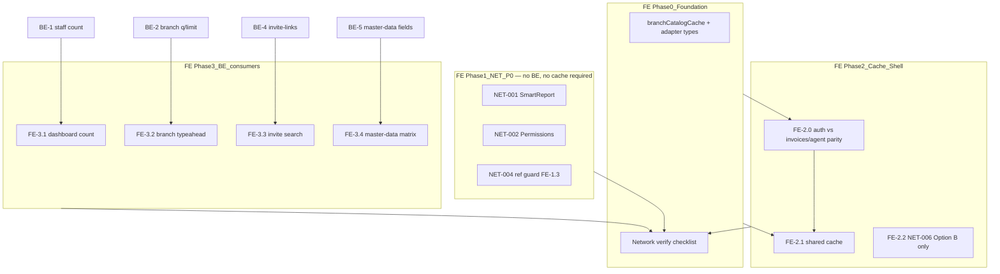

# Plan: API Network Audit fixes — frontend (backoffice-next)

> **Parallel execution:** [API Audit Parallel Build](../../../.cursor/plans/api_audit_parallel_build_d1c19150.plan.md) — Wave 1 เริ่ม FE Phase 1 + BE-2/BE-5/BE-1 พร้อมกัน

## Objective

แก้ findings จาก [API Network Audit](../../frontend/backoffice-next/docs/API-NETWORK-AUDIT-2026-07-09.md) ฝั่ง **frontend/backoffice-next** ครบทุก NET/PAY ที่ owner เป็น UI — ลด duplicate requests, รวม cache ร่วม, และ consume backend projection endpoints เมื่อพร้อม. แผน backend คู่กัน: [`api-network-audit-backend-2026-07-09.md`](./api-network-audit-backend-2026-07-09.md).

## Finding ownership matrix

| ID | ประเภท | Owner หลัก | แผนนี้ (FE) | แผน BE |
|----|--------|------------|-------------|--------|
| NET-001 | Dup-1 | **FE** | Phase 1 | — |
| NET-002 | Dup-2 | **FE** | Phase 1 | — |
| NET-003 | Dup-3 | — | ไม่แก้ (dev-only) | — |
| NET-004 | Dup-1 | **FE** | Phase 1 (FE-1.3) | — |
| NET-005 | Dup-4 | FE + BE | Phase 3 (หลัง BE-1) | BE-1 |
| NET-006 | Dup-4 | **FE** | Phase 2 (Option B) | — |
| PAY-001 | Over-fetch | FE + BE | Phase 2 (cache) + Phase 3 (typeahead) | BE-2 |
| PAY-002 | Over-fetch | FE + BE | Phase 2 (cache) | BE-3 (optional) |
| PAY-003 | Over-fetch | FE + BE | Phase 3 (search UI) | BE-4 |
| PAY-004 | Over-fetch | FE + BE | Phase 3 (`fields=matrix`) | BE-5 |
| PAY-005 | Over-fetch | FE + BE | Phase 3 (count API) | BE-1 |

## Dependency graph

**หมายเหตุ:** Phase 1 ทำก่อน Phase 0 ได้ — ไม่มี dependency ข้าม

## Recommended PR order

| PR | Scope | Blocked by |
|----|-------|------------|
| PR1 | FE-1.1 + FE-1.2 (NET-001, NET-002) | — |
| PR2 | FE-1.3 (NET-004 ref guard) | — |
| PR3 | FE-0 + FE-2.0 spike + FE-2.1 (cache) | — |
| PR4 | BE-1 + FE-3.1 | BE-1 |
| PR5 | BE-2 + FE-3.2 | BE-2 |
| PR6 | BE-5 + FE-3.4 | BE-5 |
| PR7 | BE-4 + FE-3.3 | BE-4 + [branch-report seed](../../exec-plans/active/backend-post-residual-roadmap-2026-07-09.md) |
| PR8 | FE-2.2 (NET-006 Option B) | PR3 |
| PR9 | FE-4 closure + quick wins | prior PRs |

**Defer:** NET-006 Option A → TD-020; BE-3 → optional ถ้า PR3 ลด `invoices/agent` ได้แล้ว

## Progress log

- 2026-07-09: แผนสร้างจาก API Network Audit (report-only pass)
- 2026-07-09: ปรับตาม plan review — แยก FE-1.3 จาก cache, FE-2.0 spike, NET-006 ลด scope, NET-004 prod gate
- 2026-07-09: sync [Parallel Build plan](../../../.cursor/plans/api_audit_parallel_build_d1c19150.plan.md) — Wave 1 gate, PR rollup

## Decision log

| Decision | Rationale |
|----------|-----------|
| NET-003 ไม่แก้ | Dup-3 = React Strict Mode dev-only; prod spot-check ยืนยันแล้ว |
| FE-1.3 ไม่ใช้ cache | Dup มาจาก effect remount / Strict Mode มากกว่า missing cache; `useCallback` deps ว่างอยู่แล้ว |
| FE cache ก่อน BE projection | ลด PAY-001/002 duplicate ได้ทันที — แต่ต้องผ่าน FE-2.0 parity ก่อนเลิก `invoices/agent` |
| NET-006 Option B ใน Phase 2 | Option A (เอา `key={branch_id}`) scope ใหญ่ → defer TD-020 |
| Prod network re-verify ทุก phase | ใช้ `next start -p 3006` เป็น source of truth สำหรับ Dup-1 |
| NET-004 prod verify บังคับ Phase 1 | audit ระบุ prod ยัง pending — ต้องบันทึกผลหลัง PR2 |
| Bulk export N× ไม่แก้ในรอบนี้ | intentional per-row fetch → TD-021 |
| Smart Report drawer `limit=100` | over-fetch on demand ไม่ใช่ dup → TD-022 |

---

## Phase 1 — NET P0: duplicate fixes (~1 day) — **เริ่มที่นี่**

**เป้าหมาย:** ปิด NET-001, NET-002, NET-004 — **ไม่พึ่ง backend, ไม่พึ่ง Phase 0**

### FE-1.1 — NET-001 Smart Reports mount double-fetch

**ไฟล์:** `src/views/smart-report/SmartReport.tsx`, `useAppFeedback` consumers

| Step | งาน |
|------|-----|
| 1 | รวม `fetchEnrichmentHistory` + `fetchReports` เป็น `refreshAll()` เดียว หรือ `useEffect` เดียวที่ `Promise.all` |
| 2 | แยก `message` / feedback callbacks ออกจาก effect deps — ใช้ `useRef` หรือ stable wrapper |
| 3 | เพิ่ม `AbortController` + cancelled guard เหมือน route อื่น |
| 4 | อัปเดต `SmartReport.test.tsx` — assert mount ยิง history + reports **×1 each** (mock) |

**Done when:** prod `:3006` mount `/smart-reports` → แต่ละ endpoint **×1** (ไม่ใช่ ×2)

### FE-1.2 — NET-002 Permissions tab remount

**ไฟล์:** `src/views/permission-admin/PermissionAdmin.tsx`, `MenuCatalogTab.tsx`, `RolePermissionsTab.tsx`

| Step | งาน |
|------|-----|
| 1 | Lift `listAdminMenus` ไป `PermissionAdmin` — โหลดครั้งเดียว mount |
| 2 | ส่ง `menus` + `reloadMenus` เป็น props ให้ทั้งสอง tab |
| 3 | เปลี่ยน conditional render เป็น **Tabs แบบ `forceMount`** หรือซ่อนด้วย CSS แทน unmount |
| 4 | ลบ `listAdminMenus` ซ้ำใน `RolePermissionsTab` |
| 5 | อัปเดต `MenuCatalogTab.test.tsx`, `RolePermissionsTab.test.tsx` |

**Done when:** สลับ Menu Catalog ↔ Role Permissions 2 รอบ → `GET /auth/admin/menus` **×0** (ใช้ cache parent)

### FE-1.3 — NET-004 Invoice list `invoices/agent` repeat (ref guard only)

**ไฟล์:** `src/views/invoices/hooks/useInvoices.ts`, `InvoiceList.tsx`

**ไม่ใช้ `branchCatalogCache` ใน phase นี้** — แก้ dup โดยตรง

| Step | งาน |
|------|-----|
| 1 | Module-level **in-flight dedupe** หรือ ref guard ใน `fetchInvoiceAgents` — skip ถ้า request กำลัง pending |
| 2 | `InvoiceList` effect: deps ที่เสถียร; พิจารณา `useRef` mounted flag แทน re-fire จาก parent |
| 3 | อัปเดต `InvoiceList.test.tsx`, `useInvoices.test.ts` — assert **×1** on mount (mock) |

**Done when (minimum):**

- [ ] Dev `:3005` full reload `/invoices` → `GET /api/v1/invoices/agent` **×1** (ไม่ใช่ ×4)
- [ ] **Prod `:3006` verify บังคับ** — บันทึกผลใน progress log (audit ยัง pending)

### Phase 1 acceptance

- [ ] `npm test` + `npm run build` ผ่าน
- [ ] Prod spot-check NET-001, NET-002 ผ่าน
- [ ] NET-004 prod verify บันทึกใน progress log (pass หรือ follow-up noted)
- [ ] อัปเดต audit doc §5 สถานะ fixed (optional PR)

---

## Phase 0 — Foundation (~0.5 day)

**เป้าหมาย:** โครงสร้างร่วมสำหรับ Phase 2 — **ทำหลัง Phase 1 ได้**

### Tasks

- [ ] **FE-0.1** สร้าง `src/lib/branchCatalogCache.ts`
  - In-memory cache keyed by `ou_id` + TTL (session-scoped)
  - API: `getBranchCatalog(ouId, fetcher)` — single-flight dedupe
  - **Adapter types** แยก `AuthBranch` vs `InvoiceAgentBranch` — map field names ใน module เดียว
  - Consumers: `AdminLayout` (`listMyBranches`); Phase 2 อาจรวม `listInvoiceAgents`
- [ ] **FE-0.2** Network verify checklist — `frontend/backoffice-next/docs/NETWORK-VERIFY-CHECKLIST.md`
  - อ้างอิง audit §2 + Appendix B
  - Routes บังคับ: `/smart-reports`, `/permissions`, `/invoices`, `/`
- [ ] **FE-0.3** Baseline ก่อนแก้ (prod `:3006`) — คัดลอกจาก audit §10 ลง progress log

### Acceptance

- [ ] Cache unit test: single-flight, invalidate on `switchBranch`
- [ ] Adapter test: auth shape → invoice dropdown shape

---

## Phase 2 — Shell cache + branch switch (~1 day)

**เป้าหมาย:** ลด PAY-001/002; NET-006 แบบ conservative

### FE-2.0 — Spike: `auth/me/branches` vs `invoices/agent` parity **(บังคับก่อน FE-2.1)**

| Role | เปรียบเทียบ |
|------|-------------|
| `platform_admin` (switch-capable) | จำนวน row, `branch_id` set, field names |
| Branch-pinned role (ถ้ามี seed) | `restrictBranchId` → invoices/agent คืน 1 branch |

**บันทึกใน Decision log:** เมื่อไหร่ FE ปลอดภัยที่จะเลิกเรียก `invoices/agent` สำหรับ dropdown

**Semantic ที่ต้องระวัง (backend):**

- `listInvoiceAgents` มี `restrictBranchId` + `mergeEnsuredInvoiceAgentBranches`
- Auth `listMyBranches` ใช้ role-based switch logic คนละ path

### FE-2.1 — PAY-001/002 Shared branch catalog

**ไฟล์:** `src/layouts/AdminLayout.tsx`, `useInvoices.ts`

| Step | งาน |
|------|-----|
| 1 | `AdminLayout` โหลด branches ผ่าน `branchCatalogCache` |
| 2 | `useInvoices` ใช้ cache **เฉพาะเมื่อ FE-2.0 ยืนยัน parity** — มิฉะนั้นยังเรียก `invoices/agent` แต่ reuse cache ถ้า fetcher เดียวกัน |
| 3 | Invalidate cache หลัง `switchBranch` |
| 4 | ถ้า parity ไม่ตรง: เก็บ `invoices/agent` แต่ dedupe ผ่าน cache fetcher เดียว |

**Done when:** shell warm + `/invoices` → ไม่มี request ซ้ำสำหรับ branch catalog (0 หรือ 1 incremental)

### FE-2.2 — NET-006 Branch switch (Option B only)

**ไฟล์:** `src/layouts/AdminLayout.tsx`, branch-scoped list hooks

| Step | งาน |
|------|-----|
| 1 | **เก็บ** `key={user.branch_id}` remount (ไม่ทำ Option A ในรอบนี้) |
| 2 | เพิ่ม list query cache / stale guard — หลัง switch ยอม refetch 1 ครั้งแต่ไม่ซ้ำใน mount เดียว |
| 3 | Test branch switch 777WW ↔ Zero HQ บน `/staff` |

**Done when:** สลับ branch บน `/staff` → `listProfiles` **×1** (ไม่ซ้ำจาก double effect)

**Deferred → TD-020:** Option A — เอา remount key ออก + `branchId` context

### Phase 2 acceptance

- [ ] FE-2.0 spike บันทึกใน decision log
- [ ] Shell warm + invoices → ลด branch catalog traffic วัดได้
- [ ] Branch switch probe (audit §7) ไม่ regression `branchScopedEmptyState`

---

## Phase 3 — Backend consumer updates (~1 day, หลัง BE phases)

### FE-3.1 — PAY-005 Dashboard counts (หลัง BE-1)

**ไฟล์:** `src/views/Dashboard.tsx`, `staffApiClient.ts`

- [ ] `getProfileCounts({ status })` ตาม BE contract (endpoint A แนะนำ)
- [ ] แทน `listProfiles` ×2
- [ ] Dashboard tests

### FE-3.2 — PAY-001 Branch switcher typeahead (หลัง BE-2)

**ไฟล์:** `AdminLayout.tsx`, branch switcher

- [ ] Searchable combobox — `q` + `limit=20` (โฟกัส BE-2 ที่ search/limit ไม่ใช่ `fields`)
- [ ] Selected branch จาก `getMyBranch`
- [ ] Debounce 300ms

### FE-3.3 — PAY-003 Invite-links search (หลัง BE-4)

**ไฟล์:** `ChannelPerformancePage.tsx`, `branchReportApiClient.ts`

- [ ] Lazy load — เปิด filter / พิมพ์ค้นหาแล้วค่อยยิง
- [ ] ส่ง `q` + `limit`; รองรับ response แบบเดิม (ไม่มี pagination) และแบบใหม่

**Blocked:** branch-report harness seed — ดู [backend-post-residual-roadmap Phase 2](./backend-post-residual-roadmap-2026-07-09.md)

### FE-3.4 — PAY-004 Master-data projection (หลัง BE-5)

- [ ] `game-companies?fields=matrix` (+ categories ถ้า UI ใช้)

### Phase 3 acceptance

- [ ] แต่ละ FE-3.x หลัง BE deploy ใน harness
- [ ] Re-measure payload (audit §6 thresholds)

---

## Phase 4 — Polish & closure (~0.5 day)

### FE-4.1 — Quick wins (แยก PR ได้)

- [ ] **My Profile refresh** — wire `reloadKey` → `useEffect` (`MyProfile.tsx`)
- [ ] **TD-021** — bulk export batch API (BE future)
- [ ] **TD-022** — Smart Report drawer `limit=100` → paginated `limit=20`

### FE-4.2 — Closure

- [ ] Prod network verify ครบ 14 routes vs baseline
- [ ] อัปเดต `API-NETWORK-AUDIT-2026-07-09.md` §8
- [ ] ย้ายแผนไป `completed/`

---

## Verification gates

| Gate | Command / action |
|------|------------------|
| Unit tests | `cd frontend/backoffice-next && npm test` |
| Build | `npm run build` |
| Dev smoke | `./scripts/dev/smoke.sh` |
| Prod dup check | `npx next start -p 3006` + CDP / performance API |
| Payload | curl ผ่าน `:3005` proxy + cookies (audit §10) |

---

## Risks

| Risk | Mitigation |
|------|------------|
| Auth vs `invoices/agent` semantics | FE-2.0 spike บังคับ; adapter + integration note |
| NET-006 Option A stale UI | Defer TD-020; Phase 2 ใช้ Option B |
| Phase 3 blocked on BE / seed | Phase 1–2 standalone; cross-link residual roadmap |
| Strict Mode dup ใน dev | Prod `:3006` = source of truth |

---

## Task checklist (rollup)

- [ ] Phase 1: FE-1.1 – FE-1.3 (**first**)
- [ ] Phase 0: FE-0.1 – FE-0.3
- [ ] Phase 2: FE-2.0 – FE-2.2
- [ ] Phase 3: FE-3.1 – FE-3.4 (blocked on BE)
- [ ] Phase 4: FE-4.1 – FE-4.2
