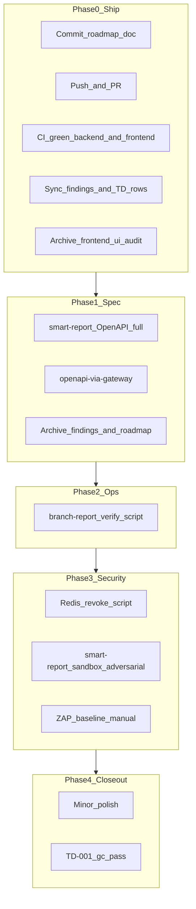

# Plan: Backend post-residual roadmap

## Objective

ดำเนินงานหลัง commit `36422b2` (residual review ปิดแล้ว) โดย **ship ก่อน** แล้วไล่ epic ตามความเสี่ยง: OpenAPI เต็ม → ops seed verify → security sprint → polish/closeout. **Phase 0 complete** (2026-07-09).

## สถานะ baseline (2026-07-09)

| หัวข้อ | สถานะ |
|--------|--------|
| Residual implement | **done** — `36422b2` |
| Git remote | `main` synced with origin (7 commits pushed 2026-07-09) |
| แผนนี้ | committed Phase 0 prep (2026-07-09) |
| TD tracker | TD-010/011/012 **closed**; TD-001 mitigated; TD-013/014/015 **open** |
| Findings doc | [`backend-review-findings-2026-07-08.md`](./backend-review-findings-2026-07-08.md) — **synced** Phase 0 |
| Frontend | COMPREHENSIVE-AUDIT P0/P1 ปิด; branch-report data + FF-01 deferred |

### Unpushed commits (PR 0 ครอบทั้งหมด)

| Commit | Area |
|--------|------|
| `36422b2` | backend — residual review, health unify, TD-011/012 |
| `ab81416` | frontend — backoffice-next comprehensive audit fixes |
| `a227e4d` | harness — MongoDB env names |
| `716c413` | docker — compose stack |
| `888c97f` | repo — scripts/docs reorg |
| `6a3353b` | frontend — Vite archive reference |



**Parallel option:** ถ้าทีมต้อง demo Channel Performance เร็ว — Phase 2 ทำคู่ Phase 1-B ได้ (ไม่พึ่ง OpenAPI)

---

## Phase 0 — Ship งานที่ commit แล้ว (~0.5 วัน)

**Objective:** land 6 unpushed commits · CI ยืนยัน backend + frontend · sync เอกสาร · เปิด TD rows สำหรับ epic ถัดไป

### PR strategy (decided)

**PR เดียว** ครอบ 6 commits (ไม่แยก branch) — title กว้าง ไม่ใช่ backend-only:

> **`chore: platform hardening — backend residual, frontend audit, harness`**

PR body **แยก area ต่อ commit** (reviewer ไม่ต้องไล่ diff ทั้งก้อน):

| Area | Commits | สรุป |
|------|---------|------|
| Backend | `36422b2` | health unify, TD-011/012, mesh plugins, GHA Redis |
| Frontend | `ab81416`, `6a3353b` | audit fixes, Vite archive |
| Harness / infra | `a227e4d`, `716c413`, `888c97f` | env names, docker, scripts reorg |

*(ทางเลือก: แยก 2 PR backend vs frontend+harness — ใช้เวลามากขึ้น; default = PR เดียว)*

### Tasks

- [x] Commit แผนนี้ + sync findings + TD rows + archive frontend-ui-audit
- [x] เปิดแถว **TD-013/014/015** ใน [`tech-debt-tracker.md`](../tech-debt-tracker.md) เป็น `open`
- [x] `git push -u origin main`
- [x] Ship direct to `main` (repo ไม่ใช้ PR gate — 7 commits รวม `4d47fd3`)
- [x] GHA: backend matrix + frontend-next-checks + docs-lint — [run 28985305608](https://github.com/Chiang-Rai-Technology/zero-platform/actions/runs/28985305608) **success**
- [x] Local verify: `./scripts/ci/ci-all.sh --only backend --skip-smoke` (with install) exit 0 ~152s
- [x] Sync [`backend-review-findings-2026-07-08.md`](./backend-review-findings-2026-07-08.md)

| Section | แก้เป็น |
|---------|---------|
| Header | Residual **complete** (ไม่ใช่ in progress) |
| Spec/OpenAPI summary | skeleton + spec:lint; partial เฉพาะ CRUD paths |
| BE-001 / Appendix B | Closed (TD-012) — ลบ "(open)" |
| Open Q mesh / health | Done (plugins + fleet extract) |
| Progress log | 2026-07-09: `36422b2` landed |

**PR test plan:**
- [ ] GHA backend matrix green (รวม smart-report `spec:lint` + lockfile ใหม่)
- [ ] GHA frontend-next lint + test + build green
- [ ] `docs-lint` pass
- [ ] Optional หลัง merge: `./scripts/dev/smoke.sh`

### Archive หลัง Phase 0 merge

- [x] [`frontend-ui-audit-2026-07.md`](../completed/frontend-ui-audit-2026-07.md) → `completed/` (audit จบแล้ว — อ้าง COMPREHENSIVE-AUDIT §F)

**Definition of done Phase 0:** ~~PR merged~~ shipped to `main` · findings synced · TD-013/014/015 เปิดใน tracker · `main` = origin · frontend-ui-audit archived · GHA green

---

## Phase 1 — smart-report OpenAPI เต็ม (~2–3 วัน · 2 PR)

**Objective:** HTTP SoT ครบทุก route ใน [`reports.route.js`](../../../backend/service/smart-report/src/modules/reports/reports.route.js)

**Oracle:** integration tests → [`technical-architecture.md`](../../specs/backend/smart-report/technical-architecture.md) → [`codes.yaml`](../../../backend/service/smart-report/codes.yaml)

### PR 1-A — CRUD + history ใน `openapi.yaml`

เพิ่ม paths ที่ยัง prose-only:

| Method | Path |
|--------|------|
| GET | `/api/v1/smart-reports/history` |
| GET | `/api/v1/smart-reports/{id}` |
| PUT | `/api/v1/smart-reports/{id}` |
| DELETE | `/api/v1/smart-reports/{id}` |
| POST | `/api/v1/smart-reports/{id}/run` |

**งานย่อย:**
1. ดึง schemas จาก `reports.schema.js` + controller envelopes
2. Components: Report, pagination, If-Match, ETag, problem codes จาก `codes.yaml`
3. `npm run spec:lint` + `npm run ci`
4. อัปเดต technical-architecture คอลัมน์ OpenAPI → yes ทุกแถว
5. อัปเดต TD-013 ใน tracker: `in progress — direct OpenAPI CRUD` (**ยังไม่ปิด**)

**Definition of done:** spec:lint error-free · integration tests pass · ทุก route ใน technical-architecture = OpenAPI yes

### PR 1-B — `openapi-via-gateway.yaml`

แพทเทิร์n [`staff/openapi-via-gateway.yaml`](../../../backend/service/staff/openapi-via-gateway.yaml):
- Gateway prefix `/api/v1/smart-reports`
- Client security: Bearer only
- `spec:lint` ทั้ง 2 ไฟล์ใน `ci`
- อัปเดต [`smart-report-spec.md`](../../specs/backend/smart-report/smart-report-spec.md)
- รัน `npm run spec:consistency` หลัง merge

**Definition of done:** dual OpenAPI lint ใน ci · **TD-013 closed** (ปิดครั้งเดียวหลัง PR 1-B เท่านั้น)

### Archive หลัง Phase 1-B merge

- [ ] `backend-review-findings-2026-07-08.md` → `completed/`
- [ ] `backend-post-residual-roadmap-2026-07-09.md` → `completed/` (แผนนี้)

---

## Phase 2 — branch-report local domain (~0.5 วัน)

**Objective:** dev ที่ต้องการ Channel Performance มี path ชัด — **ไม่บังคับ** ทุกเครื่องเลิก Atlas

**Decision:** ไม่แก้ `dev-generate-env.mjs` ให้ทับ `MONGODB_URI_READ` ที่มีอยู่

**Note:** RUNBOOK + ENV branch-report section ทำใน residual commit แล้ว — Phase 2 เหลือ verify tooling

### Tasks

- [ ] เติม RUNBOOK "Quick start: local domain data" (3 คำสั่ง: copy example → seed → curl) ถ้ายังไม่ครบ
- [ ] สร้าง `scripts/dev/verify-branch-report-seed.sh`:
  - remote URI → exit 0 + message
  - localhost → mongosh count ใน `gpp_777ww` + optional gateway curl
- [ ] Verify seed script log แสดง suggested `regDateFrom/To`
- [ ] อัปเดต COMPREHENSIVE-AUDIT §E limitation #1 เมื่อ verify บน dev machine สำเร็จ

**Definition of done:** localhost dev เห็น royalty/invite-links rows · Atlas users ไม่เสีย

---

## Phase 3 — Security sprint (~2–3 วัน · optional · ไม่ block Phase 0–1)

### 3.1 Redis revoke → gateway E2E script

สร้าง `scripts/ci/redis-revoke-gateway-e2e.sh`:

**Prereqs:** Mongo + Redis compose up · auth `:3001` + gateway `:3000` running (หรือ mini harness)

**Env (จาก harness):**
- `AUTH_INTERNAL_SERVICE_SECRET` — สำหรับ `POST /internal/users/:id/sessions/revoke`
- Redis `REDIS_URL` — ต้องตรง auth + gateway
- Gateway secret / login creds ตาม smoke

**Flow:**
```
POST /auth/login (platform_admin) → access_token + decode sub/user id
POST /internal/users/{userId}/sessions/revoke
  Authorization: Bearer {AUTH_INTERNAL_SERVICE_SECRET}
GET gateway /api/v1/me
  Authorization: Bearer {old access_token} → 401 GATEWAY_JWT_REJECTED
POST /auth/login again → 200
```

- CI: `workflow_dispatch` ใน [`.github/workflows/ci-check.yml`](../../../.github/workflows/ci-check.yml) — **ไม่** required PR gate
- ปิด **TD-014** เมื่อ merge

### 3.2 smart-report sandbox adversarial

Integration tests ใหม่/ขยาย:
- write ops ใน script → `VALIDATION_FAILED`
- test-run token reuse/expired → `TEST_RUN_TOKEN_INVALID`
- export path traversal (ถ้ามี vector)

ปิด **TD-015** เมื่อ merge

### 3.3 OWASP ZAP baseline (manual)

1. ZAP ต่อ gateway `:3000` หลัง login session (อาจต้อง cookie/token — document steps ก่อน automate)
2. สร้างโฟลเดอร์ `docs/security/` · เก็บ `zap-baseline-YYYY-MM-DD.md`
3. อัปเดต findings Appendix E — run once, not CI gate

---

## Phase 4 — Polish + closeout (~0.5–1 วัน)

### Minor polish (ตามเวลา)

| Item | Target |
|------|--------|
| agent-invoice logger | align `loggerInstance` (CS-10 partial) |
| demo central spec | thin `docs/specs/backend/demo-service/` index |
| TD-001 | `/gc` quarterly spec:consistency re-audit |

*(Archive exec plans ย้ายไป Phase 0 / Phase 1-B แล้ว — Phase 4 เหลือ polish + gc)*

**Definition of done Phase 4:** TD-001 gc pass · polish items merged or explicitly deferred ใน tracker

---

## Out of scope (explicit)

- Frontend FF-01 smart-report search stub
- Normalize health JSON bodies across fleet
- `backend/shared` health package
- Bruno collections
- Force Atlas → localhost ใน dev-up
- แยก PR 0 เป็นหลาย PR (unless team requests during Phase 0)

---

## PR order summary

| # | PR | Closes / archive |
|---|-----|------------------|
| 0 | Platform hardening (6 commits) + findings sync + TD-013/14/15 open + commit roadmap | ship · archive frontend-ui-audit |
| 1 | smart-report OpenAPI CRUD | TD-013 in progress |
| 2 | openapi-via-gateway + spec:consistency | **TD-013 closed** · archive findings + roadmap |
| 3 | branch-report verify script + RUNBOOK polish | ops R-04 |
| 4 | security sprint (script + sandbox tests + ZAP doc) | TD-014 · TD-015 |
| 5 | polish + `/gc` | TD-001 re-audit |

**Estimate:** ~4–7 วันทำงาน (Phase 2 ~0.5d; Phase 3–5 คู่ feature อื่นได้)

---

## Tech debt rows (เปิดใน Phase 0)

| ID | Priority | Description | Close when |
|----|----------|-------------|------------|
| TD-013 | P2 | smart-report OpenAPI full CRUD + via-gateway | Phase 1 PR-B |
| TD-014 | P3 | Redis revoke → gateway E2E script (workflow_dispatch) | Phase 3.1 |
| TD-015 | P3 | smart-report sandbox adversarial integration tests | Phase 3.2 |

---

## Progress log

- 2026-07-09: Plan created post-`36422b2`; no execution yet.
- 2026-07-09: Plan revised after review — PR 0 scope (6 commits), archive timing, TD-013 close rule, Redis env detail, Phase 2 estimate.
- 2026-07-09: **Phase 0 complete** — pushed 7 commits to origin/main; GHA run 28985305608 success; local ci-all backend (with install) exit 0.

## Decision log

- 2026-07-09: **Ship before new epics** — 6 unpushed commits must land before OpenAPI expansion.
- 2026-07-09: **Direct push to main** — no PR opened (commits already on default branch); GHA validates push.
- 2026-07-09: **TD-013 closes only after PR 1-B** — PR 1-A marks in progress only.
- 2026-07-09: **Archive split** — frontend-ui-audit after Phase 0; findings + roadmap after Phase 1-B.
- 2026-07-09: **Do not force localhost Atlas override** — preserve read-only demo URI; document local path instead.
- 2026-07-09: **ZAP non-blocking** — manual baseline only; no required CI gate until noise controlled.
- 2026-07-09: **Redis E2E via workflow_dispatch** — requires `AUTH_INTERNAL_SERVICE_SECRET`; unit + GHA Redis sufficient for PR CI.

## Risks

- Large PR 0 (6 commits) — mitigate with per-area summary in PR body (not backend-only title).
- smart-report OpenAPI CRUD — If-Match/ETag schemas easy to drift; use integration tests as oracle first.
- ZAP on local gateway — session/cookie setup; document manual steps before CI automate.
- smart-report `package-lock.json` changed in `36422b2` — confirm GHA install path in Phase 0.

## Related documents

| Document | Purpose |
|----------|---------|
| [backend-review-findings-2026-07-08.md](./backend-review-findings-2026-07-08.md) | Review rollup (sync Phase 0; archive Phase 1-B) |
| [backend-review-plan (completed)](../completed/backend-review-plan-2026-07-08.md) | Original review plan |
| [tech-debt-tracker.md](../tech-debt-tracker.md) | TD rows — open 013/014/015 in Phase 0 |
| [COMPREHENSIVE-AUDIT frontend](../../../frontend/backoffice-next/docs/COMPREHENSIVE-AUDIT-2026-07-08.md) | Frontend deferred items |
