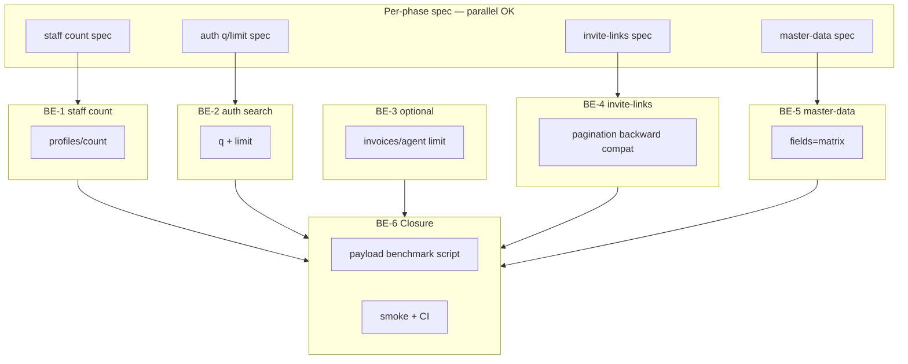

# Plan: API Network Audit fixes — backend

> **Parallel execution:** API Audit Parallel Build (`api_audit_parallel_build_d1c19150.plan.md`, Cursor workspace) — Wave 1 รวม BE-2 + BE-5 + BE-1 parallel กับ FE NET fixes

## Objective

แก้ findings **PAY** (และ NET-005 ที่ต้องการ count API) จาก [API Network Audit](../../../frontend/backoffice-next/docs/API-NETWORK-AUDIT-2026-07-09.md) ฝั่ง backend — ลด payload, เพิ่ม projection/search endpoints, และจัดทำ contract ให้ frontend consume ได้โดยไม่ breaking existing clients. แผน frontend คู่กัน: [`api-network-audit-frontend-2026-07-09.md`](./api-network-audit-frontend-2026-07-09.md).

## Finding ownership matrix

| ID | Endpoint ปัจจุบัน | Service | แผน BE | แผน FE (consumer) | Priority |
|----|------------------|---------|--------|-------------------|----------|
| PAY-001 | `GET /auth/me/branches` | auth | **BE-2** | FE-3.2 | **P0** (~20 KB) |
| PAY-002 | `GET /api/v1/invoices/agent` | agent-invoice | **BE-3** (optional) | FE-2.1 | P1 — skip ถ้า FE cache พอ |
| PAY-003 | `GET /api/v1/branch-report/invite-links` | branch-report | **BE-4** | FE-3.3 | P1 — ต้องการ seed |
| PAY-004 | `GET .../master-data/game-companies` | agent-invoice | **BE-5** | FE-3.4 | P1 (~17 KB) |
| PAY-005 | `GET /api/v1/staff/profiles?limit=1` | staff | **BE-1** | FE-3.1 | P2 (~453 B ×2) |
| NET-005 | (same as PAY-005) | staff | **BE-1** | FE-3.1 | P2 |

**ไม่รวมในแผน BE:** NET-001/002/003/004/006 (frontend-only), Dup-5 interceptor

## Dependency graph



**ลำดับ ship แนะนำ:** BE-2 → BE-5 → BE-1 → BE-4 → BE-3 (optional)

## Recommended PR order

| PR | Scope | Notes |
|----|-------|-------|
| PR-B1 | BE-2 auth `q` + `limit` | ROI สูงสุด |
| PR-B2 | BE-5 master-data `fields=matrix` | ไม่พึ่ง seed |
| PR-B3 | BE-1 staff count | เล็ก, คู่ FE-3.1 |
| PR-B4 | BE-4 invite-links | หลัง [branch-report seed](./backend-post-residual-roadmap-2026-07-09.md) |
| PR-B5 | BE-3 invoices/agent (optional) | ข้ามถ้า FE-2.1 ลดการเรียกแล้ว |

## Progress log

- 2026-07-09: แผนสร้างจาก API Network Audit (report-only pass)
- 2026-07-09: ปรับตาม plan review — BE-2 โฟกัส q/limit, BE-4 backward compat, BE-3 optional, Phase 0 parallel
- 2026-07-09: sync Parallel Build plan (`api_audit_parallel_build_d1c19150.plan.md`) — BE-1 ย้ายเข้า Wave 1
- 2026-07-09: **BE-2/BE-5/BE-1** shipped Wave 1 (`dc1279a`, `1e0183d`, `6423563`)
- 2026-07-09: **BE-4** invite-links `q`/`limit` shipped; **BE-3 skipped** (FE cache + parity)
- 2026-07-09: **BE-6** `scripts/ops/payload-benchmark-api-audit.mjs` delivered
- 2026-07-09: Plan moved to `completed/`

## Decision log

| Decision | Rationale |
|----------|-----------|
| Optional query params only | Default = behavior เดิม — ไม่ breaking |
| BE-2 ไม่เน้น `fields=summary` | Response มี minimal fields อยู่แล้ว — ปัญหาคือ **197 rows** |
| BE-3 optional | FE cache + FE-2.0 parity อาจเลิกเรียก `invoices/agent` ได้ |
| BE-4 backward-compatible envelope | ไม่มี `page/limit` → `data` array เหมือนเดิม |
| BE-1 endpoint แยก (Option A) | ชัดกว่า `fields=count` บน list |
| invite-links 22KB = volume | schema สรุปแล้ว — แก้ pagination/search |
| BE-4 blocked on seed | Cross-link [backend-post-residual-roadmap](./backend-post-residual-roadmap-2026-07-09.md) Phase 2 |

---

## Phase 0 — Spec & contract (~0.5 day, **parallel per phase**)

**เป้าหมาย:** normative spec ก่อน implement — **ไม่ต้องรอ spec ทุก service ก่อนเริ่ม BE-1**

### Tasks

- [ ] **BE-0.1** อัปเดต specs **ตาม phase ที่เริ่ม**:
  - BE-1: `docs/specs/backend/staff/` — count endpoint
  - BE-2: `docs/specs/backend/auth/` — `q`, `limit` query
  - BE-3: `docs/specs/backend/agent-invoice/` — `invoices/agent` note (optional)
  - BE-4: `docs/specs/backend/branch-report/` — invite-links query + response modes
  - BE-5: `docs/specs/backend/agent-invoice/` — master-data `fields`
- [ ] **BE-0.2** OpenAPI per service + gateway verify ตอนปิดแต่ละ phase
- [ ] **BE-0.3** Payload baseline — audit §10 Appendix C → progress log

### Acceptance

- [ ] แต่ละ phase มี spec diff ก่อน merge
- [ ] ไม่มี breaking default behavior

---

## Phase 1 — BE-1: Staff profile counts (PAY-005 / NET-005) (~1 day)

**Service:** `backend/service/staff`  
**Priority:** P2 (payload เล็ก — ทำหลัง BE-2/BE-5 ได้)

### Design — **Option A (locked)**

```
GET /api/v1/staff/profiles/count?status=active|archived
→ { success, data: { total: number } }
```

### Tasks

| ID | งาน | ไฟล์ |
|----|-----|------|
| BE-1.1 | บันทึก Option A ใน decision log | spec |
| BE-1.2 | `countProfiles({ ouId, branchId, status })` | `profiles.repository.js` |
| BE-1.3 | Route + schema + controller | `profiles.route.js`, `profiles.schema.js` |
| BE-1.4 | Permission เดียวกับ list scope | `require-permission` |
| BE-1.5 | Unit + integration tests | `profiles/tests/` |

### Acceptance

- [ ] Response **< 100 bytes**
- [ ] Branch scope เหมือน list (HQ vs 777WW)
- [ ] `npm run ci` staff ผ่าน → unblocks **FE-3.1**

---

## Phase 2 — BE-2: Auth branches search (PAY-001) (~1–1.5 days) — **P0**

**Service:** `backend/auth`  
**ปัญหา:** 197 branches ~19.9 KB — UI ต้องการ typeahead ไม่ใช่ field projection

### Design

```
GET /auth/me/branches?q=77&limit=20
```

| Param | Default | Behavior |
|-------|---------|----------|
| `q` | — | filter `branch_code` / `branch_name` (case-insensitive) |
| `limit` | ไม่ส่ง = **ทั้งหมด** (backward compatible); ส่ง = cap (max 100) |

**ไม่ทำ `fields=summary` ในรอบนี้** — fields ปัจจุบัน minimal อยู่แล้ว

### Tasks

| ID | งาน | ไฟล์ |
|----|-----|------|
| BE-2.1 | Query schema `q`, `limit` | `auth.schema.js` |
| BE-2.2 | Filter + limit ใน `listMyBranches` | `auth.branch.js`, `auth.controller.js` |
| BE-2.3 | Index `platform_branches` by `ou_id` ถ้าช้า | erd docs |
| BE-2.4 | Tests: no params = full list; `q` + `limit`; branch-pinned role | `auth/tests/` |
| BE-2.5 | `backend/auth/openapi.yaml` | openapi |

### Acceptance

- [ ] `q=777&limit=20` → payload **< 2 KB**
- [ ] ไม่มี query params → identical to current (197 branches)
- [ ] `./scripts/dev/smoke.sh` ผ่าน → unblocks **FE-3.2**

---

## Phase 3 — BE-3: Invoice agent branches (PAY-002) — **OPTIONAL** (~0.5 day)

**Service:** `backend/service/agent-invoice`  
**ทำเมื่อ:** FE-2.0 spike ยืนยันว่ายังต้องเรียก `invoices/agent` (เช่น `ensureBranchIds`, `restrictBranchId`)

### Design

| Option | งาน |
|--------|-----|
| A only | Spec deprecation note — prefer auth branches + FE cache |
| A + B | เพิ่ม `?limit=&q=` เหมือน BE-2 สำหรับ legacy callers |

### Tasks

- [ ] **BE-3.1** (ถ้าจำเป็น) `limit`, `q` ใน `listInvoiceAgents`
- [ ] **BE-3.2** OpenAPI note + `restrictBranchId` integration test
- [ ] **BE-3.3** ข้ามทั้ง phase ถ้า FE-2.1 ไม่เรียก endpoint แล้ว — บันทึกใน progress log

### Acceptance

- [ ] Documented skip หรือ backward-compatible `limit`
- [ ] Coordinate กับ **FE-2.0** decision

---

## Phase 4 — BE-4: Invite-links pagination & search (PAY-003) (~1 day)

**Service:** `backend/service/branch-report`  
**Blocked:** harness seed — [backend-post-residual-roadmap Phase 2](./backend-post-residual-roadmap-2026-07-09.md)

### Design — **backward-compatible response**

| Request | Response `data` |
|---------|-----------------|
| ไม่มี `page`/`limit` | `data: InviteLink[]` — **เหมือนเดิมทุกประการ** |
| มี `page` + `limit` | `data: { items: InviteLink[], pagination: { page, limit, total } }` |

หรือใช้ `limit` อย่างเดียว (ตัด array) โดยไม่เปลี่ยน envelope — เลือกใน BE-4.1 แล้วล็อคใน decision log

```
GET /api/v1/branch-report/invite-links?q=&limit=20
```

### Tasks

| ID | งาน | ไฟล์ |
|----|-----|------|
| BE-4.1 | เลือก response mode — บันทึก decision log | spec |
| BE-4.2 | Query schema `q`, `limit` (+ `page` ถ้าใช้) | `invite-links.schema.js` |
| BE-4.3 | Repository filter + skip/limit + count | `invite-links.repository.js` |
| BE-4.4 | Service + controller | `invite-links.service.js`, `.controller.js` |
| BE-4.5 | Integration tests + seed verify | `integration-test/` |
| BE-4.6 | `RUNBOOK.md` curl example | RUNBOOK |

### Acceptance

- [ ] Client เดิม (ไม่มี query) → response byte-identical หรือ schema-equivalent
- [ ] `limit=20` → payload **< 5 KB** (เมื่อมี seed)
- [ ] Tenant scope ไม่หลุด → unblocks **FE-3.3**

---

## Phase 5 — BE-5: Master-data field projection (PAY-004) (~1 day)

**Service:** `backend/service/agent-invoice`

```
GET /api/v1/agent-invoice/master-data/game-companies?ou_id=&fields=matrix
→ [{ _id, provider_name: { en } }]
```

### Tasks

| ID | งาน |
|----|-----|
| BE-5.1 | `fields` enum ใน schema — default `full` |
| BE-5.2 | Projection ใน service/repository |
| BE-5.3 | Tests: default unchanged; `fields=matrix` ≥50% smaller |
| BE-5.4 | OpenAPI + spec |

### Acceptance

- [ ] Default response ไม่เปลี่ยน
- [ ] `fields=matrix` ลด payload **≥ 50%** → unblocks **FE-3.4**

---

## Phase 6 — Gateway, verify & closure (~0.5 day)

### Tasks

- [ ] **BE-6.1** Gateway OpenAPI รวม query params ใหม่
- [ ] **BE-6.2** **Deliverable:** `scripts/ops/payload-benchmark-api-audit.mjs` (หรือเทียบเท่า) — วัด bytes ก่อน/หลัง ต่อ endpoint; output markdown table
- [ ] **BE-6.3** `./scripts/dev/smoke.sh` + per-service `npm run ci`
- [ ] **BE-6.4** Staging verify (`staging-seed-all.sh`) ถ้า deploy
- [ ] **BE-6.5** อัปเดต [`tech-debt-tracker.md`](../tech-debt-tracker.md) — TD-021 bulk invoice batch
- [ ] **BE-6.6** ย้ายแผนไป `completed/` เมื่อ BE phases ปิด + FE consumers merged

### Acceptance

- [ ] ทุก PAY มี task ปิดหรือ documented skip (BE-3)
- [ ] Payload benchmark script รันได้ใน harness
- [ ] CI green ทุก service ที่แตะ

---

## Cross-plan coordination

| Milestone | Backend | Frontend | Merge order |
|-----------|---------|----------|-------------|
| M1 | — | FE Phase 1 (PR1–2) | FE standalone |
| M2 | — | FE Phase 0+2 (PR3) | FE standalone |
| M3 | BE-2 | FE-3.2 | BE ก่อน FE |
| M4 | BE-5 | FE-3.4 | BE ก่อน FE |
| M5 | BE-1 | FE-3.1 | BE ก่อน FE |
| M6 | BE-4 | FE-3.3 | BE ก่อน FE + seed |
| M7 | BE-3 (optional) | — | ถ้า FE ยังเรียก invoices/agent |

---

## Verification gates

| Gate | Command |
|------|---------|
| staff CI | `cd backend/service/staff && npm run ci` |
| auth CI | `cd backend/auth && npm run ci` |
| agent-invoice CI | `cd backend/service/agent-invoice && npm run ci` |
| branch-report CI | `cd backend/service/branch-report && npm run ci` |
| Harness smoke | `./scripts/dev/smoke.sh` |
| Payload benchmark | `node scripts/ops/payload-benchmark-api-audit.mjs` (BE-6.2) |

---

## Risks

| Risk | Mitigation |
|------|------------|
| Branch search ช้า | `ou_id` index; limit cap |
| invite-links empty in harness | [residual roadmap](./backend-post-residual-roadmap-2026-07-09.md) Phase 2 |
| `invoices/agent` semantics ≠ auth | FE-2.0 spike; BE-3 only if needed |
| BE-4 envelope confusion | Two-mode response documented in OpenAPI |

---

## Future (out of scope → tech-debt-tracker)

| TD | Item |
|----|------|
| TD-021 | Batch `GET /invoices?ids=` for bulk export |
| — | ETag / Cache-Control on branch catalog |
| — | GraphQL / BFF |

---

## Task checklist (rollup)

- [ ] Phase 0: BE-0.1 – BE-0.3 (per-phase)
- [ ] Phase 2: BE-2 (PAY-001) **first BE priority**
- [ ] Phase 5: BE-5 (PAY-004)
- [ ] Phase 1: BE-1 (PAY-005)
- [ ] Phase 4: BE-4 (PAY-003) — after seed
- [ ] Phase 3: BE-3 (optional)
- [ ] Phase 6: BE-6 closure
