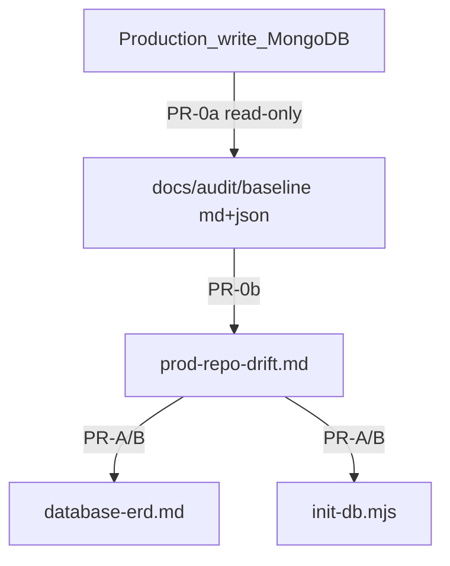

# Plan: ERD ↔ init-db ↔ generated db-schema sync (production-first)

## Objective

**Production write MongoDB = SoT** — อ่าน schema จาก prod (read-only) → **commit baseline ลง repo ก่อน** → ค่อยทำงานต่อทุกอย่าง (drift matrix, แก้ ERD/init-db, harness snapshot). ไม่แก้ repo จนกว่า `docs/audit/prod-schema-baseline-*` จะอยู่ใน git.

## Workflow gate (ลำดับบังคับ)

```
PR-0a  อ่าน prod (read-only)     →  human รัน dump → baseline .md + .json ใน repo
PR-0b  drift matrix              →  agent อ่าน baseline จาก repo เท่านั้น (ไม่เดาจาก dev)
PR-A/B/C                           →  อ้างอิง docs/audit/* + matrix
```

**ห้าม** เริ่ม PR-A ก่อน PR-0b merge — ทุก PR หลัง PR-0 ต้อง diff กับไฟล์ใน `docs/audit/`.

**Deliverables ก่อน PR-A:**

| ไฟล์ | เนื้อหา | ใครสร้าง |
|------|---------|----------|
| `docs/audit/prod-schema-baseline-YYYY-MM-DD.md` | human-readable: collections, indexes, TTL, `$jsonSchema` validators | human dump + agent format (ถ้าต้อง) |
| `docs/audit/prod-schema-baseline-YYYY-MM-DD.json` | machine-readable — **SoT สำหรับ static check** | dump script |
| `docs/audit/prod-repo-drift-YYYY-MM-DD.md` | matrix prod vs ERD vs init-db vs harness + verdict | agent หลัง 0a merge |

### Baseline metadata (บังคับในทุก baseline)

| Field | ตัวอย่าง |
|-------|----------|
| `dumped_at` | ISO date |
| `environment` | `production` |
| `prod_git_commit` | commit บน prod server ตอน dump (`git rev-parse HEAD` ใน `/var/www/zero-platform`) — ถ้าไม่รู้ใส่ `unknown` |
| `dumped_by` | human handle |
| `databases` | `zero-platform`, `zero-agent-invoice`, `zero-smart-report` |

### Redaction checklist (ก่อน commit baseline)

ห้ามอยู่ในไฟล์ที่ commit:

- [ ] `DATABASE_URI` / `MONGODB_URI` เต็ม (ใช้ `<prod-host>` placeholder)
- [ ] password, API keys, JWT secrets
- [ ] sample documents / field values จาก collection
- [ ] username, email, tel จาก prod users/profiles

อนุญาต: ชื่อ collection, index keys, index names, `expireAfterSeconds`, validator schema structure (ไม่มีค่าจริง)

## Ops policy — production (hard constraint)

| ใคร | ทำได้บน prod | ห้าม |
|-----|--------------|------|
| **Agent / automation** | **อ่านอย่างเดียว** — `listCollections`, `getIndexes`, `listCollections` options/validator | write ใดๆ, SSH/exec ที่ไม่ใช่ read dump |
| **Human (owner)** | รันสคริปต์ที่ agent เตรียม — read dump + write fixes | — |

**กฎ handoff เมื่อ prod ต้องแก้ (verdict = repo-wins หรือ ADR):**

1. Agent **ไม่รัน** write บน prod
2. Agent สร้าง `docs/ops/prod-schema-handoff-<date>.md` + runnable script
3. Human รันเอง → read-only verify (`verify-indexes.mjs` หรือ re-dump) → แจ้งผล

## SoT hierarchy

| ลำดับ | ชั้น | บทบาท |
|-------|------|--------|
| 1 | Production write MongoDB | SoT จริง |
| 2 | `docs/audit/prod-schema-baseline-*.json` (+ `.md`) | Sanitized snapshot ใน git |
| 3 | `docs/specs/backend/*/database-erd.md` | Normative docs — sync ตาม baseline |
| 4 | `*/scripts/init-db.mjs` + ensure-* | Bootstrap ตาม baseline |
| 5 | `docs/generated/db-schema/` | Dev harness verification |



## Production write scope

| Database | Services |
|----------|----------|
| `zero-platform` | auth, staff |
| `zero-agent-invoice` | agent-invoice |
| `zero-smart-report` | smart-report |

**Out of scope:** `demo-service` (dev/CI only), Atlas read (`gpp_777ww`), production data/documents, branch-report write.

## Baseline จาก dev review — รอยืนยันจาก prod (hypotheses only)

| หัวข้อ | Dev observation | ต้อง verify กับ prod baseline |
|--------|-----------------|-------------------------------|
| Auth indexes | `init-db` partial; seed เติม menus/role/platform | คาดว่า prod ครบกว่า repo init-db |
| `staff_profiles` | 4 indexes + `$jsonSchema` หลัง staff init-db | dump ต้องดึง validator ด้วย |
| Orphan collections ใน `zero-platform_0` | `agents`, `agent_fees`, `agent_iv` ใน dev | คาดว่า prod ไม่มีใน `zero-platform` |

## Progress log

- 2026-07-09: Plan created — drift review; MVP scoped PR-A + PR-B.
- 2026-07-09: **Revised production-first** — prod write = SoT; PR-0 gate.
- 2026-07-09: **Ops policy** — agent read-only; human write + handoff.
- 2026-07-09: **Workflow gate** — baseline ใน repo ก่อน PR-A/B/C.
- 2026-07-09: **Plan review** — แยก PR-0a/0b, JSON baseline, redaction checklist, verify-indexes ใน PR-C, demo out of scope, prod git commit metadata.
- 2026-07-09: **Implemented** — prod baseline + drift matrix; `ensure-auth-indexes.mjs`; ERD sync; harness snapshot; `verify-indexes.mjs`; handoff doc.

- 2026-07-09: **Baseline files in repo = hard gate** — งานหลัง PR-0 อ้างอิง `docs/audit/` เท่านั้น.
- 2026-07-09: **JSON baseline = machine SoT** — `.md` สำหรับ human review; static check อ่าน `.json`.
- 2026-07-09: **PR-0b หลัง PR-0a merge** — drift matrix จาก baseline ใน git ไม่ใช่ dev harness.
- 2026-07-09: **Agent prod access = read-only** — write = human handoff.
- 2026-07-09: **Drift verdicts:** prod-wins → update repo; repo-wins → handoff; ADR for conflicts.
- 2026-07-09: **demo-service out of scope** — ไม่ dump prod; ไม่ sync ERD ในรอบนี้.
- 2026-07-09: **Re-dump baseline** เมื่อ deploy migration ที่เปลี่ยน indexes — บันทึก `prod_git_commit` ใหม่.
- 2026-07-09: **Prod handoff complete** — human applied `by_ou_role`, agents index cleanup, smart-report collection drops (MongoDB Compass).
- 2026-07-09: **Verify + closure** — `verify-indexes` passed (3 DBs); baseline re-dumped; drift matrix resolved; plan completed.
- 2026-07-09: **ADRs** — formalized in [`docs/adrs/`](../adrs/README.md) (schema SoT, legacy drops, validator policy).

## Outcome

| Deliverable | Status |
|-------------|--------|
| `docs/audit/prod-schema-baseline-2026-07-09.{json,md}` | Post-handoff snapshot in repo |
| `docs/audit/prod-repo-drift-2026-07-09.md` | All rows resolved |
| `ensure-auth-indexes.mjs` + ERD + harness tools | Shipped `27f5e80` |
| Prod handoff | Applied + verified |
| TD-016 | Mitigated |

## PR-0a: Dump script + prod baseline (must)

**Prerequisite:** human มี prod Mongo read access (`.env.prod` บน prod server).

### Tasks

- [x] Agent สร้าง `scripts/ops/dump-db-schema.mjs`:
  - read-only: `listCollections`, `indexes()`, collection `options` (validator / `validationLevel`)
  - output: `.md` + `.json` พร้อม metadata block
  - redact URI host/credentials อัตโนมัติ
  - รองรับ 3 DBs ตาม env (`DATABASE_URI` auth, `MONGODB_URI`+`DB_NAME` อื่นๆ)
- [x] **Human รันบน prod server:**
  ```bash
  cd /var/www/zero-platform   # หรือ path deploy จริง
  git rev-parse HEAD          # บันทึกเป็น prod_git_commit
  node scripts/ops/dump-db-schema.mjs --env-file=backend/auth/.env.prod --out docs/audit/
  # ทำซ้ำ per service env หรือ script รับ --all-prod
  ```
- [x] Commit `docs/audit/prod-schema-baseline-YYYY-MM-DD.{md,json}` หลังผ่าน redaction checklist

### Acceptance

- 3 prod write DBs ครบใน baseline
- JSON + MD คู่กัน, metadata ครบ
- Redaction checklist ผ่าน — ไม่มี credentials/data
- **ยังไม่มี** drift matrix (รอ PR-0b)

## PR-0b: Drift matrix (must — หลัง PR-0a merge)

### Tasks

- [x] Agent อ่าน `docs/audit/prod-schema-baseline-*.json` จาก repo **เท่านั้น**
- [x] สร้าง `docs/audit/prod-repo-drift-YYYY-MM-DD.md`:
  - ต่อ collection: prod indexes/validator vs ERD vs init-db vs harness
  - verdict ทุก delta: `prod-wins` | `repo-wins` | `ADR`
  - แถว `repo-wins` → ระบุต้องมี handoff (ยังไม่รันบน prod)
  - แถว prod index เก่าที่น่าสงสัย → `ADR` ไม่ auto prod-wins

### Acceptance

- ทุก collection ใน prod baseline มีแถวใน matrix
- ทุก delta มี verdict
- PR-A **ห้าม** เริ่มก่อน PR-0b merge

## PR-A: init-db / ensure-* sync to prod baseline

**Goal:** Bootstrap สร้าง schema shape ตรง prod baseline (จาก matrix).

### Tasks

- [x] `backend/auth/scripts/ensure-auth-indexes.mjs` — match prod JSON baseline
- [x] ลบ duplicate paths (seed-permissions, test helper import)
- [x] staff / agent-invoice / smart-report init-db ตาม matrix (รวม `$jsonSchema` staff ถ้า prod มี)
- [x] `npm run ci` ทุก service ที่แก้

### Acceptance

- harness `init-db` → index + validator shape ตรง prod baseline JSON

## PR-B: ERD sync to prod baseline

- [x] อัปเดต `docs/specs/backend/*/database-erd.md` ตาม baseline + matrix
- [x] OBSERVED → normative ที่ prod ยืนยัน
- [x] bump document versions

**Note:** PR-A + PR-B รวมเป็น PR เดียวได้ถ้า matrix เล็ก

## PR-C: Harness snapshot + static check + verify script

### Tasks

- [x] Refactor `scripts/ci/generate-db-schema.mjs` — multi-DB harness output
- [x] สร้าง `scripts/ops/verify-indexes.mjs` (read-only):
  - เปรียบ live DB (harness หรือ `--env-file`) กับ prod baseline JSON หรือ ensure-* manifest
  - ใช้ human หลัง prod handoff; ใช้ dev หลัง harness init-db
- [x] `spec:consistency` static check: ERD ↔ ensure-* manifest ↔ `prod-schema-baseline.json`
- [x] Compare harness vs prod ใน `docs/generated/db-schema/README.md`
- [x] ปิด **TD-016** เมื่อเสร็จ

## PR-D: Polish (defer)

- Per-service ERD detail, local mirror banners, dev orphan cleanup

## PR order

```
PR-0a  dump script + human prod baseline (.md + .json)   (must — gate)
PR-0b  drift matrix จาก baseline ใน repo                 (must — gate)
PR-A   init-db / ensure-* → prod                         (must)
PR-B   ERD → prod                                        (must; รวม A ได้)
PR-C   harness snapshot + verify-indexes + static check  (should)
PR-D   polish                                            (defer)
```

## Prod change handoff (human-only)

เมื่อ verdict = **repo-wins** หรือ ADR กำหนด mutate prod:

1. Agent merge PR-A (repo ตรง baseline + missing indexes ใน manifest)
2. Agent สร้าง `docs/ops/prod-schema-handoff-<date>.md` + script
3. **Human รัน** บน prod
4. Human รัน `node scripts/ops/verify-indexes.mjs --env-file=backend/auth/.env.prod` (read-only)
5. (Optional) re-dump baseline ถ้า schema เปลี่ยน — อัปเดต `prod_git_commit`
6. ปิด TD-016 / matrix row

## Effort (revised)

| Phase | Effort |
|-------|--------|
| PR-0a | ~0.5 day (+ human dump on prod) |
| PR-0b | ~0.5 day |
| PR-A (+B ถ้ารวม) | ~1–1.5 days |
| PR-C | ~0.5–1 day |
| **Total** | **~3–4 days** |

## Risks

| Risk | Mitigation |
|------|------------|
| Prod มี index เก่าที่ไม่ต้องการ | Matrix → `ADR` ไม่ auto prod-wins |
| Baseline stale หลัง deploy | Re-dump + อัปเดต `prod_git_commit` |
| Credentials in dump | Redaction checklist + script redact |
| Agent write on prod | Blocked — handoff only |
| No prod access | Block PR-0a; staging proxy เฉพาะถ้า ops ยืนยัน schema = prod |

## Out of scope

- `demo-service` prod schema
- Atlas read DB (`gpp_777ww`)
- Production data migration
- Agent write on prod
- Dropping prod indexes without ADR + human execution

## Related

- TD-016 in [tech-debt-tracker.md](../tech-debt-tracker.md)
- [backend/ENV.md](../../../backend/ENV.md) — DB name mapping
