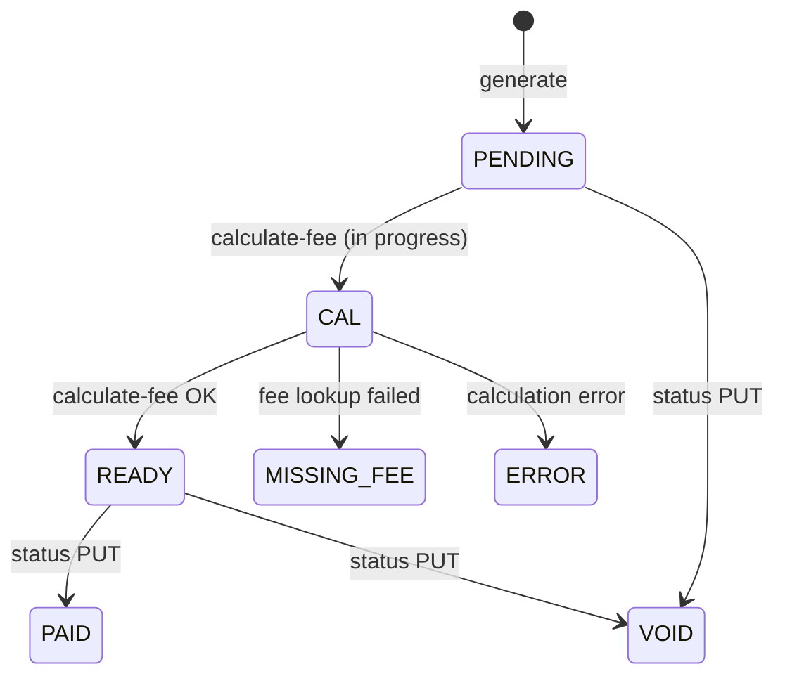

# agent-invoice — Business domain

> Entry: [agent-invoice-spec.md](./agent-invoice-spec.md) · **implemented**

## 1. Scope

| In scope | Out of scope |
|----------|--------------|
| Agent (branch) CRUD + sync from branch master | Payment collection |
| Per-agent fee overrides (company + category) | General ledger export |
| Invoice generate / list / detail / transactions | Customer-facing billing portal |
| Fee calculation & status transitions | |

## 2. Domain entities

- **Agent** (`agents`) — branch/contractor profile with fee defaults
- **Agent fee** (`agent_fees`) — override rate per game company + game category
- **Agent invoice** (`agent_iv`) — monthly billing document per agent
- **Invoice transaction** (`agent_iv_transaction`) — line items / fee breakdown

## 3. Invoice lifecycle

Statuses (**OBSERVED** `invoice-status.js`): `PENDING`, `VOID`, `CAL`, `MISSING_FEE`, `READY`, `ERROR`, `PAID`

**Detail `currency`:** GET/PUT invoice detail responses include `currency` resolved from the `agents` row for the invoice `branch_id` (uppercase). It is **not** stored on `agent_iv`. Null when no agent exists for that branch. List responses omit currency.

## 4. Fee resolution

1. Lookup `agent_fees` for agent + company + category
2. Else `agents.default_fee_rate`
3. Else error / partial failure on generate

## 5. Branch & OU tenancy

- **`ou_id`** from `x-user-ou` — mandatory scope on all reads/writes
- **Branch-pinned roles** (`branch_admin`, `branch_staff`, …): list/detail always scoped to `x-user-branch`; cannot pass another `branch_id`
- **Branch-switchable roles** (`platform_admin`, `support_admin`, `support`): list may use explicit `branch_id` or `branch_id=all` for OU-wide view; by-id reads are OU-scoped only (no branch pin on repository filter)
- **List default (switchable):** when query omits `branch_id` and caller has active branch → inject `x-user-branch` (`resolveListInvoicesRequestQuery`)
- **Generate:** pinned roles use active branch; switchable roles require/provide `body.branch_id` + `month` (YYYY-MM)

## 6. Permissions (**OBSERVED** route guards)

| Key | Operations |
|-----|------------|
| `agents:list` | list/detail agents, master-data |
| `agents:write` | create/update/delete/sync |

**List `includeInactive`:** GET `/agents` defaults to active agents only (`active` not in `false` / `0` / `"0"`). Pass `includeInactive=true` to include soft-deleted agent rows in list pagination.
| `agent-fees:*` | fee override CRUD |
| `invoices:list` | list, agent picker |
| `invoices:read` | detail, transactions |
| `invoices:write` | generate, calculate-fee, status |

## 7. Audit

Standard `cr_*` / `upd_*` on collections — see [database-erd.md](./database-erd.md)

## 8. Legacy docs consolidated

Content merged from package `docs/agent-fee-phase-*.md`, `docs/database/erd.md`, `docs/fee-data/*` — relabeled **OBSERVED** where verified against code.
