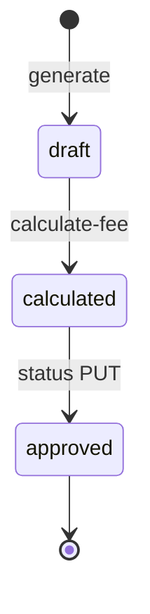

# agent-invoice — Business domain

> Entry: [agent-invoice-spec.md](./agent-invoice-spec.md) · **implemented**

## 1. Scope

| In scope | Out of scope |
|----------|--------------|
| Agent (branch) CRUD + sync from branch master | Payment collection |
| Per-agent fee overrides (company + category) | General ledger export |
| Invoice generate / list / detail / transactions | Customer-facing billing portal |
| Fee calculation & status transitions | |

## 2. Domain entities

- **Agent** (`agents`) — branch/contractor profile with fee defaults
- **Branch category fee** (`branch_category_fees`) — override rate per game company + category
- **Agent invoice** (`agent_iv`) — monthly billing document per agent
- **Invoice transaction** (`agent_iv_transaction`) — line items / fee breakdown

## 3. Invoice lifecycle

Statuses (**OBSERVED** `invoice-status.js`): `draft`, `calculated`, `approved`, `cancelled` (verify in code)

## 4. Fee resolution

1. Lookup `branch_category_fees` for agent + company + category
2. Else `agents.default_fee_rate`
3. Else error / partial failure on generate

## 5. Branch & OU tenancy

- **`ou_id`** from `x-user-ou` — mandatory scope on all reads/writes
- **List invoices:** default `branch_id` = caller `x-user-branch` when query omits filter (**OBSERVED**)
- **Generate:** body `branch_id` + `month` (YYYY-MM)

## 6. Permissions (**OBSERVED** route guards)

| Key | Operations |
|-----|------------|
| `agents:list` | list/detail agents, master-data |
| `agents:write` | create/update/delete/sync |
| `agent-fees:*` | fee override CRUD |
| `invoices:list` | list, agent picker |
| `invoices:read` | detail, transactions |
| `invoices:write` | generate, calculate-fee, status |

## 7. Audit

Standard `cr_*` / `upd_*` on collections — see [database-erd.md](./database-erd.md)

## 8. Legacy docs consolidated

Content merged from package `docs/agent-fee-phase-*.md`, `docs/database/erd.md`, `docs/fee-data/*` — relabeled **OBSERVED** where verified against code.
