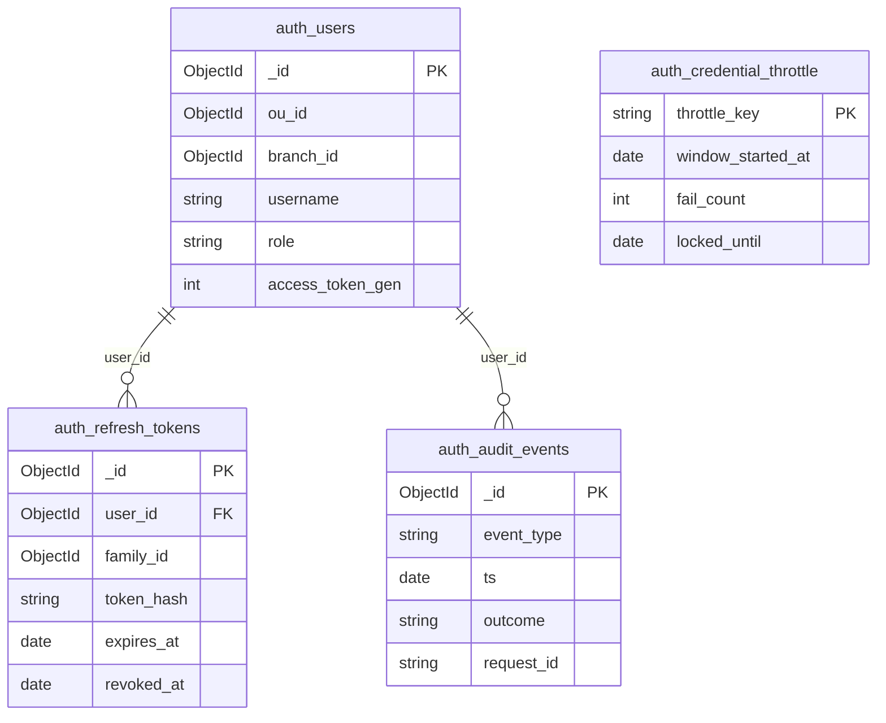

# auth — Database Design (ERD & Schema)

## Metadata

| Field                | Value                                   |
| :------------------- | :-------------------------------------- |
| **Filename**         | `database-erd.md` (this folder)                                        |
| **Entry point**      | [auth-spec.md](./auth-spec.md)                                         |
| **Status**           | Active — Persistence SoT (central spec folder)                         |
| **Parent doc**       | [technical-architecture.md](./technical-architecture.md)               |
| **Package version**  | `0.1.8`                                                                |
| **Document version** | `1.0.3`                                 |

| Layer            | Document                                                                      |
| :--------------- | :---------------------------------------------------------------------------- |
| HTTP contract    | [openapi.yaml](../../../../backend/auth/openapi.yaml)                            |
| Business         | [business-domain.md](./business-domain.md)                                  |
| Service design   | [technical-architecture.md](./technical-architecture.md)                    |
| Org data mgmt    | [`12-data-management.md`](../../../../coding-standard/backend/12-data-management.md)           |
| Org tenant audit | [`12-data-management.md`](../../../../coding-standard/backend/12-data-management.md) |

**Scope:** MongoDB persistence สำหรับ login, refresh, throttle, audit — สร้าง index ผ่าน **`npm run init:db`** ([`scripts/init-db.mjs`](../../../../backend/auth/scripts/init-db.mjs))

## Contents

1. [MongoDB database design (normative)](#1-mongodb-database-design-normative)
2. [Collections](#2-collections)
3. [ER diagram](#3-er-diagram)
4. [Index bootstrap — ตัวอย่าง `mongosh`](#4-index-bootstrap--ตัวอย่าง-mongosh)
5. [Schema validation (`$jsonSchema`)](#5-schema-validation-jsonschema)

## 1. MongoDB database design (normative)

**ชื่อ database:** กำหนดผ่าน `DATABASE_URI` (เช่น `zero-platform` — harness ใช้ `zero-platform_0`)

**ชื่อ collection:** prefix **`auth_*`** (`auth_users`, `auth_refresh_tokens`, `auth_credential_throttle`, `auth_audit_events`, `auth_menus`, `auth_role_permissions`) + `platform_branches` — ค่าจริงอยู่ที่ [`mongo-collections.js`](../../../../backend/auth/src/config/mongo-collections.js) (7 collections)

**หลักการทั่วไป**

- เก็บค่าเวลาเป็น **`Date` (UTC)** ใน MongoDB
- **ห้าม** เก็บ refresh token แบบ plaintext — เก็บเฉพาะ **`token_hash`** (แนะนำ **SHA-256** ของ opaque token ที่ส่งให้ client)
- **Username:** application **ต้อง** normalize ก่อน persist/query (`trim` + **lowercase**) แล้วเก็บใน **`username`** — **Globally Unique** (ไม่ scope ตาม `ou_id` / `branch_id`)
- **ควร** ใช้ **MongoDB transaction** (หรือ pattern atomic เทียบเท่า) สำหรับ **refresh rotation**
- **Tenant + Audit** — `auth_users` **ต้อง** มี `ou_id`, `branch_id` และ audit fields ตาม [`12-data-management.md`](../../../../coding-standard/backend/12-data-management.md); สร้าง/แก้ผ่าน Admin UI หลัง login ผ่าน `gateway` (headers `x-user-id`, `x-user-ou`, `x-user-branch`)
- **`access_token_gen`:** SoT ใน MongoDB; เมื่อตั้ง **`REDIS_URL`** (production) หลัง login/refresh สำเร็จ และหลัง revoke/password/branch switch → **`SET`** `user:{sub}:token_gen` ให้สอดคล้อง DB — Gateway อ่านจาก Redis (ดู [technical-architecture.md §9](./technical-architecture.md))
- **Deviation — Operational collections:** `auth_refresh_tokens`, `auth_credential_throttle`, `auth_audit_events` **ยกเว้น** `ou_id` / `branch_id` / `cr_*` / `upd_*` — ถ้าเพิ่มในอนาคต **ต้อง** ADR; **ไม่ใส่** `$jsonSchema` validator ตาม [ADR 005](../../../adrs/005-mongodb-collection-validators-policy.md)

## 2. Collections

### 2.1 Collection `auth_users`

| Field              | Type     | Required | Description                                                                                       |
| :----------------- | :------- | :------- | :------------------------------------------------------------------------------------------------ |
| `_id`              | ObjectId | Yes      | primary key                                                                                       |
| `ou_id`            | ObjectId | Yes      | tenant OU — [`12-data-management.md`](../../../../coding-standard/backend/12-data-management.md)         |
| `branch_id`        | ObjectId | Yes      | tenant branch                                                                                     |
| `username`         | string   | Yes      | หลัง normalize — login; **Globally Unique**                                                       |
| `password_hash`    | string   | Yes      | **Argon2id** encoded — **ห้าม** plaintext                                                         |
| `role`             | string   | Yes      | map ไป JWT role claim (`JWT_CLAIM_ROLE` บน Gateway)                                               |
| `access_token_gen` | int      | Yes      | Monotonic counter → JWT **`token_gen`**; default **`0`**; **`$inc`** เมื่อ internal revoke (O-16) |
| `cr_by`            | string   | Yes      | `x-user-id` — insert only                                                                         |
| `cr_date`          | Date     | Yes      | UTC — insert only                                                                                 |
| `cr_prog`          | string   | Yes      | route template — insert only                                                                      |
| `upd_by`           | string   | Yes      | refresh ทุก update                                                                                |
| `upd_date`         | Date     | Yes      | UTC; basis for ETag                                                                               |
| `upd_prog`         | string   | Yes      | route template                                                                                    |

**Index (ต้องสร้าง)**

| Index           | Spec                             | Purpose                     |
| :-------------- | :------------------------------- | :-------------------------- |
| `uniq_username` | `{ "username": 1 }` **unique**   | login + global uniqueness   |
| `by_ou_branch`  | `{ "ou_id": 1, "branch_id": 1 }` | tenant-scoped admin queries |
| `by_ou_role`    | `{ "ou_id": 1, "role": 1 }`      | tenant-scoped role queries  |

### 2.2 Collection `auth_refresh_tokens`

หนึ่งแถว = opaque refresh หนึ่งชิ้น (หลัง hash) ภายใต้ `family_id` เดียวกัน

| Field            | Type     | Required | Description                                                  |
| :--------------- | :------- | :------- | :----------------------------------------------------------- |
| `_id`            | ObjectId | Yes      | primary key                                                  |
| `user_id`        | ObjectId | Yes      | FK → `auth_users._id`                                        |
| `family_id`      | ObjectId | Yes      | rotation group — revoke ทั้งกลุ่ม (O-03, O-13)               |
| `token_hash`     | string   | Yes      | SHA-256(hex/base64 ตาม implement) ของ token ที่ออกให้ client |
| `expires_at`     | Date     | Yes      | `REFRESH_TOKEN_TTL_SECONDS`                                  |
| `revoked_at`     | Date     | Optional | `null` = active; ตั้งเมื่อ rotate / logout / reuse           |
| `replaced_by_id` | ObjectId | Optional | FK → `auth_refresh_tokens._id` หลัง rotation                 |
| `created_at`     | Date     | Yes      | สร้างแถว                                                     |

**Index (ต้องสร้าง)**

| Index                 | Spec                                                 | Purpose                                           |
| :-------------------- | :--------------------------------------------------- | :------------------------------------------------ |
| `uniq_token_hash`     | `{ "token_hash": 1 }` **unique**                     | lookup ตอน refresh                                |
| `by_user_revoked_exp` | `{ "user_id": 1, "revoked_at": 1, "expires_at": 1 }` | revoke ตาม user / cleanup                         |
| `by_family`           | `{ "family_id": 1 }`                                 | revoke family                                     |
| `ttl_expires_at`      | `{ "expires_at": 1 }`, **`expireAfterSeconds`: 0**   | TTL หลัง `expires_at` (reuse detection จนหมดอายุ) |

### 2.3 Collection `auth_credential_throttle`

หนึ่งเอกสารต่อ `throttle_key` — นับ login/refresh ผิดแยก **user** และ **IP**

| Field               | Type     | Required | Description                                                   |
| :------------------ | :------- | :------- | :------------------------------------------------------------ |
| `_id`               | ObjectId | Yes      | primary key                                                   |
| `throttle_key`      | string   | Yes      | **`user:<auth_users._id hex>`** หรือ **`ip:<normalized_ip>`** |
| `window_started_at` | Date     | Yes      | จุดเริ่ม rolling window 15 นาที                               |
| `fail_count`        | int      | Yes      | จำนวนครั้งผิดใน window                                        |
| `locked_until`      | Date     | Optional | lock จนถึงเวลานี้ (O-12)                                      |

**Index (ต้องสร้าง)**

| Index               | Spec                               | Purpose        |
| :------------------ | :--------------------------------- | :------------- |
| `uniq_throttle_key` | `{ "throttle_key": 1 }` **unique** | upsert ต่อ key |

### 2.4 Collection `auth_audit_events`

**Implementation ปัจจุบัน:** service persist ลง MongoDB ผ่าน `AuthRepository.insertAudit` (พร้อม `retention_until` = `ts` + 180 วัน) — index ด้านล่าง **ต้อง** มีใน env ที่เปิด audit ใน DB; ทีมอาจ mirror ไป log stack (Loki ฯลฯ) เพิ่มได้โดยไม่แทน schema นี้

| Field             | Type     | Required | Description                                                                                 |
| :---------------- | :------- | :------- | :------------------------------------------------------------------------------------------ |
| `_id`             | ObjectId | Yes      | primary key                                                                                 |
| `event_type`      | string   | Yes      | เช่น `auth.login`, `auth.refresh`, `auth.logout`, `auth.sessions_revoked_by_service` (O-16) |
| `ts`              | Date     | Yes      | เวลาเหตุการณ์ (UTC)                                                                         |
| `outcome`         | string   | Yes      | `success` \| `fail`                                                                         |
| `request_id`      | string   | Yes      | correlation id                                                                              |
| `user_id`         | ObjectId | Optional | เมื่อรู้ตัวตนแล้ว                                                                           |
| `ip_digest`       | string   | Optional | one-way digest (ไม่เก็บ IP เต็ม)                                                            |
| `detail_safe`     | object   | Optional | **ห้าม** password / token                                                                   |
| `retention_until` | Date     | Yes      | TTL (O-14)                                                                                  |

**Index (ต้องสร้าง)**

| Index                 | Spec                                                    | Purpose                    |
| :-------------------- | :------------------------------------------------------ | :------------------------- |
| `by_request_id`       | `{ "request_id": 1 }`                                   | correlation lookup         |
| `ttl_retention_until` | `{ "retention_until": 1 }`, **`expireAfterSeconds`: 0** | auto-delete หลัง retention |

### 2.5 Collection `platform_branches` (OBSERVED)

Platform-internal branches (e.g. Zero HQ) — **ไม่** อยู่ใน `gpp_777ww.su_branch`; ใช้ร่วมกับ branch-read DB ใน `BranchAccessResolver` (`platform-branch.repository.js`)

| Field         | Type     | Required | Description                                      |
| :------------ | :------- | :------- | :----------------------------------------------- |
| `_id`         | ObjectId | Yes      | branch id (matches JWT `branch_id` when platform) |
| `ou_id`       | ObjectId | Yes      | tenant OU                                        |
| `branch_code` | string   | Optional | display code                                     |
| `branch_name` | string   | Optional | display name                                     |
| `active`      | bool/int | Optional | inactive → branch access denied                  |

**Index:** **ควร** `{ ou_id: 1 }` สำหรับ lookup ตาม tenant — สร้างผ่าน seed/migration ตาม env

### 2.6 Collection `auth_menus` (OBSERVED — `admin.repository.js`, `admin.service.js`)

Menu tree สำหรับ dynamic permissions — admin CRUD ผ่าน `/auth/admin/menus`; lookup ด้วย `key`

| Field        | Type     | Required | Description                                             |
| :----------- | :------- | :------- | :------------------------------------------------------ |
| `_id`        | ObjectId | Yes      | primary key                                             |
| `key`        | string   | Yes      | menu/permission key (lookup ด้วย `findOne({ key })`)    |
| `label`      | string   | Yes      | display label                                           |
| `parent_key` | string   | Optional | parent menu key (`null`/absent = root); nest ผ่าน field นี้ |
| `sort_order` | int      | Optional | ลำดับแสดง                                               |
| `ou_id`      | ObjectId | Optional | `null` = global menu (ปัจจุบันรองรับเฉพาะ global)       |

**Index:** ไม่มีใน `init-db.mjs` — lookup by `key` / `parent_key` (unique on `key` **ควร** เพิ่มถ้า scale)

### 2.7 Collection `auth_role_permissions` (OBSERVED — `admin.repository.js`, `admin.service.js`)

Mapping `(ou_id, role)` → `menu_keys`; admin mutate ผ่าน `/auth/admin/role-permissions` — upsert/delete รองรับเฉพาะ global (`ou_id = null`)

| Field        | Type     | Required | Description                                                       |
| :----------- | :------- | :------- | :---------------------------------------------------------------- |
| `_id`        | ObjectId | Yes      | primary key                                                       |
| `ou_id`      | ObjectId | Yes      | `null` = global mapping (`ou_id !== null` → `400`)                |
| `role`       | string   | Yes      | ค่าใน `VALID_ROLES`; upsert key = `(ou_id, role)`                 |
| `menu_keys`  | string[] | Yes      | permission keys (exact + wildcard `domain:*`) → JWT `permissions` |

**Index:** ไม่มีใน `init-db.mjs` — upsert/lookup by `(ou_id, role)` (compound unique **ควร** เพิ่ม)

**หมายเหตุ:** `auth_menus` / `auth_role_permissions` **ไม่** ถูก bootstrap index ผ่าน `init-db.mjs` (§4) — admin module สร้าง/ใช้ document ตรง; seed ผ่าน `seed-*` scripts

## 3. ER diagram

Logical entities (ชื่อใน diagram ≠ ชื่อ collection ทุกตัว):



`auth_credential_throttle` ไม่ FK ไป `auth_users` — ผูกผ่าน `throttle_key` แบบ string

## 4. Index bootstrap — ตัวอย่าง `mongosh`

**ข้อจำกัด:** สคริปต์อ้างอิง — แก้ชื่อ database ให้ตรง `DATABASE_URI`; index ชื่อเดิมแต่ key ต่าง → **`dropIndex`** ก่อนสร้างใหม่

**แนะนำ:** รัน **`npm run init:db`** แทน copy-paste ด้วยมือ (สร้าง index + seed admin)

**Placeholder:** database **`zero-platform`**

```javascript
// mongosh — สร้าง indexes ตาม section 2 (เทียบ init-db.mjs)
use zero-platform;

db.auth_users.createIndex(
  { username: 1 },
  { unique: true, name: "uniq_username" }
);

db.auth_users.createIndex(
  { ou_id: 1, branch_id: 1 },
  { name: "by_ou_branch" }
);

db.auth_users.createIndex(
  { ou_id: 1, role: 1 },
  { name: "by_ou_role" }
);

db.auth_refresh_tokens.createIndex(
  { token_hash: 1 },
  { unique: true, name: "uniq_token_hash" }
);

db.auth_refresh_tokens.createIndex(
  { user_id: 1, revoked_at: 1, expires_at: 1 },
  { name: "by_user_revoked_exp" }
);

db.auth_refresh_tokens.createIndex(
  { family_id: 1 },
  { name: "by_family" }
);

db.auth_refresh_tokens.createIndex(
  { expires_at: 1 },
  { name: "ttl_expires_at", expireAfterSeconds: 0 }
);

db.auth_credential_throttle.createIndex(
  { throttle_key: 1 },
  { unique: true, name: "uniq_throttle_key" }
);

db.auth_audit_events.createIndex(
  { request_id: 1 },
  { name: "by_request_id" }
);

db.auth_audit_events.createIndex(
  { retention_until: 1 },
  { name: "ttl_retention_until", expireAfterSeconds: 0 }
);

db.auth_menus.createIndex({ key: 1 }, { unique: true, name: "uniq_menu_key" });
db.auth_menus.createIndex({ parent_key: 1 }, { name: "by_parent_key" });

db.auth_role_permissions.createIndex(
  { ou_id: 1, role: 1 },
  { unique: true, name: "uniq_ou_role" }
);

db.platform_branches.createIndex(
  { ou_id: 1, branch_code: 1 },
  { unique: true, name: "uniq_ou_branch_code" }
);
db.platform_branches.createIndex(
  { ou_id: 1, active: 1 },
  { name: "by_ou_active" }
);
```

## 5. Schema validation (`$jsonSchema`)

`validationLevel: "moderate"` on insert/update — applied by [`init-db.mjs`](../../../../backend/auth/scripts/init-db.mjs) and [`collection-validators.mjs`](../../../../backend/auth/scripts/collection-validators.mjs). Policy: [ADR 005](../../../adrs/005-mongodb-collection-validators-policy.md).

| Collection | Required (summary) | Module |
|------------|-------------------|--------|
| `auth_users` | `ou_id`, `branch_id`, `username`, `password_hash`, `role`, `access_token_gen`, audit | [`collection-validators.mjs`](../../../../backend/auth/scripts/collection-validators.mjs) |
| `platform_branches` | `ou_id` | same |
| `auth_menus` | `key`, `label` | same |
| `auth_role_permissions` | `role`, `menu_keys` | same |

**Skipped:** `auth_refresh_tokens`, `auth_credential_throttle`, `auth_audit_events` — operational collections (ADR 005).
