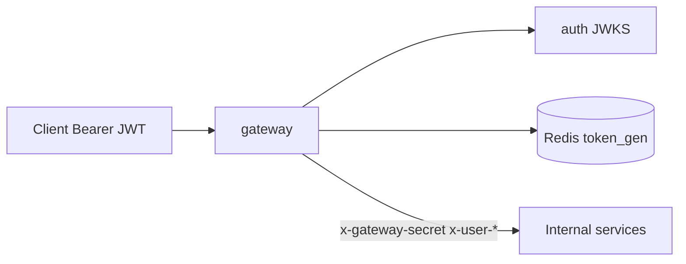

# gateway — Business domain (SoT)

> **Package status:** **implemented** — entry: [gateway-spec.md](./gateway-spec.md)

เอกสารนี้อธิบาย **ขอบเขตผลิตภัณฑ์และ trust boundary** ของ API Gateway — ไม่ครอบ login/JWT issuance (auth) หรือ business rules ของ upstream

## 1. บทบาทและขอบเขต

| ใน scope | นอก scope |
|----------|-----------|
| Verify JWT (JWKS) ที่ edge | User management, password policy |
| `token_gen` stale check (Redis) | Business validation ของ upstream |
| Inject `x-gateway-secret` + `x-user-*` | mTLS gateway↔internal (future) |
| Proxy ตาม `routes.json` | Schema ธุรกิจแต่ละ service |
| `/healthz`, `/readyz` | TypeScript runtime |

## 2. Proxy flows

### 2.1 Protected routes (default)

1. Client ส่ง `Authorization: Bearer <JWT>`
2. Gateway verify signature ผ่าน JWKS (`JWT_JWKS_URL`)
3. Parse claims → validate `sub`, `ou_id`, `branch_id`, `role`, `permissions` format
4. ถ้ามี `REDIS_URL`: เทียบ JWT `token_gen` กับ Redis `user:{sub}:token_gen` — stale/missing → **401** `GATEWAY_JWT_REJECTED` (**OBSERVED** `jwt-auth.js`)
5. Strip inbound `x-user-*`, `x-gateway-secret`, `authorization`
6. Inject trusted headers + proxy ไป upstream (**OBSERVED** `inject-context.js`, `register-proxies.js`)

### 2.2 Public route `/auth`

- `isPublic: true` ใน route config — **ไม่** รัน JWT preHandler
- **คง** client `Authorization` ไป auth upstream สำหรับ login/refresh

### 2.3 Upstream routing

**OBSERVED** `routes.json` — longest prefix match, `stripPrefix: false` ทุก route ปัจจุบัน

| Prefix | Upstream (local) | Service |
|--------|------------------|---------|
| `/auth` | :3001 | auth (public) |
| `/api/v1/staff` | :3101 | staff |
| `/api/v1/agent-invoice`, `/api/v1/invoices` | :3102 | agent-invoice |
| `/api/v1/smart-reports*` | :3103 | smart-report (timeouts vary) |
| `/api/v1/branch-report` | :3015 | branch-report |

## 3. Trusted header contract (product)

Internal services **ต้อง** ตรวจ `x-gateway-secret` ก่อน trust `x-user-*`

| Header | ที่มา (JWT claim env) | บังคับ |
|--------|----------------------|--------|
| `x-gateway-secret` | `GATEWAY_SECRET` | yes |
| `x-user-id` | `JWT_CLAIM_USER_ID` (default `sub`) | yes |
| `x-user-ou` | `JWT_CLAIM_OU` (`ou_id`) | yes, non-empty |
| `x-user-branch` | `JWT_CLAIM_BRANCH` (`branch_id`) | yes, non-empty |
| `x-user-role` | `JWT_CLAIM_ROLE` (`role`) | yes |
| `x-user-permissions` | `permissions` claim | comma-separated, validated |
| `x-user-home-branch` | `home_branch_id` | optional |
| `x-request-id` | generated or client | recommended |

**Role values:** ต้องเป็นหนึ่งใน `VALID_ROLES` จาก `@zero-platform/roles` — auth เป็นผู้ออก claim; gateway validate format เท่านั้น

## 4. Session invalidation (`token_gen`)

สัญญาร่วมกับ auth — ดูรายละเอียด technical ที่ [technical-architecture.md](./technical-architecture.md) § JWT/Redis และ [`backend/auth/docs/session-revoke-token-gen-changes.md`](../../../../backend/auth/docs/session-revoke-token-gen-changes.md)

| Event | พฤติกรรม |
|-------|----------|
| Password change / revoke sessions | auth bump Redis `user:{sub}:token_gen` |
| Gateway verify | JWT `token_gen` < Redis → reject stale token |
| `REDIS_URL` empty (dev) | skip Redis gate (**OBSERVED**) |
| `NODE_ENV=production` | `REDIS_URL` **required** (**OBSERVED** `env.js`) |

## 5. Error behavior (product-facing)

Gateway คืน RFC 7807 `application/problem+json` พร้อม `code` จาก org registry — ไม่ leak upstream stack

| สถานการณ์ | HTTP | code |
|-----------|------|------|
| ไม่มี/invalid JWT | 401 | `GATEWAY_JWT_MISSING` / `GATEWAY_JWT_REJECTED` |
| Claim format ผิด | 401 | `GATEWAY_CLAIM_REJECTED` |
| ไม่มี route | 404 | `GATEWAY_ROUTE_NOT_FOUND` |
| Upstream down | 502/504 | `GATEWAY_UPSTREAM_UNAVAILABLE` / `GATEWAY_UPSTREAM_TIMEOUT` |
| Not ready | 503 | `GATEWAY_NOT_READY` |

## 6. Out of scope / tech debt

- mTLS ระหว่าง gateway และ internal
- Rate limiting ที่ edge (upstream อาจมีของตัวเอง)
- WAF / bot protection
