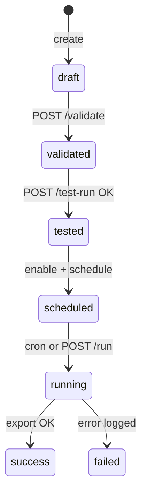

# smart-report — Business domain

> Entry: [smart-report-spec.md](./smart-report-spec.md)

## Problem (**DOCUMENTED** from `docs/raw-requirment.md`, verified **OBSERVED**)

Staff รัน MongoDB queries ซ้ำๆ ด้วยมือ — ช้าและ error-prone

## Solution

1. เก็บ report definition (name, script, params, schedule, output format)
2. Validate script ด้วย static analysis (read-only ops only)
3. Test-run ใน sandbox กับ read MongoDB
4. Schedule ด้วย cron หรือ manual run
5. Export CSV/Excel เก็บ local + download history

## Scope

| In | Out |
|----|-----|
| CRUD reports, validate, test-run, run | Cloud storage |
| Scheduler (daily/weekly/monthly) | Charts/dashboards |
| Download history | Non-MongoDB sources |

## Report lifecycle

## Tenancy

**OBSERVED:** ไม่มี `ou_id` isolation ใน collection — accepted risk ตาม legacy ERD; ทุก caller ที่ผ่าน gateway ยังต้องมี mesh headers

## Permissions

Gateway mesh + role จาก `x-user-role` — รายละเอียด route guards ใน technical doc
