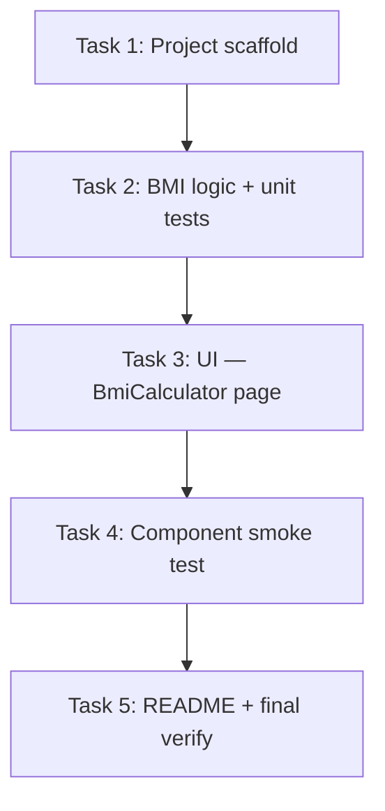

# Implementation Plan: BMI Calculator (zero-platform demo)

> สถานะ: **อนุมัติแล้ว** (2026-06-10) · อ้างอิง `_mission-control/SPEC.md`

## Overview

สร้าง demo app **BMI Calculator** แบบ pure frontend ใน `frontend/bmi-cal` — หน้าเดียว ภาษาไทย รับส่วนสูง (cm) + น้ำหนัก (kg) กดปุ่ม "คำนวณ" แล้วแสดง BMI (1 ทศนิยม) + หมวดหมู่ WHO

โปรเจกต์ยังไม่มี source code — เริ่มจาก scaffold โดย mirror pattern จาก `frontend/backoffice` แต่ตัด dependencies ที่ไม่ใช้ (axios, react-router-dom)

## Architecture Decisions

| การตัดสินใจ | เหตุผล |
| :--- | :--- |
| **แยก logic ใน `src/lib/bmi.ts`** | ทดสอบ unit ได้โดยไม่ต้อง mount UI; ตรง Spec |
| **TDD สำหรับ domain logic ก่อน UI** | ลดความเสี่ยง boundary BMI (18.5, 25, 30) ผิด |
| **ไม่ใช้ react-router** | หน้าเดียว — `App.tsx` render `BmiCalculator` โดยตรง |
| **ConfigProvider + `th_TH` ใน App.tsx** | สอดคล้อง backoffice + OQ-1 ไทยทั้งหมด |
| **Dev port 5174** | ไม่ชน backoffice (`5173`) |
| **Dependencies เท่าที่จำเป็น** | react, react-dom, antd, @ant-design/icons + dev toolchain |

## Dependency Graph



```
Scaffold (config, entry, empty App)
    │
    └── lib/bmi.ts + bmi.test.ts  ← pure functions, no UI
            │
            └── pages/BmiCalculator.tsx + App.tsx theme
                    │
                    └── BmiCalculator.test.tsx (smoke)
                            │
                            └── README + build/lint gate
```

## Task List

### Phase 1: Foundation

#### Task 1: Project scaffold (Vite + React + TS + Ant Design + Vitest)

**Description:** สร้างโครงโปรเจกต์ทั้งหมดจากศูนย์ — config files, entry points, placeholder App — ให้ `npm run dev` รันที่ port 5174 ได้

**Acceptance criteria:**
- [ ] `package.json` มี scripts: `dev`, `build`, `test`, `lint`, `preview`
- [ ] Dependencies: react 19, antd 6, vite 8, vitest, testing-library (ไม่มี axios/react-router-dom)
- [ ] `vite.config.ts` ตั้ง `server.port: 5174`
- [ ] TypeScript strict + ESLint flat config (pattern เดียว backoffice)
- [ ] `src/setupTests.ts` mock `matchMedia` สำหรับ Ant Design
- [ ] `npm ci && npm run dev` เปิดหน้า placeholder ได้
- [ ] `npm run lint` ผ่าน

**Verification:**
- `npm ci && npm run dev` → `http://localhost:5174`
- `npm run lint`

**Dependencies:** None

**Files likely touched:**
- `package.json`, `package-lock.json`
- `vite.config.ts`, `vitest.config.ts`, `eslint.config.js`
- `tsconfig.json`, `tsconfig.app.json`, `tsconfig.node.json`
- `index.html`, `src/main.tsx`, `src/App.tsx`, `src/index.css`, `src/setupTests.ts`
- `public/favicon.svg` (optional — copy จาก backoffice หรือ placeholder)

**Estimated scope:** M (8–10 ไฟล์)

---

### Checkpoint: Foundation (หลัง Task 1)

- [ ] Dev server รันที่ port 5174
- [ ] Lint ผ่าน
- [ ] โครงสร้างโฟลเดอร์ตรง Spec (`src/lib/`, `src/pages/`)

---

### Phase 2: Core Features (vertical slices)

#### Task 2: BMI domain logic + unit tests (TDD)

**Description:** สร้าง pure functions สำหรับคำนวณ BMI, จัดหมวดหมู่ WHO, format ทศนิยม 1 ตำแหน่ง — พร้อม unit tests ครอบ boundary values

**Acceptance criteria:**
- [ ] `calculateBmi(70, 170)` ≈ 24.22 (หรือ round ตาม spec)
- [ ] `getBmiCategory()` คืน `BmiResult` พร้อม `labelTh` ถูกต้อง
- [ ] Boundary: 18.5 → ปกติ, 24.9 → ปกติ, 25.0 → น้ำหนักเกิน, 30.0 → อ้วน
- [ ] แสดง BMI ทศนิยม 1 ตำแหน่ง (helper `formatBmi` หรือเทียบเท่า)
- [ ] `npm run test` ผ่านเฉพาะ `bmi.test.ts`

**Verification:**
- `npm run test -- src/lib/bmi.test.ts`

**Dependencies:** Task 1

**Files likely touched:**
- `src/lib/bmi.ts`
- `src/lib/bmi.test.ts`

**Estimated scope:** S (2 ไฟล์)

---

#### Task 3: UI — หน้า BmiCalculator + App shell

**Description:** สร้างหน้าหลักพร้อม Ant Design Form (InputNumber × 2, ปุ่ม "คำนวณ"), validation rules ตาม Spec, แสดงผล BMI + หมวดหมู่เมื่อกดปุ่ม — ไม่คำนวณ real-time

**Acceptance criteria:**
- [ ] `App.tsx`: `ConfigProvider` locale `th_TH`, theme token ตรง backoffice
- [ ] Form labels/placeholder/error เป็นภาษาไทย
- [ ] Validation: ส่วนสูง 50–300 ซม., น้ำหนัก 1–500 กก.
- [ ] กด "คำนวณ" → แสดง BMI + หมวดหมู่ (เรียก `lib/bmi`)
- [ ] กรอกค่าว่าง/out-of-range → แสดง error ไม่คำนวณ
- [ ] ไม่มี auth, routing, API call
- [ ] Manual: 170 cm, 70 kg → ~24.2, "ปกติ"

**Verification:**
- Manual บน `npm run dev`
- ตรวจ Network tab — ไม่มี API call

**Dependencies:** Task 2

**Files likely touched:**
- `src/App.tsx`
- `src/pages/BmiCalculator.tsx`

**Estimated scope:** M (2 ไฟล์, อาจแตะ `index.css` เล็กน้อย)

---

### Checkpoint: Core Features (หลัง Task 3)

- [ ] Core user flow ทำงาน end-to-end บน browser
- [ ] SC-2, SC-3, SC-4 ผ่าน (manual)
- [ ] Unit tests ยังผ่าน

---

#### Task 4: Component smoke test

**Description:** เพิ่ม smoke test 1 case — กรอก 170/70, กดคำนวณ, assert แสดง "24.2" (หรือใกล้เคียง) และ "ปกติ"

**Acceptance criteria:**
- [ ] `src/pages/BmiCalculator.test.tsx` มีอย่างน้อย 1 test case
- [ ] ใช้ `@testing-library/react` + `user-event`
- [ ] `npm run test` ผ่านทั้ง unit + component

**Verification:**
- `npm run test`

**Dependencies:** Task 3

**Files likely touched:**
- `src/pages/BmiCalculator.test.tsx`

**Estimated scope:** S (1 ไฟล์)

---

### Phase 3: Polish

#### Task 5: README + production build gate

**Description:** เพิ่ม README สั้นๆ วิธีรัน demo และยืนยัน build/lint/test ครบตาม Success Criteria ใน Spec

**Acceptance criteria:**
- [ ] `README.md` มี: prerequisites, `npm ci`, `npm run dev`, port 5174
- [ ] `npm run build` ผ่าน
- [ ] `npm run lint && npm run test && npm run build` ผ่านครบ
- [ ] SC-1 ถึง SC-6 ครบ

**Verification:**
```bash
npm run lint && npm run test && npm run build
npm run dev  # manual SC-2, SC-3
```

**Dependencies:** Task 4

**Files likely touched:**
- `README.md`

**Estimated scope:** XS (1 ไฟล์ + verify)

---

### Checkpoint: Complete (หลัง Task 5)

- [ ] Success Criteria SC-1 – SC-6 ครบ
- [ ] พร้อมส่ง `/code-build` หรือ review
- [ ] มนุษย์อนุมัติ deliverable

---

## Risks and Mitigations

| ความเสี่ยง | ผลกระทบ | วิธีรับมือ |
| :--- | :--- | :--- |
| Boundary BMI floating-point (24.999 vs 25) | กลาง | ใช้ comparison ชัดเจนใน `getBmiCategory`; test boundary ใน unit |
| Ant Design Form + InputNumber validation UX | ต่ำ | ใช้ `rules` ตาม Spec; ทด manual SC-3 |
| โฟลเดอร์ชื่อ `bmi-cal` มีอักขระพิเศษ | ต่ำ | ใช้ path จริงจาก filesystem ไม่ rename โดยไม่ขอ |
| Version drift จาก backoffice | ต่ำ | copy version ranges จาก `backoffice/package.json` ตอน scaffold |

## Parallelization

| ทำขนานได้ | ต้องเรียงลำดับ |
| :--- | :--- |
| — (โปรเจกต์เล็ก ทำ sequential ปลอดภัยกว่า) | T1 → T2 → T3 → T4 → T5 |

## Open Questions

ไม่มี — ปิดครบใน Spec (OQ-1/OQ-2/OQ-3)

## Approval

- [x] เบียร์อนุมัติ Plan นี้ (2026-06-10)
- [x] Implementation เสร็จ — `/code-build` (2026-06-10)
