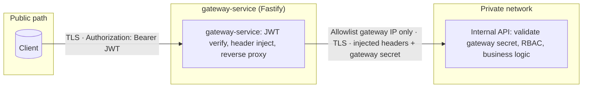
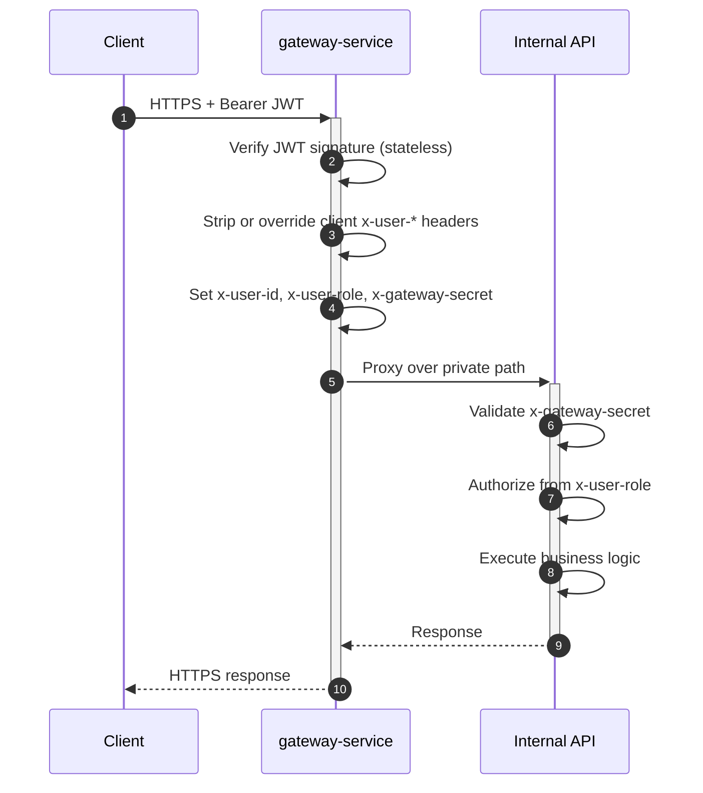
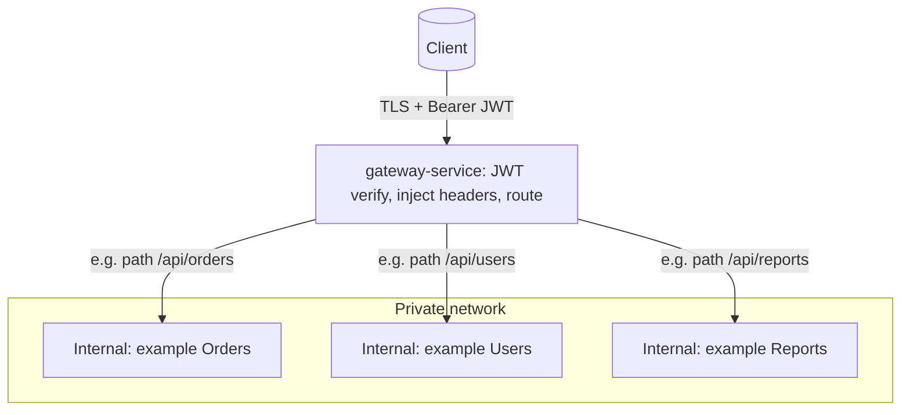
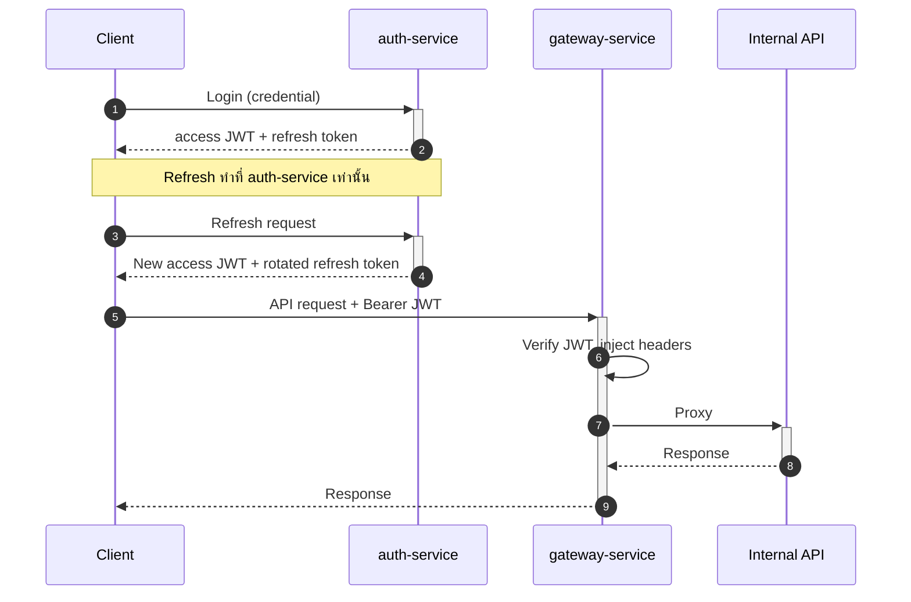

# gateway-service (API Gateway) & Internal APIs — Architecture ADR

## Metadata

| Field | Value |
|-------|-------|
| **Filename** | `gateway-architecture.md` |
| **Document index** | [README.md](./README.md) |
| **Status** | Active — ADR / architecture overview, trust boundary, และ system flow ของชุดเอกสาร `authorization-gateway/` |
| **Companion docs** | [`gateway-design.md`](./gateway-service/gateway-design.md) — Production SoT ของ `gateway-service` · [`auth-login-design.md`](./auth-service/auth-login-design.md) — Production SoT ของ `auth-service` |
| **Scope** | เอกสารนี้อธิบายภาพรวมเชิงสถาปัตยกรรม, trust boundary, และเหตุผลเชิงระบบ — **ไม่** แทน SoT เชิง contract / env / runtime ของ `gateway-service` หรือ `auth-service` |
| **Document version** | `1.0.5` |
| **Terms** | **ต้อง (MUST)** = บังคับในบริบทที่อ้างอิง SoT · **ควร (SHOULD)** = default ที่แนะนำ · **อาจ (MAY)** = ทางเลือก |

> **การเปลี่ยนแปลง:** หากแก้ flow, trust boundary, security strategy, หรือ diagram ที่กระทบความเข้าใจระบบโดยรวม → **ควร** review คู่กับ `gateway-service/gateway-design.md` และ `auth-service/auth-login-design.md` และ bump เวอร์ชันเอกสารนี้ตามผลกระทบ

---

เอกสารในโฟลเดอร์ `authorization-gateway/` ชุดนี้ใช้เป็นชุดอ้างอิงกลางสำหรับ **services ใน repo เดียว** (`gateway-service`, `auth-service`, `internal-api`):

| File | Role |
|------|------|
| **gateway-architecture.md** | ADR, system flow, trust boundary, diagrams |
| [**gateway-design.md**](./gateway-service/gateway-design.md) | `gateway-service` — production SoT (contract, env, lifecycle) |
| [**auth-login-design.md**](./auth-service/auth-login-design.md) | `auth-service` (self-hosted IdP) — ออก JWT, refresh |

**Production SoT — `gateway-service`:** [`gateway-design.md`](./gateway-service/gateway-design.md) — เวอร์ชันและเกณฑ์ MUST/SHOULD  
**Production SoT — `auth-service`:** [`auth-login-design.md`](./auth-service/auth-login-design.md)

**TL;DR:** Client รับ access JWT จาก `auth-service` แล้วเรียก `gateway-service`; `gateway-service` เป็นจุด verify JWT, inject headers, และ proxy ไปยัง internal APIs ส่วน internal API จะเชื่อถือ user context ได้ก็ต่อเมื่อ request ผ่าน `gateway-service` และตรวจ `x-gateway-secret` สำเร็จ

## 1. System Flow

**ขั้นก่อน (กรณีไม่ใช้ IdP ภายนอก):** Client ได้รับ **access JWT** จาก **[`auth-service`](./auth-service/auth-login-design.md)** ก่อน แล้วจึงเรียก `gateway-service` ตาม flow ด้านล่าง

1. **Client** ส่ง request พร้อม `Authorization: Bearer <JWT>`
2. **`gateway-service` (Fastify)** verify JWT signature แบบ stateless
3. **`gateway-service`** อ่าน payload แล้ว inject HTTP headers พร้อมแนบ `x-gateway-secret` — **ไม่ไว้ใจ** user context ที่ client ส่งมาโดยตรง; claim ที่ map ไป `x-user-id` **ควร** เป็น ASCII printable และ **ต้องไม่** เกิน 128 ตัวอักษร มิฉะนั้น `gateway-service` ตอบ `400`
4. **`gateway-service`** proxy ต่อไปยัง internal API ตาม routing ที่กำหนด
5. **Internal API** ตรวจ `x-gateway-secret` ก่อน แล้วจึงใช้ user context จาก headers ที่ `gateway-service` ใส่ให้ใน business logic

**Trust boundary:** Internal API ถือว่า `x-user-id` / `x-user-role` เป็นความจริง **ก็ต่อเมื่อ** request มาจาก private network ที่อนุญาตเฉพาะ `gateway-service`, ผ่าน `gateway-service`, และตรวจ `x-gateway-secret` สำเร็จแล้ว

## 2. `gateway-service` Component

- **Tech stack:** Node.js + **Fastify** (`@fastify/jwt`, `@fastify/http-proxy`) — เขียนด้วย **JavaScript ESM** (`import` / `export`, `"type": "module"` ใน `package.json`) **ไม่ใช้ TypeScript** — ทดสอบด้วย **Jest**
- **Reasoning:** Fastify มี overhead ต่ำและรองรับ throughput ได้ดี จึงเหมาะกับงาน proxy ด้านหน้า; ส่วน **`gateway-service` ใช้ ESM** เพื่อให้สอดคล้องกับ module graph และ ecosystem รุ่นใหม่ — แนวทางนี้ **ต่างจาก**มาตรฐาน backend หลักของทีมที่เป็น **Express + CommonJS** (`engineering-standards/active/backend/`) จึงนับเป็น exception เฉพาะ service นี้ (ไม่บังคับให้ internal API เปลี่ยนมา ESM)
- **Responsibilities:**
  - Stateless authentication (JWT)
  - Header injection (user context + gateway secret)
  - Reverse proxy / routing แบบ **path-based (`prefix`)** ไปหลาย internal upstream (ดู diagram 5.3)

### MVP decisions (ล็อกแล้ว — `gateway-design.md` section 11)

- **Gateway secret:** ค่าเดียวกันทุก upstream ในรอบแรก
- **ไม่ forward** `Authorization` ไป internal — identity ผ่าน headers ที่ `gateway-service` inject เท่านั้น
- **JWT:** สำหรับชุดเอกสารนี้ `gateway-service` **ต้อง** verify access JWT ด้วยโหมด **asymmetric + JWKS** (`JWT_JWKS_URL`) เท่านั้น และตรวจ `aud` / `iss` เมื่อตั้ง `JWT_AUDIENCE` / `JWT_ISSUER`; โหมด **HS256 + `JWT_SECRET`** ไม่ใช่ current design ของ ADR นี้

### Operational baseline (ล็อกแล้ว — `gateway-design.md` section 12)

- **ไม่มี JWT:** เปิดเฉพาะ `GET /health` ในรอบแรก; `GET /ready` และ metrics สาธารณะยังไม่อยู่ใน baseline ของ ADR นี้
- **`x-user-id`:** map จาก `JWT_CLAIM_USER_ID`; **ควร** เป็น ASCII printable และยาวไม่เกิน 128 ตัวอักษร — เกิน `400` ที่ `gateway-service`
- **`x-user-role`:** string เดียวหรือหลายค่าคั่นด้วย comma; สูงสุด 256 ตัวอักษร — เกิน `400` ที่ `gateway-service`
- **JWT leeway:** default 60 วินาที · มี `nbf` ให้ตรวจตาม claim (+ leeway)
- **CORS:** ปิดเป็น default (server-to-server) · WebSocket/SSE นอกขอบเขต MVP · body default 1 MiB · `TRUST_PROXY` ตาม env · error body ใช้ของ Fastify ไปก่อน · Node `>=24`
- **Upstream `5xx`:** passthrough ไปยัง client · **internal secret ผิด:** `403` เท่านั้น (`gateway-design.md` section 12.9)

### Key risks & mitigations

- **Proxy timeout:** ตั้ง upstream timeout และตอบ `504 Gateway Timeout` เมื่อ upstream ไม่ตอบ เพื่อลดความเสี่ยงที่ `gateway-service` จะค้างตาม internal ที่ล่มหรือช้า
- **Error mapping:** ใช้ `502`/`504` เมื่อ upstream ติดต่อไม่ได้หรือ timeout; หาก **upstream ตอบ HTTP 5xx สมบูรณ์** ให้ passthrough status; ส่วน `gateway-service` ใช้ `401`/`400`/`404` ตาม `gateway-design.md` section 7 และ section 12.9; internal ใช้ **`403`** เมื่อ `x-gateway-secret` ไม่ถูกต้อง (`gateway-design.md` section 8)

## 3. Internal API Component

- **Responsibilities:** โฟกัสที่ business logic
- **Security rules:**
  - **ไม่ verify JWT ที่ internal** — ไม่ซ้ำงานกับ `gateway-service`; การยืนยันตัวตนผู้ใช้ผ่าน JWT ทำที่ `gateway-service` เท่านั้น
  - **Authorization:** ตรวจสิทธิ์ (เช่น role-based) จาก `x-user-role` หลังผ่านการตรวจจาก `gateway-service` แล้ว
  - **Gateway validation:** ตรวจ `x-gateway-secret` ทุกครั้งก่อนประมวลผล

## 4. Security Strategy (Defense in Depth)

แนวทางนี้ใช้ลดความเสี่ยงจากการโจมตีและป้องกันการพยายามข้าม `gateway-service` ไปเรียก internal โดยตรง

1. **Infrastructure (network isolation):** วาง internal API ใน private network; inbound อนุญาตเฉพาะ IP/subnet ของ `gateway-service`
2. **Application (shared secret):** ใช้ `x-gateway-secret` เพื่อยืนยันว่า request มาจาก `gateway-service` จริง ลดความเสี่ยง header spoofing ใน network เดียวกัน

### Operational notes (secret & transport)

- **Secret:** เก็บใน env/secret manager; หลีกเลี่ยงการ log request headers ที่มี secret; เปรียบเทียบแบบ constant-time; วางแผน rotate (หรือ dual-key ระหว่างช่วงเปลี่ยน)
- **Transport:** Client → `gateway-service` **ต้อง** ใช้ TLS; `gateway-service` → internal **ต้อง** วิ่งบน private network และ **ต้อง** ใช้ TLS; **mTLS ยังไม่อยู่ใน baseline ของ ADR นี้**

### JWT stateless (ข้อจำกัด)

- การ revoke token ทันที (logout / compromise) ทำได้ยากถ้าใช้แค่ stateless JWT — ความสามารถ revocation เพิ่มเติม **ยังไม่ถูกล็อกใน ADR นี้**; หาก requirement ต้อง revoke ได้ทันที **ต้อง** ทำ ADR/SoT เพิ่มเติม โดยอ้างอิงรายละเอียดการออก token / refresh ที่ [`auth-service/auth-login-design.md`](./auth-service/auth-login-design.md)

## 5. Diagrams

แผนภาพด้านล่าง render ได้ใน GitHub, GitLab, VS Code / Cursor (Markdown preview) และ tools ที่รองรับ [Mermaid](https://mermaid.js.org/)

### 5.1 Trust zones & components

### 5.2 Request sequence

### 5.3 Multiple internal services (routing)

เมื่อมีหลาย internal service `gateway-service` จะทำหน้าที่รวม **auth ไว้จุดเดียว** แล้ว **กระจายตาม route แบบ path-based (`prefix`)** — upstream ทุกตัว **ต้อง** ตรวจ `x-gateway-secret` และทำ authorization ตาม section 3 (Internal API) เหมือนกัน; ใน ADR นี้ **ใช้ secret ชุดเดียวกันทุก upstream** และหากจะเปลี่ยนเป็น secret คนละตัวต่อ service **ต้อง** ทำ decision แยก

ในทางปฏิบัติ ลูกศรทุกเส้นจาก `gateway-service` ไป internal จะแนบ **ชุด header เดียวกัน** (user context + gateway secret) ตามที่ `gateway-service` inject หลัง verify JWT แล้ว

### 5.4 Self-hosted IdP: `auth-service` + `gateway-service` (ภาพรวม)

รายละเอียด API และความปลอดภัยของ `auth-service` ดูต่อที่ [`auth-service/auth-login-design.md`](./auth-service/auth-login-design.md)

---

_Document version **1.0.5** — architecture ADR (flow, trust boundary, diagrams)._
