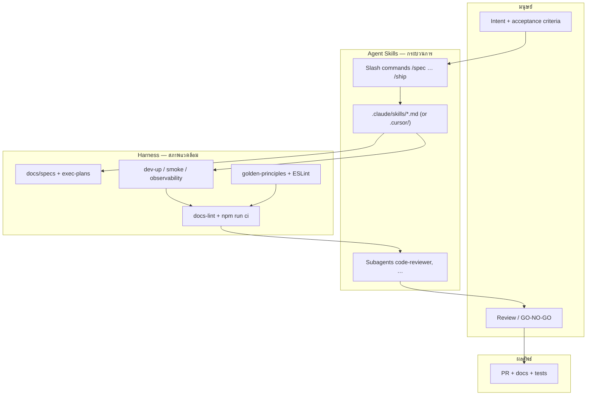

# Harness Engineering — แนวคิดการทำงานของ zero-platform

> **Humans steer. Agents execute.**

โฟลเดอร์นี้คือ **เอกสารแนวคิดและวิธีทำงาน** ของ repo — ไม่ใช่แค่คู่มือรันคำสั่ง อธิบายว่าทำไม repo ถึงออกแบบแบบนี้ และ **agent-skills ทำงานร่วมกับ harness อย่างไร**

| เอกสาร | บทบาท |
|--------|--------|
| **README.md** (ไฟล์นี้) | ภาพรวม + การผสาน skills ↔ harness |
| [core-beliefs.md](./core-beliefs.md) | หลักการที่ไม่ควรฝ่าฝืน |
| [workflows.md](./workflows.md) | ตัวอย่างขั้นตอนการทำงาน — onboarding, SDLC, ทดสอบ, debug, deploy |
| [openai-com-index-harness-engineering.md](./openai-com-index-harness-engineering.md) | บทความอ้างอิง OpenAI |

สารบัญสั้น: [AGENTS.md](../AGENTS.md) · กฎเชิงกลไก: [golden-principles.md](../docs/golden-principles.md)

---

## 1. Repo นี้ทำงานอย่างไร (ภาพรวม)



**สรุป:** Agent Skills กำหนด *ลำดับและวิธีคิด* — Harness กำหนด *context, การตรวจ, และเครื่องมือที่ agent ใช้ได้*

---

## 2. สองชั้นที่ต้องเข้าใจคู่กัน

### Harness (สิ่งที่ repo สร้างให้ agent)

| องค์ประกอบ | หน้าที่ | Path |
|------------|---------|------|
| Knowledge base | สิ่งที่ build, plan, debt | `docs/specs/`, `docs/exec-plans/` |
| Mechanical rules | invariant ที่บังคับได้ | `docs/golden-principles.md`, ESLint, spectral |
| Runnable feedback | boot, smoke, metrics, logs | `scripts/dev-*.sh`, `docs/observability.md` |
| Quality score | สุขภาพ domain | `docs/QUALITY_SCORE.md` |

### Agent Skills (สิ่งที่ sync จาก upstream + ปรับ local)

| องค์ประกอบ | หน้าที่ | Path |
|------------|---------|------|
| Skills | วิธีทำแต่ละ phase ครบถ้วน | `.claude/skills/<name>/SKILL.md` (Cursor: `.cursor/skills/`) |
| Slash commands | จุด invoke ด้วยมือ | `.claude/commands/` (Cursor: `.cursor/commands/`) |
| Standards map |  skill ต้องอ่าน coding-standard ไหน | `scripts/agent-skills-standards/` |
| Subagents | review แบบ fan-out | `.claude/agents/` (Cursor: `.cursor/agents/`) |
| Checklists | DoD, security, perf | `references/` |

Sync ทั้งสอง target พร้อมกันด้วยสคริปต์เดียว — ดู [scripts/README.md](../scripts/README.md)

**กฎสำคัญ:** มี skill ตรง → อ่าน `SKILL.md` ให้ครบ ห้าม improvise workflow (ดู [CLAUDE.md](../CLAUDE.md) หรือ [.cursor/rules/agent-skills.mdc](../.cursor/rules/agent-skills.mdc))

---

## 3. ผสาน Agent Skills กับ Harness ต่อ phase

```
/spec → /plan → /build → /test → /review → /code-simplify → /ship → /release
                                                          ↘ /gc (เป็นรอบ)
```

| Phase | Command | Skill(s) | Harness ที่ skill ต้องใช้ |
|-------|---------|----------|---------------------------|
| Define | `/spec` | spec-driven-development | `docs/specs/backend/<svc>/`, `coding-standard/` |
| Plan | `/plan` | planning-and-task-breakdown | `docs/exec-plans/active/`, service `WORKFLOW.md` |
| Build | `/build` | incremental-implementation, test-driven-development | spec + golden-principles, `npm run ci` ใน package |
| Verify | `/test` | test-driven-development | **`dev-up` + `smoke`**, integration tests |
| Review | `/review` | code-review-and-quality | golden-principles, coding-standard |
| Simplify | `/code-simplify` | code-simplification | staff เป็น reference pattern |
| Ship | `/ship` | shipping-and-launch + subagents | **smoke + docs-lint**, rollback plan |
| Release | `/release` | release-notes-and-handoff (local) | `docs/releases/`, **docs-lint** (ci-all ทำแล้วที่ `/ship`), PR |
| GC | `/gc` | code-simplification | QUALITY_SCORE, tech-debt-tracker, docs-lint |

คำสั่ง `/test` และ `/ship` มี **Harness verification** ฝังใน `scripts/agent-skills-standards/` — sync แล้วไปที่ `.claude/commands/` และ `.cursor/commands/`

---

## 4. Intent → Skill (เมื่อไม่รู้จะเริ่ม command ไหน)

| สถานการณ์ | เริ่มที่ |
|-----------|----------|
| คำขอคลุมเครือ / ไม่ชัด | `interview-me` หรือ `idea-refine` |
| Feature ใหม่ | `/spec` → `/plan` → `/build` |
| Bug / พฤติกรรมผิดปกติ | `debugging-and-error-recovery` (+ browser skill ถ้าเป็น UI) |
| ออกแบบ API | `api-and-interface-design` |
| งาน UI | `frontend-ui-engineering` |
| ไม่แน่ใจว่ามี skill อะไร | `using-agent-skills` |
| Session ใหญ่จบ / drift สะสม | `/gc` |

---

## 5. Subagents และ `/ship`

`/ship` เป็น **orchestrator** — ไม่ใช่ skill เดียว แต่ fan-out ไป subagents คู่ขนาน:

| Persona | ตรวจอะไร |
|---------|----------|
| `code-reviewer` | correctness, readability, architecture, security, performance |
| `security-auditor` | OWASP, secrets, auth/authz |
| `test-engineer` | coverage, edge cases |

Harness ที่ `/ship` ต้องรันก่อน GO (นอกเหนือจากรายงาน persona):

1. `./scripts/dev-up.sh && ./scripts/smoke.sh`
2. `node scripts/docs-lint.mjs`
3. `npm run ci` ใน package ที่แก้

Persona **ไม่เรียก persona อื่น** — มีแค่ user หรือ `/ship` ที่ orchestrate

---

## 6. เมื่อ agent ติด — playbook

1. **อ่าน context ที่ขาด** — spec? exec-plan? coding-standard?
2. **รัน feedback** — `dev-up`, `smoke`, `npm run ci` — เก็บ error จริง
3. **ถาม capability** — ขาด lint? doc? script? observability query?
4. **Encode กลับ repo** — อย่าแก้แค่ใน chat; อัปเดต golden-principles, docs-lint, หรือ script
5. **บันทึก debt** — `docs/exec-plans/tech-debt-tracker.md` ถ้าแก้ไม่ทันตอนนี้

---

## 7. Sync และ local overrides

```bash
./scripts/sync-agent-skills.sh
```

| Sync ทับ | ไม่ทับ (แก้ใน repo นี้) |
|----------|-------------------------|
| `.claude/skills`, `commands`, `agents` | `scripts/agent-skills-standards/` |
| `.cursor/skills`, `commands`, `rules`, `agents` | `scripts/local-commands/` (เช่น `/gc`) |
| `references/`, root `CLAUDE.md` | `harness-engineering/` (แนวคิดนี้) |
| | `docs/golden-principles.md` |

**ลำดับความสำคัญเมื่อ conflict:** `core-beliefs` → `golden-principles` → `coding-standard` → skill → โค้ดเดิมใน service

---

## 8. โครงสร้าง repo (อ่านอะไรเมื่อไหร่)

```
AGENTS.md                    ← สารบัญ (agent เริ่มที่นี่)
harness-engineering/         ← แนวคิดการทำงาน (โฟลเดอร์นี้)
├── core-beliefs.md          ← หลักการ
├── workflows.md             ← ตัวอย่างขั้นตอนการทำงาน
└── openai-com-index-…md     ← บทความอ้างอิง
docs/specs/                  ← what to build
docs/exec-plans/             ← multi-PR work
docs/golden-principles.md    ← mechanical invariants
coding-standard/             ← org rules
scripts/                     ← harness tooling
CLAUDE.md                    ← orchestration (auto-loaded, generated)
.claude/                     ← agent-skills runtime (Claude Code)
.cursor/                     ← agent-skills runtime (Cursor)
```

---

## 9. ปฏิบัติการ (reference สั้น)

### Boot + verify

```bash
./scripts/dev-up.sh                  # backend stack
./scripts/dev-up.sh --with-frontend  # + backoffice (Vite) สำหรับงาน UI
./scripts/smoke.sh
./scripts/dev-down.sh
```

Worktree แยก: `PORT_OFFSET=100 ./scripts/dev-up.sh` (port + DB + Redis + frontend แยก)

### Observability

```bash
./scripts/dev-obs-up.sh   # หลัง dev-up
```

ดู [docs/observability.md](../docs/observability.md)

### Quality gates

| Gate | Command |
|------|---------|
| Docs | `node scripts/docs-lint.mjs` |
| Package | `npm run ci` |
| Smoke | `./scripts/smoke.sh` |

รายละเอียด script: [scripts/README.md](../scripts/README.md)

---

## 10. อ่านต่อ

| หัวข้อ | ลิงก์ |
|--------|-------|
| หลักการ (beliefs) | [core-beliefs.md](./core-beliefs.md) |
| ตัวอย่างขั้นตอนการทำงาน | [workflows.md](./workflows.md) |
| กฎเชิงกลไก | [golden-principles.md](../docs/golden-principles.md) |
| Agent map | [AGENTS.md](../AGENTS.md) |
| Claude Code SDLC | [.claude/USAGE.md](../.claude/USAGE.md) |
| Cursor SDLC | [.cursor/USAGE.md](../.cursor/USAGE.md) |
| บทความ OpenAI | [openai-com-index-harness-engineering.md](./openai-com-index-harness-engineering.md) |

---

*อัปเดต: 2026-07-08 — เพิ่ม `.claude/` (Claude Code) คู่กับ `.cursor/`*
