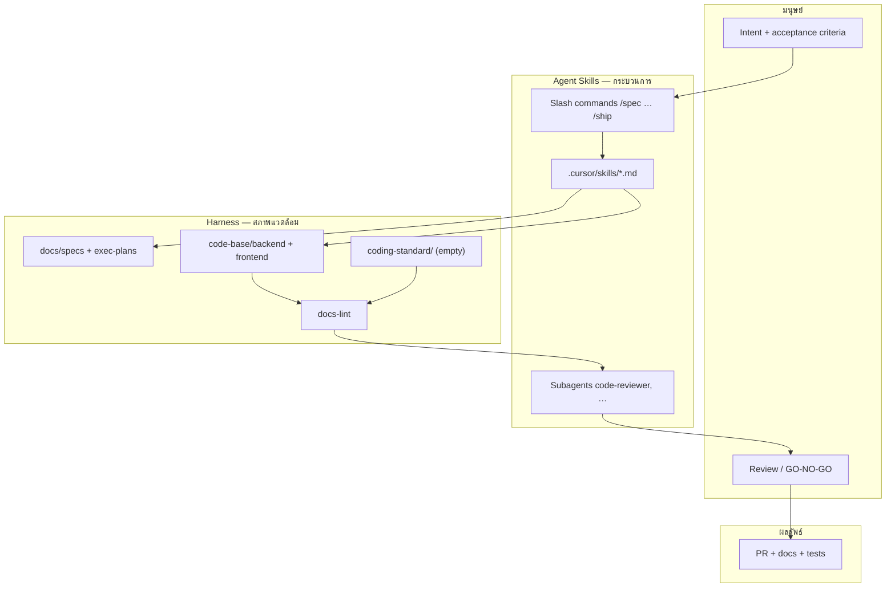

# Harness Engineering — ai-agent-template

> **Humans steer. Agents execute.**

โฟลเดอร์นี้คือ **เอกสารแนวคิดและวิธีทำงาน** ของ repo — อธิบายว่าทำไม repo ถึงออกแบบแบบนี้ และ **agent-skills ทำงานร่วมกับ harness อย่างไร**

| เอกสาร | บทบาท |
|--------|--------|
| **README.md** (ไฟล์นี้) | ภาพรวม + การผสาน skills ↔ harness |
| [core-beliefs.md](./core-beliefs.md) | หลักการที่ไม่ควรฝ่าฝืน |
| [workflows.md](./workflows.md) | ตัวอย่างขั้นตอนการทำงาน — onboarding, SDLC |
| [adopt.md](./adopt.md) | Code layout — greenfield (`code-base/`) vs brownfield (root) |
| [openai-com-index-harness-engineering.md](./sources/openai-com-index-harness-engineering.md) | บทความอ้างอิง OpenAI |

สารบัญสั้น: [AGENTS.md](../../../AGENTS.md) · โค้ด: `harness.config.yaml` · เอกสารโปรเจกต์: [docs/](../../../docs/README.md)

---

## 1. Repo นี้ทำงานอย่างไร (ภาพรวม)



**สรุป:** Agent Skills กำหนด *ลำดับและวิธีคิด* — Harness กำหนด *context, การตรวจ, และโครงสร้าง repo*

---

## 2. สองชั้นที่ต้องเข้าใจคู่กัน

### Harness (สิ่งที่ repo สร้างให้ agent)

| องค์ประกอบ | หน้าที่ | Path |
|------------|---------|------|
| Code zone | แอปพลิเคชัน | `code-base/backend/`, `code-base/frontend/` |
| Knowledge base | สิ่งที่ build, plan, debt | `docs/specs/`, `docs/exec-plans/` |
| Mechanical rules | invariant ที่บังคับได้ | `coding-standard/` (empty — vendor after fork), ESLint |
| Quality gates | ตรวจโครงสร้าง + ลิงก์ | `harness/scripts/ci/docs-lint.mjs` |

### Agent Skills (sync จาก upstream + local overrides)

| องค์ประกอบ | หน้าที่ | Path |
|------------|---------|------|
| Skills | วิธีทำแต่ละ phase ครบถ้วน | `.cursor/skills/<name>/SKILL.md` |
| Slash commands | จุด invoke ด้วยมือ | `.cursor/commands/` |
| Standards map | skill ต้องอ่าน domain standards ไหน (เมื่อ vendor แล้ว) | `harness/scripts/agent/agent-skills-standards/` |
| Subagents | review แบบ fan-out | `.cursor/agents/` |
| Checklists | DoD, security, perf | `harness/references/` |

Sync ด้วย `./harness/scripts/agent/sync-agent-skills.sh` — ดู [harness/README.md](../../README.md)

**กฎสำคัญ:** มี skill ตรง → อ่าน `SKILL.md` ให้ครบ ห้าม improvise workflow (ดู [.cursor/rules/agent-skills.mdc](../../../.cursor/rules/agent-skills.mdc))

---

## 3. SDLC

```
/spec → /plan → /build → /test → /review → /code-simplify → /ship → /release
                                                          ↘ /gc (เป็นรอบ)
```

| Phase | Command | Skill(s) | Harness ที่ skill ต้องใช้ |
|-------|---------|----------|---------------------------|
| Define | `/spec` | spec-driven-development | `docs/specs/` (+ `coding-standard/` when vendored) |
| Plan | `/plan` | planning-and-task-breakdown | `docs/exec-plans/active/` |
| Build | `/build` | incremental-implementation, test-driven-development | spec + `code-base/` |
| Verify | `/test` | test-driven-development | package tests ใน `code-base/` |
| Review | `/review` | code-review-and-quality | `coding-standard/` (when vendored) |
| Ship | `/ship` | shipping-and-launch + subagents | docs-lint + package CI |
| Release | `/release` | release-notes-and-handoff (local) | `docs/releases/`, docs-lint |
| GC | `/gc` | code-simplification | docs-lint, tech-debt-tracker |

---

## 4. Sync และ local overrides

```bash
./harness/scripts/agent/sync-agent-skills.sh
```

| Sync ทับ | ไม่ทับ (แก้ใน repo นี้) |
|----------|-------------------------|
| `.cursor/skills`, `commands`, `rules`, `agents` | `harness/scripts/agent/agent-skills-standards/` |
| `harness/references/` | `harness/scripts/agent/local-commands/` |
| | `harness/scripts/agent/local-skills/` |
| | `harness/knowledge/harness/` (แนวคิดนี้) |
| | `code-base/`, `docs/` |

---

## 5. โครงสร้าง repo

```
AGENTS.md                    ← สารบัญ (agent เริ่มที่นี่)
harness/                     ← runbook, knowledge, references, scripts
code-base/                   ← backend + frontend (empty in template)
docs/                        ← specs, exec-plans, releases
coding-standard/             ← org build rules (vendor after fork)
.cursor/                     ← agent-skills runtime (Cursor)
```

---

## 6. Quality gates

| Gate | Command |
|------|---------|
| Docs skeleton | `node harness/scripts/ci/docs-lint.mjs` |
| Package CI | `npm run ci` (เมื่อมีโค้ดใน `code-base/`) |

รายละเอียด: [HARNESS-RUNBOOK.md](../../HARNESS-RUNBOOK.md) · [README.md](../../README.md)

---

## 7. อ่านต่อ

| หัวข้อ | ลิงก์ |
|--------|-------|
| หลักการ | [core-beliefs.md](./core-beliefs.md) |
| ตัวอย่างขั้นตอน | [workflows.md](./workflows.md) |
| Agent map | [AGENTS.md](../../../AGENTS.md) |
| Cursor SDLC | [.cursor/USAGE.md](../../../.cursor/USAGE.md) |
