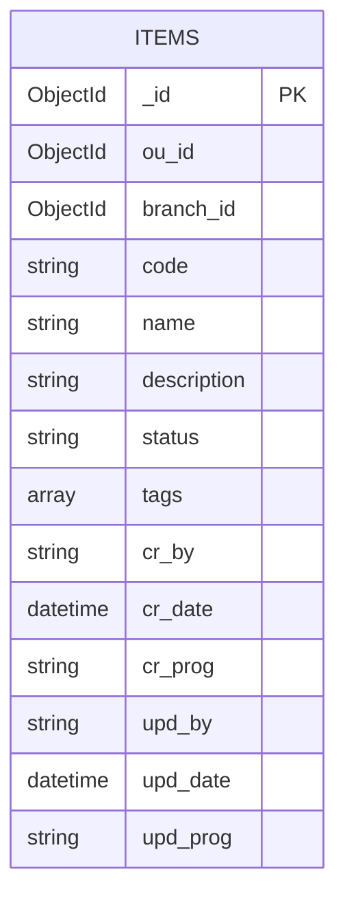

# crud-service — Database (ERD & schema)

## Metadata

| Field | Value |
| :--- | :--- |
| **Filename** | `docs/db/erd.md` |
| **Document index** | [README.md](../../README.md) |
| **Status** | Active — persistence SoT |
| **Parent doc** | [`../architecture.md`](../architecture.md) |
| **Package version** | `0.1.0` |
| **Document version** | `1.0.2` |

| Layer | Document |
| :--- | :--- |
| HTTP contract | [`openapi.yaml`](../../openapi.yaml) |
| Service design | [`../architecture.md`](../architecture.md) |
| ADR (`PUT`) | [`../adrs/001-put-full-replace.md`](../adrs/001-put-full-replace.md) |
| Org MongoDB std | [`mongodb.md`](../../../../../../../_coding-standards/backend/mongodb.md) |

**Scope:** writes **only** collection **`items`** in **`DB_NAME`** (default `api_example`). **`GET /api/v1/me`** does not read MongoDB.

## Contents

1. [Engine and connection](#1-engine-and-connection)
2. [Lifecycle](#2-lifecycle)
3. [Security](#3-security)
4. [ER diagram](#4-er-diagram)
5. [Data dictionary (`items`)](#5-data-dictionary-items)
6. [Indexes](#6-indexes)

## 1. Engine and connection

- **Engine:** MongoDB — driver config [`../../src/config/database.js`](../../src/config/database.js)
- **Database:** **`DB_NAME`** (default **`api_example`**) — [`../../.env.example`](../../.env.example), [`../../src/config/env.js`](../../src/config/env.js)
- **Collections written:** **`items`** only — [`../../src/modules/items/items.repository.js`](../../src/modules/items/items.repository.js)

| Variable | Role |
| :--- | :--- |
| **`MONGODB_URI`** | Required; full URI + `authSource` when needed |
| **`DB_NAME`** | Logical DB for `MongoClient#db()` |
| **`MAX_POOL_SIZE`**, **`MIN_POOL_SIZE`** | Pool sizing (`env.js`) |
| **`APP_NAME`** | Client metadata (default `crud-service`) |

Timeouts, `readPreference`, retries: **`database.js`** (change per org policy).

## 2. Lifecycle

1. **`server.js`** → **`connectDatabase(env)`** before listen
2. Handlers → **`getDatabase()`** → `collection("items")`
3. **`GET /readyz`** → **`pingDatabase(1000)`**
4. Shutdown → **`closeDatabase()`** (graceful shutdown)

## 3. Security

- **ห้าม** log raw **`MONGODB_URI`** — ใช้ `redactMongoUri` ใน `database.js`
- Tenant isolation: **`ou_id`** + **`branch_id`** ทุก query จาก trusted headers (ไม่จาก client body สำหรับ identity)
- **`ou_id` / `branch_id`:** repository แปลง **hex24** → `ObjectId` เมื่อครบรูปแบบ; ไม่เช่นนั้นเก็บ string (fixtures) — ใน local smoke ใช้ hex24 ตาม [`RUNBOOK.md`](../../RUNBOOK.md)

## 4. ER diagram

Entity **`ITEMS`** = collection **`items`** (logical BSON types).



**Cardinality:** scoped by **`(ou_id, branch_id)`** — ไม่มี collection `tenants` แยกใน demo นี้

## 5. Data dictionary (`items`)

Write shape SoT: [`items.repository.js`](../../src/modules/items/items.repository.js) (`createItem`, `mapPublic`, updates)

| Field | Type | Req | In API | Description |
| :--- | :--- | :---: | :---: | :--- |
| `_id` | `ObjectId` | yes | yes (`id`) | PK; stringified in `mapPublic` |
| `ou_id` | `ObjectId` / string | yes | no | Tenant OU ↔ `x-user-ou` (hex24 ใน prod-like dev) |
| `branch_id` | `ObjectId` / string | yes | no | Branch ↔ `x-user-branch` (hex24 ใน prod-like dev) |
| `code` | string | yes | yes | Business code; **ควร** unique ต่อ `(ou_id, branch_id)` — ดู §6.3 |
| `name` | string | yes | yes | Display name |
| `description` | string / null | no | yes | Nullable |
| `status` | string | yes | yes | e.g. `draft`, `active`, `inactive` (OpenAPI) |
| `tags` | string[] | no | yes | Default `[]` |
| `cr_by` | string | yes | no | Create audit user |
| `cr_date` | `Date` | yes | no | Create time (UTC) |
| `cr_prog` | string | yes | no | Create route template |
| `upd_by` | string | yes | no | Update audit user |
| `upd_date` | `Date` | yes | no | Update time; basis for weak **ETag** |
| `upd_prog` | string | yes | no | Update route template |

### List query (`GET /api/v1/items`)

- Filter: `{ ou_id, branch_id }` จาก trusted context
- Sort: `{ _id: -1 }` · pagination: `page`, `limit` → `skip` / `limit` (response `pagination` ตาม [`openapi.yaml`](../../openapi.yaml))
- Implementation: `listItems` ใน [`items.repository.js`](../../src/modules/items/items.repository.js)

## 6. Indexes

**Policy:** app bootstrap **does not** create indexes — **DBA-owned**

### Summary

| Name | Keys | Purpose |
| :--- | :--- | :--- |
| **`IDX_ITEMS_TENANT_LIST`** | `{ ou_id: 1, branch_id: 1, _id: -1 }` | Tenant list + `_id` desc pagination |
| **`IDX_ITEMS_TENANT_VERSION_CHECK`** | `{ _id: 1, ou_id: 1, branch_id: 1, upd_date: 1 }` | Optimistic locking (`PUT`/`PATCH`/`DELETE`) |
| **`IDX_ITEMS_TENANT_CODE_UNIQUE`** (recommended) | `{ ou_id: 1, branch_id: 1, code: 1 }` **unique** | กันซ้ำ `code` ต่อ tenant — §6.3 |

### `IDX_ITEMS_TENANT_LIST`

| | |
| :--- | :--- |
| **keys** | `{ ou_id: 1, branch_id: 1, _id: -1 }` |
| **options** | `{ background: true }` |
| **reason** | `GET /api/v1/items` by tenant, sort `_id` desc |
| **date** | `2026-04-20` |
| **PR/ticket** | `N/A (demo package)` |

```js
db.items
  .find({ ou_id: "<ou_id>", branch_id: "<branch_id>" })
  .sort({ _id: -1 })
  .skip(0)
  .limit(20)
  .explain("executionStats");
```

### `IDX_ITEMS_TENANT_VERSION_CHECK`

| | |
| :--- | :--- |
| **keys** | `{ _id: 1, ou_id: 1, branch_id: 1, upd_date: 1 }` |
| **options** | `{ background: true }` |
| **reason** | Filter `_id` + tenant + `upd_date` for concurrency |
| **date** | `2026-04-20` |
| **PR/ticket** | `N/A (demo package)` |

```js
db.items
  .find({
    _id: ObjectId("<item_id>"),
    ou_id: "<ou_id>",
    branch_id: "<branch_id>",
    upd_date: ISODate("<etag_timestamp>"),
  })
  .explain("executionStats");
```

### `IDX_ITEMS_TENANT_CODE_UNIQUE` (recommended — not created by app)

| | |
| :--- | :--- |
| **keys** | `{ ou_id: 1, branch_id: 1, code: 1 }` |
| **options** | `{ unique: true, background: true }` |
| **reason** | Enforce business **`code`** uniqueness per tenant at DB layer |
| **date** | `2026-05-21` |
| **PR/ticket** | `N/A (demo package)` |
| **app today** | Demo **ไม่** สร้าง index นี้ และ **ไม่** catch duplicate ใน service layer — DBA ควรสร้างใน env จริง; จนกว่าจะมี index อาจ insert ซ้ำได้ |
